**Amplify your Integration Middleware with DevOps: The IBM DevOps Deploy
Way**

Session 1440

Lab Exercise Guide

Rafael de Oliveira Osorio

Learning Content Development, Automation Software

rosorio@br.ibm.com

Randall Langehennig

Solution Architect, Product Manager

rlange@ibm.com

**Notices and disclaimers**

© 2024 International Business Machines Corporation. No part of this
document may be reproduced or transmitted in any form without
written permission from IBM.

**U.S. Government Users Restricted Rights — use, duplication or
disclosure restricted by GSA ADP Schedule Contract with IBM.**

This document is current as of the initial date of publication and may
be changed by IBM at any time. Not all offerings are available in every
country in which IBM operates.

Information in these presentations (including information relating to
products that have not yet been announced by IBM) has been reviewed for
accuracy as of the date of initial publication and could include
unintentional technical or typographical errors. IBM shall have no
responsibility to update this information.

**This document is distributed “as is” without any warranty, either
express or implied. In no event, shall IBM be liable for any damage
arising from the use of this information, including but not limited to,
loss of data, business interruption, loss of profit or loss of
opportunity.** IBM products and services are warranted per the terms and
conditions of the agreements under which they are provided. The
performance data and client examples cited are presented for
illustrative purposes only. Actual performance results may vary
depending on specific configurations and operating conditions.

IBM products are manufactured from new parts or new and used parts.  
In some cases, a product may not be new and may have been previously
installed. Regardless, our warranty terms apply.”

**Any statements regarding IBM's future direction, intent or product
plans are subject to change or withdrawal without notice.**

Performance data contained herein was generally obtained in a
controlled, isolated environments. Customer examples are presented as
illustrations of how those customers have used IBM products and the
results they may have achieved. Actual performance, cost, savings or
other results in other operating environments may vary. 

References in this document to IBM products, programs, or services does
not imply that IBM intends to make such products, programs or services
available in all countries in which IBM operates or does business. 

Workshops, sessions and associated materials may have been prepared by
independent session speakers, and do not necessarily reflect the views
of IBM. All materials and discussions are provided for informational
purposes only, and are neither intended to, nor shall constitute legal
or other guidance or advice to any individual participant or their
specific situation.

It is the customer’s responsibility to ensure its own compliance
with legal requirements and to obtain advice of competent legal counsel
as to the identification and interpretation of any relevant laws and
regulatory requirements that may affect the customer’s business and any
actions the customer may need to take to comply with such laws. IBM does
not provide legal advice or represent or warrant that its services or
products will ensure that the customer follows any law.

**Notices and disclaimers (Continued)**

Questions on the capabilities of non-IBM products should be addressed to
the suppliers of those products. IBM does not warrant the quality of any
third-party products, or the ability of any such third-party products to
interoperate with IBM’s products. **IBM expressly disclaims all
warranties, expressed or implied, including but not limited to, the
implied warranties of merchantability and fitness for a purpose.**

The provision of the information contained herein is not intended to,
and does not, grant any right or license under any IBM patents,
copyrights, trademarks or other intellectual property right.

IBM, the IBM logo, and ibm.com are trademarks of International Business
Machines Corporation, registered in many jurisdictions worldwide. Other
product and service names might be trademarks of IBM or other companies.
A current list of IBM trademarks is available on the Web at “Copyright
and trademark information” at:
[www.ibm.com/legal/copytrade.shtml](http://www.ibm.com/legal/copytrade.shtml).

**Table of Contents**

[1 Introduction 5](#introduction)

[1.1 Lab Environment Architecture 5](#lab-environment-architecture)

[1.2 What is App Connect Enterprise (ACE)
6](#what-is-app-connect-enterprise-ace)

[1.3 What is IBM DevOps Deploy 6](#what-is-ibm-devops-deploy)

[1.4 What is IBM DevOps Test Hub 7](#what-is-ibm-devops-test-hub)

[2 Getting Started 9](#getting-started)

[2.1 How to Connect to the Lab 9](#how-to-connect-to-the-lab)

[3 Lab Exercises 11](#lab-exercises)

[3.1 Developing an IBM ACE broker archive using the IBM App Connect
Enterprise Toolkit
11](#developing-an-ibm-ace-broker-archive-using-the-ibm-app-connect-enterprise-toolkit)

[3.1.1 Overview 11](#overview)

[3.1.2 Workbook steps 11](#workbook-steps)

[3.2 Setup a Jenkins CI Pipeline to Automate Build
17](#setup-a-jenkins-ci-pipeline-to-automate-build)

[3.2.1 Overview 17](#overview-1)

[3.2.2 Workbook Steps 18](#workbook-steps-1)

[3.3 Review the Emerald eStore Application in IBM DevOps Deploy
30](#review-the-emerald-estore-application-in-ibm-devops-deploy)

[3.3.1 Overview 30](#overview-2)

[3.3.2 Workbook steps 31](#workbook-steps-2)

[3.4 Work with the emerald-ACE-BAR Component in Deploy
32](#work-with-the-emerald-ace-bar-component-in-deploy)

[3.4.1 Overview 32](#overview-3)

[3.4.2 Workbook steps 32](#workbook-steps-3)

[3.5 Deploy the ACE Broker Archive using IBM DevOps Deploy to DEV
44](#deploy-the-ace-broker-archive-using-ibm-devops-deploy-to-dev)

[3.5.1 Overview 44](#overview-4)

[3.5.2 Workbook steps 44](#workbook-steps-4)

[3.6 Promote the Emerald Components to the QA Environment
51](#promote-the-emerald-components-to-the-qa-environment)

[3.6.1 Overview 51](#overview-5)

[3.6.2 Workbook steps 51](#workbook-steps-5)

[3.7 Publishing a Product to API Connect using IBM DevOps Deploy
61](#publishing-a-product-to-api-connect-using-ibm-devops-deploy)

[3.7.1 Overview 61](#overview-6)

[3.7.2 Workbook steps 62](#workbook-steps-6)

[4 Wrapping Things Up 74](#wrapping-things-up)

[4.1 Lab Re-Cap 74](#lab-re-cap)

# Introduction

The purpose of the IBM DevOps Hands On workshop is to provide a
high-level overview on how to achieve end-to-end automation in your
DevOps pipelines to ensure good quality code is progressing from your
lower environments all the way to your production environment. The focus
will be to highlight App Connect Enterprise (ACE) and API Connect
(APIC).

In this lab, you will be working with these two primary IBM DevOps
solutions:

  - IBM DevOps Deploy (formerly known as IBM UrbanCode Deploy)

  - IBM DevOps Test Hub

Working with a container-based application called Emerald eStore, you
will gain an understanding of IBM DevOps Deploy and how to configure and
deploy the Emerald eStore application which includes an ACE broker
archive and an API Connect Product you will publish to a catalog. You
will also learn how to configure automated test execution using IBM
DevOps Test Hub in your automated processes.

This lab will provide an example of how you can leverage gates in IBM
DevOps Deploy for governance, call automated tests (could include
integration, functional, and performance tests) following an automated
deployment to track quality, and initiate releases to your target
environments.

## Lab Environment Architecture

The high-level architecture for the environment includes three different
servers as shown below:

The main system we will utilize for our labs is the RedHat (rhel8) host
found in the middle of the screen. You will connect to this host to
follow the steps in the labs. One server image hosts the IBM DevOps
Deploy Server and Agent. Finally, the last server image hosts the IBM
DevOps Test Hub installation.

## What is App Connect Enterprise (ACE)

IBM App Connect Enterprise combines the existing industry-trusted
technologies of IBM Integration Bus with cloud-native technologies to
deliver a platform that supports the full breadth of integration needs
across a modern digital enterprise.

You can use IBM App Connect Enterprise to connect applications together,
regardless of the message formats or protocols that they support. This
connectivity means that your diverse applications can interact and
exchange data with other applications in a flexible, dynamic, and
extensible infrastructure. IBM App Connect routes, transforms, and
enriches messages from one location to any other location.

By using the IBM App Connect Enterprise Toolkit, you can develop
integration solutions and deploy them to IBM Cloud Pak for Integration,
the dedicated runtime of IBM App Connect Enterprise software, and to IBM
App Connect Enterprise as a Service. The labs that follow will make use
of this toolkit to complete our tasks.

## What is IBM DevOps Deploy

IBM DevOps Deploy is an application-release solution that infuses
automation into the continuous delivery and continuous deployment
(CI/CD) process and provides robust visibility, traceability and
auditing capabilities.

IBM DevOps Deploy provides the following capabilities:

  - **Integrations that replace custom scripting**

> Integrations with technologies such as Jenkins, Kubernetes, Microsoft,
> ServiceNow and IBM® WebSphere® make processes more robust and easier
> to design.

  - **Scalable distributed automation**

> Meet enterprise requirements with an architecture designed to scale —
> providing high availability, horizontal scalability and tight
> security.

  - **Visual deployment modeling**
    
    Model cloud environments in a simple graphical editor to deploy your
    applications to public, private and hybrid clouds.

  - **Inventory control**

> Track what resides where with visibility into your applications,
> environments and configurations.

  - **Quality gates and approvals**

> Ensure that only application-component versions that meet quality
> criteria are promoted across test environments en route to production.

  - **Coordination of multicontainer deployments**

> Employ industry-leading release automation capabilities for the
> container world.

  - **Rapid migration to the cloud**

> UrbanCode Deploy is available as a container and certified to work
> with Red Hat OpenShift.

## What is IBM DevOps Test Hub

The IBM DevOps Test Hub application (formerly known as IBM Rational Test
Automation Server) brings together test data, test environments, and
test runs and reports into a single, web-based browser for testers and
non-testers.

The solution provides the following capabilities:

  - **Web-based continuous testing platform**

> IBM DevOps Test Hub is a web-based continuous testing platform built
> on modern, cloud native technologies that enables test teams to run a
> breadth of tests that includes API, functional, and performance tests.

  - **Role-based access and security**

> Security is a key concern for IBM clients and therefore, DevOps Test
> Hub brings a comprehensive, role-based access control scheme to the
> server with project owners assigning key permissions (by using roles)
> for specific members. For example, managing test data or working with
> secrets such as passwords.

  - **Running of tests from the server by using Docker containers**
    
    The DevOps Test Hub solution enables direct running of tests from
    the browser by using transient Docker containers.

  - Connected agents for existing performance agents.
    
    Agent owners can connect existing performance agents to the server
    and add them to a project for running schedules and Accelerated
    Functional Testing (AFT) Suites on the current infrastructure.

  - **Project overview statistics**
    
    The Overview page for IBM DevOps Test Hub offers you a quick, simple
    view on the state of testing for your projects.

  - **Test data authoring**
    
    Beyond the concept of a project held in a Git repository for a
    simple location of tests and related assets, you can do full
    concurrent editing of test data sets directly from DevOps Test Hub.
    This true multi-user capability enables team members to collaborate
    more easily as well as try out data changes without impacting the
    rest of the team. When satisfied with the results, team members can
    push their changes.

  - **Integration with DevOps tools**
    
    You can integration DevOps Test Hub with various popular DevOps
    tools like Jenkins, DevOps Deploy, or Microsoft Azure DevOps to get
    more value from your DevOps pipelines. You can configure an IBM
    DevOps Deploy process that automatically triggers test cases and
    have those test insights set a status to indicate that the tests
    passed or failed.
    
    DevOps Test Hub also integrates with Jira for defect tracking and
    GitHub for software source management and version control.

# Getting Started

## How to Connect to the Lab

Follow these instructions to connect to the lab environment.

1.  On your laptop, start your Firefox browser.

2.  Click on the link to your environment that has been assigned to you.
    For example:
    
    https://te-ilo.learninglabs.ibm.com/events/techxchange/1676\_A\#
    
    You will see a screen that looks like this:
    
    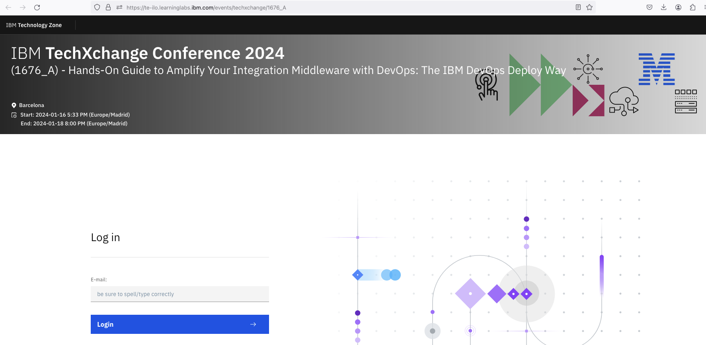

3.  Enter your email address and click the Login button (as shown
    above).
    
    You should see the screen below:
    
    

4.  Click on the “Launch Lab” button. You will see the following screen:

> 

5.  Click on the RedHat or ‘rhel8’ screen as shown above. This will
    launch the console we will be using for the labs.
    
    

6.  Click on the screen and you will see a login for the ‘sysadmin’
    user. Provide a password of “**Passw0rd**” and press Enter.

7.  You are good to proceed to the first lab\!

# Lab Exercises

## Developing an IBM ACE broker archive using the IBM App Connect Enterprise Toolkit

### Overview

In this lab we will explore our IBM App Connect Enterprise (ACE)
development capabilities. We will first explore the use of the IDE
Tookit to create and test a broker archive (BAR).

This toolkit is called the “IBM App Connect Enterprise Toolkit” as shown
below:

Afterwards, we will look at an example pipeline that can be used to
automate the build, unit test, and ultimately the deploy of the broker
archive to your target environments.

### Workbook steps

<table>
<thead>
<tr class="header">
<th><strong>Step</strong></th>
<th><strong>Details</strong></th>
<th><strong>Additional Information</strong></th>
</tr>
</thead>
<tbody>
<tr class="odd">
<td>1</td>
<td>Click on the Red Hat image found in the middle of the virtual machines to open this image.</td>
<td>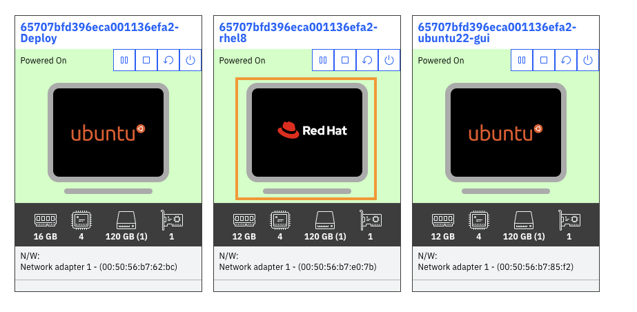</td>
</tr>
<tr class="even">
<td>2</td>
<td>
Login as the user <em><strong>sysadmin</strong></em> with password of <em><strong>Passw0rd</strong></em>

The 0 is a zero.
</td>
<td>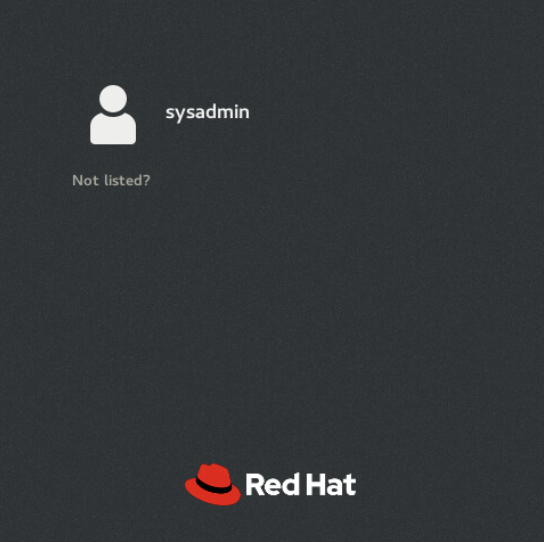</td>
</tr>
<tr class="odd">
<td>3</td>
<td>Open a Terminal Window by clicking the terminal shortcut on the desktop</td>
<td>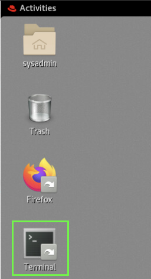</td>
</tr>
<tr class="even">
<td>4</td>
<td>
Before we get started, we need to start our ACE environment by running a script.

In your terminal window, run these commands:

$ cd scripts

$ ./start-ace.sh

<strong>NOTE:</strong> let the script run for a couple of minutes so you see that it starts INODEDEV, INODEQA, and INODEPROD before moving to next step.
</td>
<td>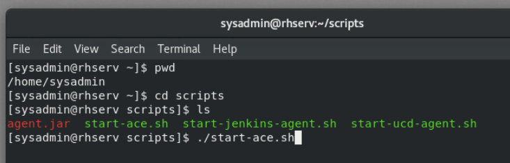</td>
</tr>
<tr class="odd">
<td>5</td>
<td>
We will now start the IBM App Connect Enterprise (ACE) Toolkit eclipse-based IDE. It is a great tool for developers as they develop APIs.

To start the ACE Toolkit, we need to first source the ACE mqsiprofile by running this command:

$ . /opt/IBM/ace-12.0.10.0/server/bin/mqsiprofile
</td>
<td>
. /opt/IBM/ace-12.0.10.0/server/bin/mqsiprofile

<strong>NOTE:</strong> there is a space after the . shown above.

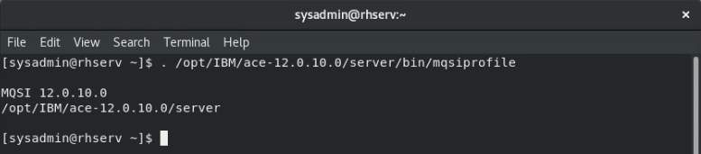
</td>
</tr>
<tr class="even">
<td>5</td>
<td>
We can now start the IBM App Connect Enterprise Toolkit eclipse-based IDE.

Run the commands below to start the toolkit:

$ cd /opt/IBM/ace-12.0.10.0

$ ./ace toolkit
</td>
<td>
# cd /opt/IBM/ace-12.0.10.0

# ./ace toolkit

You should see output as follows:

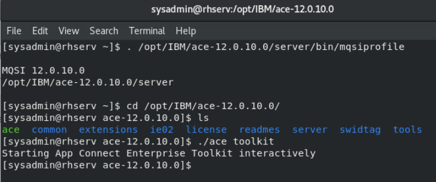
</td>
</tr>
<tr class="odd">
<td>6</td>
<td>
A launcher dialog will appear.

Take the default workspace that is shown and click the “<strong>Launch</strong>” button.
</td>
<td></td>
</tr>
<tr class="even">
<td>7</td>
<td>The IDE will appear as shown to the right and your workspace is already populated with an example ACE project we will use.</td>
<td>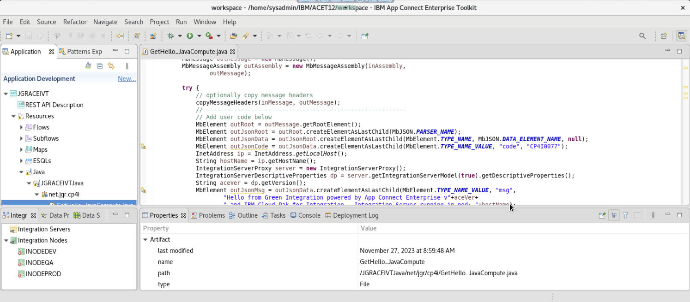</td>
</tr>
<tr class="odd">
<td>8</td>
<td>
As a developer, you can edit your ACE code in the IDE, compile your code, and deploy to a DEV environment.

Let’s make a small change to our program to see how this works in the IDE.
</td>
<td></td>
</tr>
<tr class="even">
<td>9</td>
<td>In the <strong>GetHello_JavaCompute.java</strong> program, scroll down to the line that starts with “MbElement outJsonMsg” as highlighted to the right.</td>
<td>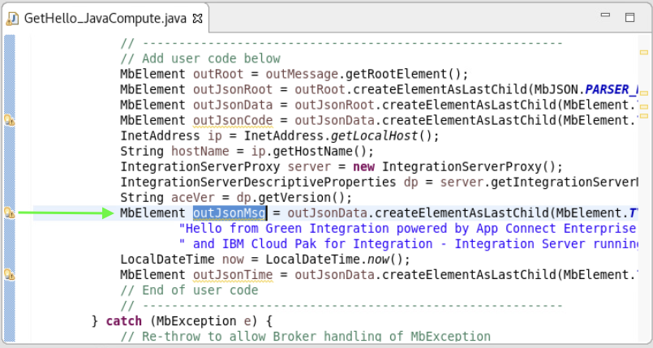</td>
</tr>
<tr class="odd">
<td>10</td>
<td>Change the text that says “Hello from <strong>Green</strong> Integration powered by…” to “Hello from <strong>Blue</strong> Integration powered by…” as shown to the right</td>
<td>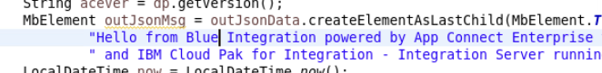</td>
</tr>
<tr class="even">
<td>11</td>
<td>
Save your changes by clicking on the File menu and then clicking “Save”

or

by clicking the Save icon as shown to the right.
</td>
<td>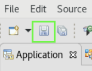</td>
</tr>
<tr class="odd">
<td>12</td>
<td>
You can build and deploy your BAR file in a single step using the IDE.

Expand the INODEDEV integration node that is shown towards the bottom of the page.

You should see the child node, “Emerald-ACE-DEV”, which is an integration server as shown to the right.
</td>
<td>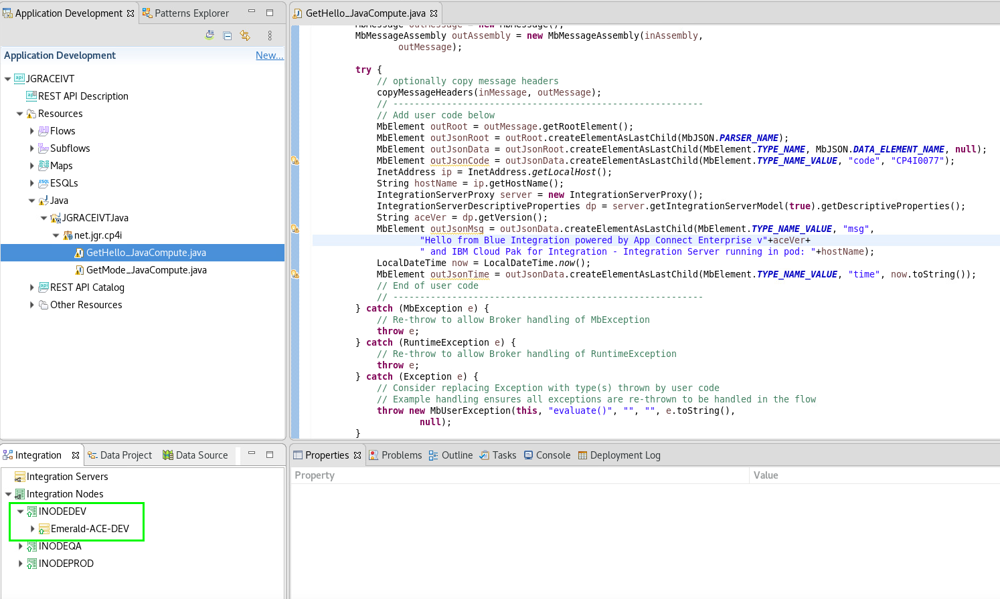</td>
</tr>
<tr class="even">
<td>13</td>
<td>To initiate the build and deploy, in the left-hand pane, drag “<strong>JGRACEIVT</strong>” from the top pane to the “<strong>Emerald-ACE-DEV</strong>” integration server as shown in the screen shot above.</td>
<td>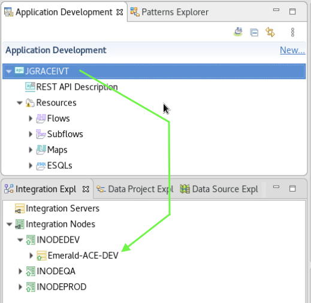</td>
</tr>
<tr class="odd">
<td>14</td>
<td>
A “Progress Information” dialog will appear to show you the progress of your build and deployment.

The task should complete successfully as shown to the right.

In the messages that appear, you should see that your BAR file has been successfully deployed to the integration server, Emerald-ACE-DEV.
</td>
<td>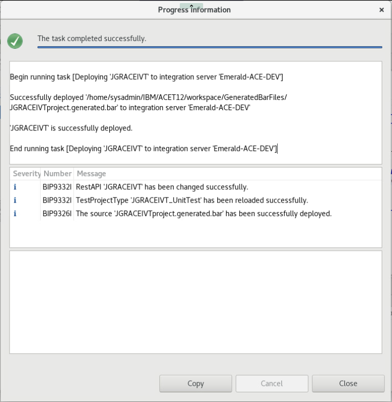</td>
</tr>
<tr class="even">
<td>15</td>
<td>Click the ‘<strong>Close</strong>’ button to close the ‘Progress Information’ window.</td>
<td></td>
</tr>
<tr class="odd">
<td>16</td>
<td>
Click the ‘Deployment Log’ perspective at the bottom of the screen to see a log of your deployments.

Expand the parent tree node to see all the messages as shown to the right.
</td>
<td>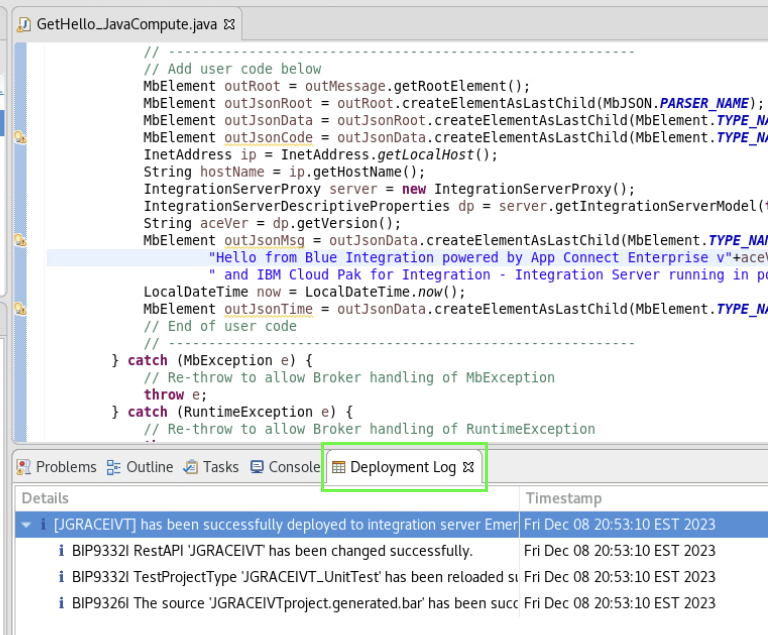</td>
</tr>
<tr class="even">
<td>17</td>
<td>
We will now validate that our changes are visible in this new version of the BAR.

You can minimize the ACE IDE by clicking on the application workspace icon at the bottom of the screen.

Open a Firefox dialog using the Desktop shortcut as shown to the right.
</td>
<td>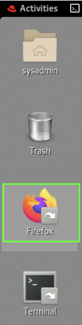</td>
</tr>
<tr class="odd">
<td>18</td>
<td>Click on the “IBM ACE – INODEDEV” bookmark found in the bookmark bar as shown to the right.</td>
<td>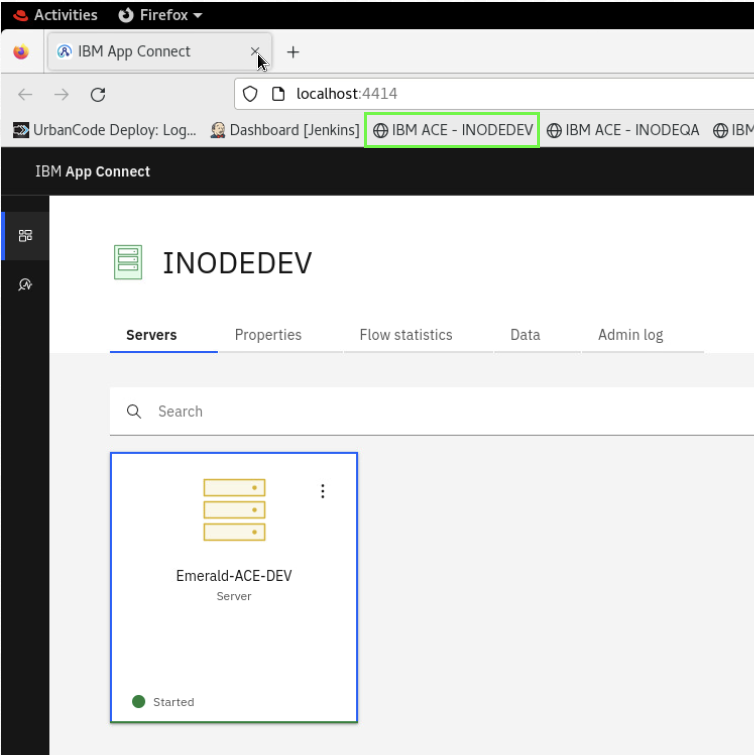</td>
</tr>
<tr class="even">
<td>19</td>
<td>
First, click on ‘Emerald-ACE-DEV’ and you will see the ‘JGRACEIVT’ api.

Second, click on ‘JGRACEIVT’ and you will see the Documentation tab of the API as shown to the right.

Notice the ‘Endpoint’ value. Copy this to your buffer.
</td>
<td>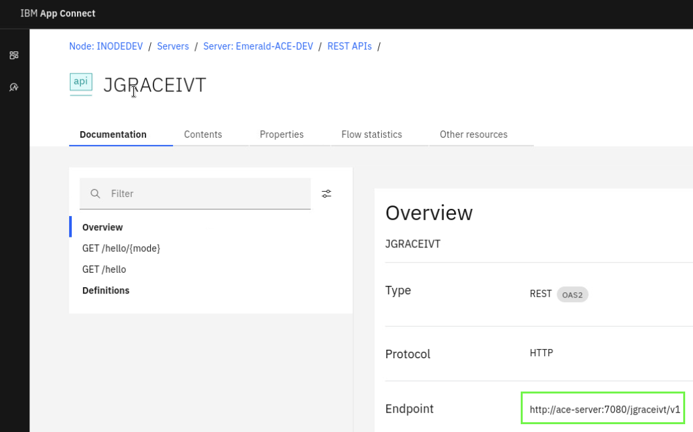</td>
</tr>
<tr class="odd">
<td>20</td>
<td>
In your browser, open a new tab and paste the endpoint value into the browser and append /hello as shown below to the URL:

<a href="http://ace-server:7080/jgraceivt/v1/hello">http://ace-server:7080/jgraceivt/v1/hello</a>

Press Enter.
</td>
<td>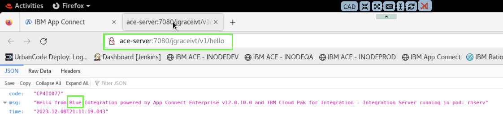</td>
</tr>
<tr class="even">
<td>21</td>
<td>
You should see ‘Blue’ in the message as shown above.

You have completed this section! In the next section, we will explore a way to create an automated build process in a CI/CD pipeline as well as automatically run some unit tests against your ACE BAR.
</td>
<td>
<strong>NOTE:</strong> You would not want your developers performing automating deployments to QA or PROD from their local desktop IDE.

You would want a proper DevOps pipeline to ensure you have the right controls and governance in place.
</td>
</tr>
<tr class="odd">
<td><strong>End of Section – 3.1</strong></td>
<td></td>
<td></td>
</tr>
</tbody>
</table>

## Setup a Jenkins CI Pipeline to Automate Build

### Overview

In the past, many developers using their IDE would build a new BAR and
copy it to a shared folder that others would pick up for deployment. The
issue with this is you do not have traceability back to the build, you
are not placing the artifact in a definitive asset repository that is
immutable, and you don’t have any real record of the build or
deployment.

In this lab section, you will explore an example Continuous Integration
(CI) Pipeline using Jenkins. This pipeline requires that developer’s
check-in their code changes to a git repository. You could configure the
pipeline to automatically trigger a build on code-commit if you like or
on-demand.

You will see in this lab that we have incorporated a stage to run unit
tests and to push the deployable artifact (a BAR file) to IBM DevOps
Deploy’s version repository called ‘codestation’, which is like a JFrog
Artifactory or Sonatype Nexus. Using this pipeline, we will have full
traceability and trail of audit with proper governance.

### Workbook Steps

### 

<table>
<thead>
<tr class="header">
<th><strong>Step</strong></th>
<th><strong>Details</strong></th>
<th><strong>Additional Information</strong></th>
</tr>
</thead>
<tbody>
<tr class="odd">
<td>1</td>
<td>
Before we open our Jenkins pipeline, we need to start our Jenkins build agent.

Open a <strong>new terminal</strong> <strong>window</strong> by clicking on Activities at the upper left-hand corner of the screen and then click on the Terminal icon as shown to the right.

<strong>NOTE:</strong> we are opening a new terminal to ensure JAVA_HOME is set to a Java 11 installation on the host.
</td>
<td>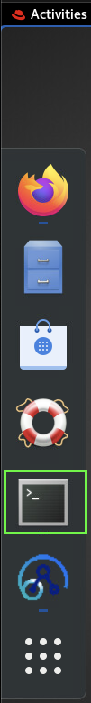 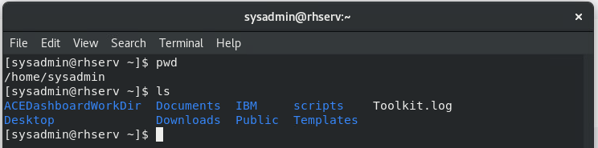</td>
</tr>
<tr class="even">
<td>2</td>
<td>
In the terminal window, change directories to /home/sysadmin/scripts

$ cd /home/sysadmin/scripts
</td>
<td>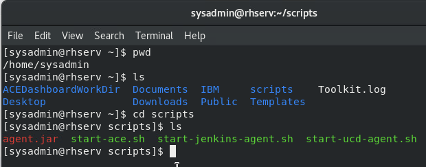</td>
</tr>
<tr class="odd">
<td>3</td>
<td>
Run the following command to start the Jenkins agent:

$ sudo ./start-jenkins-agent.sh
</td>
<td>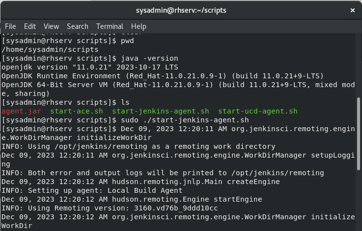</td>
</tr>
<tr class="even">
<td>4</td>
<td>
We also need to start the IBM DevOps Deploy Agent used for deployment.

Run the following command to start the Deploy agent:

$ sudo ./start-ucd-agent.sh
</td>
<td>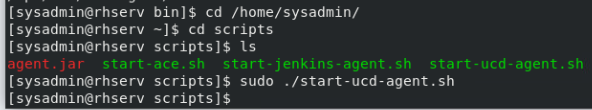</td>
</tr>
<tr class="odd">
<td>5</td>
<td>
We can now explore our Jenkins CI pipeline.

In your Firefox browser window, create a new tab and click on the “<strong>Dashboard [Jenkins]</strong>” bookmark as shown to the right
</td>
<td>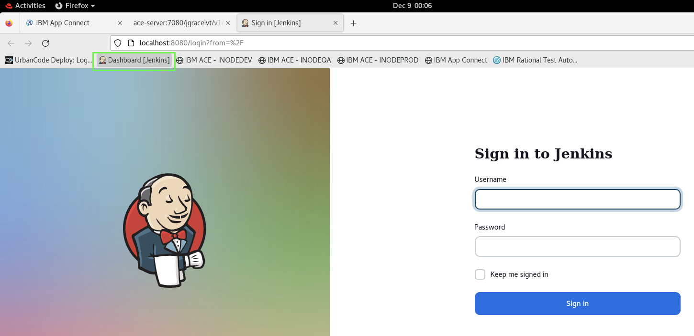</td>
</tr>
<tr class="even">
<td>6</td>
<td>Login to the console with a user of “<strong>admin</strong>” and a password of “<strong>password</strong>”</td>
<td></td>
</tr>
<tr class="odd">
<td>7</td>
<td>Click on the “<strong>emerald-ace</strong>” pipeline as shown to the right</td>
<td>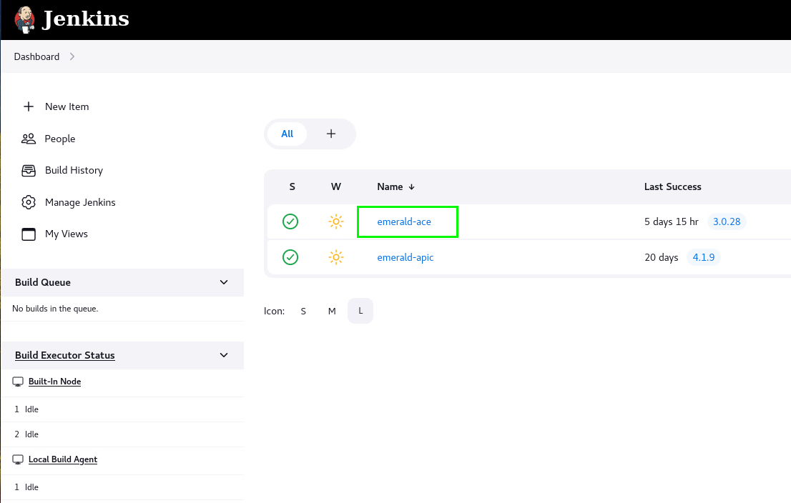</td>
</tr>
<tr class="even">
<td><strong>INFO</strong></td>
<td>This is an example pipeline that is pointed to a GitHub repository that I have created for this lab. Take time to explore the pipeline as much as you like.</td>
<td></td>
</tr>
<tr class="odd">
<td>8</td>
<td>
You will see the ‘emerald-ace’ pipeline and you can see each stage on the right-hand side which includes:

<ul>
<li>
Cloning the repository
</li>
<li>
Build
</li>
<li>
UnitTest
</li>
<li>
Push Artifact of Build to IBM DevOps Deploy
</li>
</ul></td>
<td>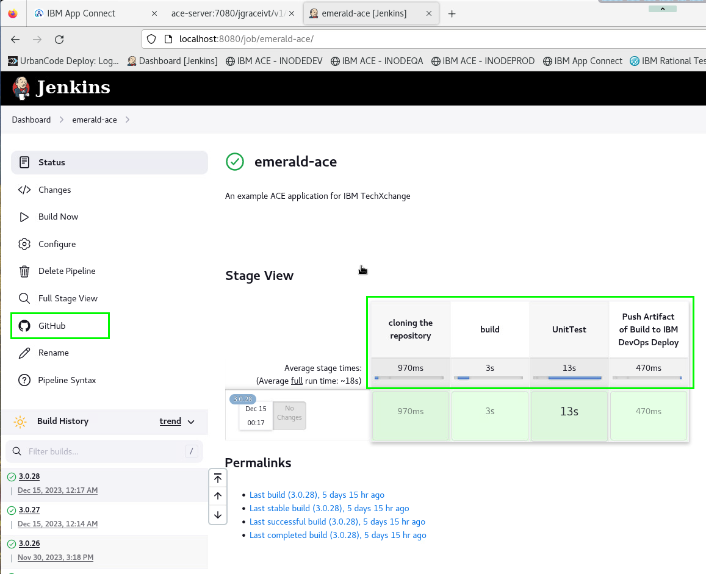</td>
</tr>
<tr class="even">
<td>9</td>
<td>
Move mouse over the “GitHub” found in the left-hand pane.

Right click on this link and select “Open Link in a New Tab” as shown to the right.
</td>
<td>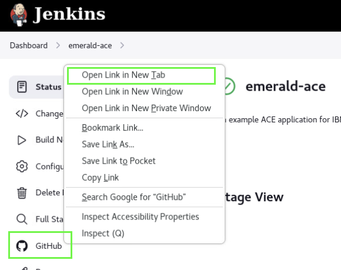</td>
</tr>
<tr class="odd">
<td>10</td>
<td>
This is the same code that you were working with in the first lab.

The focus of this lab is to explain how you can setup a CI pipeline that includes automated unit testing and deployment as part of the process.
</td>
<td>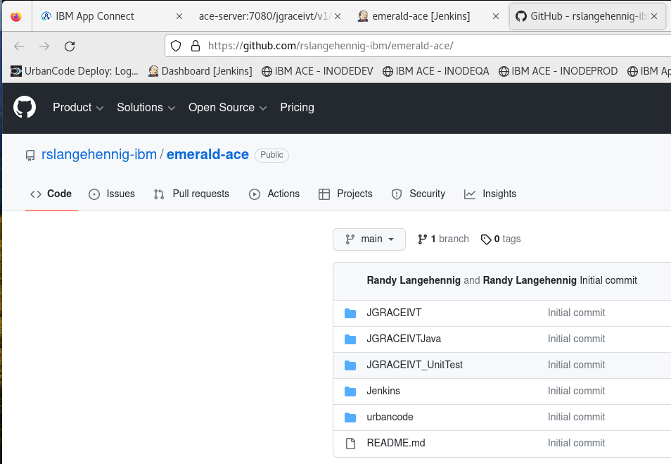</td>
</tr>
<tr class="even">
<td>11</td>
<td>
Return to the Jenkins tab in your browser.

Notice the build history at the bottom left showing you the most recent builds.

Notice the build tags that identify each build (3.0.28, 3.0.27, etc).
</td>
<td>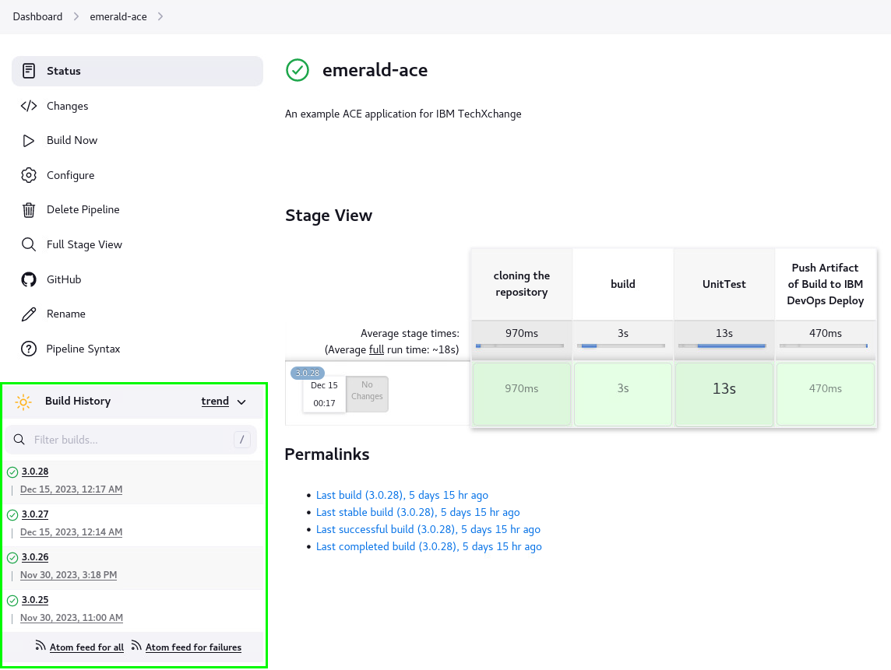</td>
</tr>
<tr class="odd">
<td>12</td>
<td>Click the “Configure” link in the left-hand pane to explore the build pipeline.</td>
<td>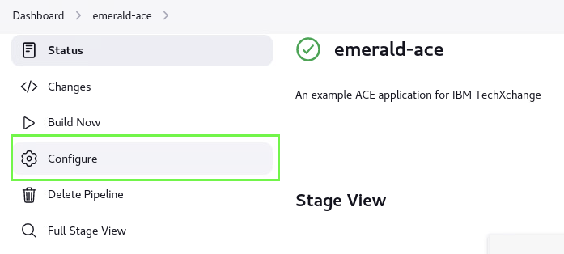</td>
</tr>
<tr class="even">
<td>13</td>
<td>
Scroll down to the Pipeline script area as shown to the right.

<strong>NOTE:</strong> You can make the script pane larger by dragging the text area further down using your mouse.
</td>
<td>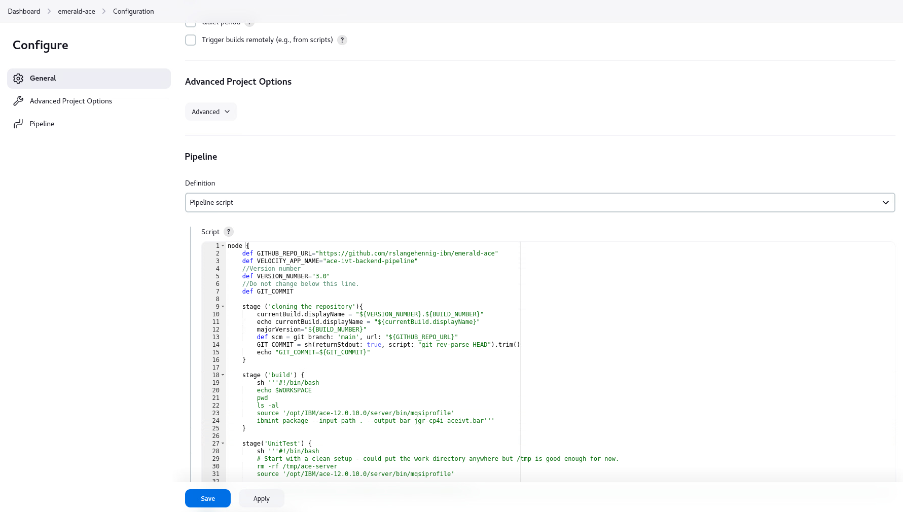</td>
</tr>
<tr class="odd">
<td>14</td>
<td>In the pipeline view, you will see each stage of the build process. Our first stage is to ‘Clone the Repository’ which will pull down your source code from git to a workspace that is used by the Jenkins Agent to perform the build.</td>
<td>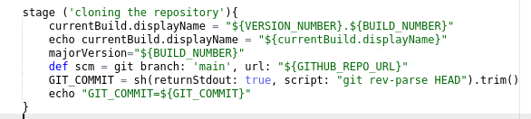</td>
</tr>
<tr class="even">
<td>15</td>
<td>Next, you see the ‘Build’ stage of the process. This is where the agent will use the ‘<strong>ibmint</strong>’ command to build your broker archive (BAR) image.</td>
<td>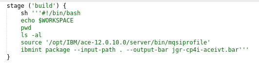</td>
</tr>
<tr class="odd">
<td>16</td>
<td>As you scroll down, you will find a ‘UnitTest’ stage of the pipeline to run unit tests against your newly built BAR file. This helps to ensure your changes did not break any functionality.</td>
<td>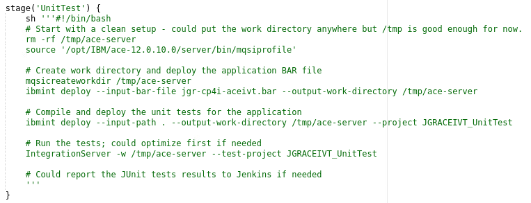</td>
</tr>
<tr class="even">
<td>17</td>
<td>For now, scroll back to the top of the browser and click on ‘emerald-ace’ in the crumb trail as shown to the right.</td>
<td>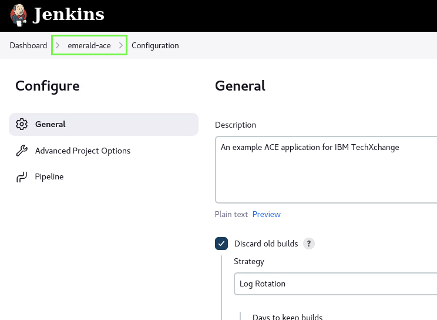</td>
</tr>
<tr class="odd">
<td>18</td>
<td>
Let’s start a build and watch it run.

Click the ‘<strong>Build Now</strong>’ button in the left-hand pane.
</td>
<td>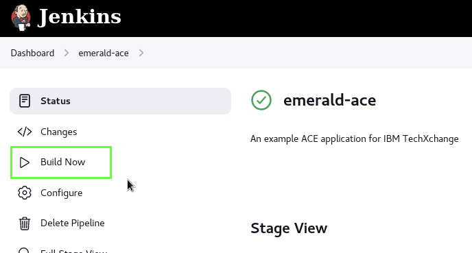</td>
</tr>
<tr class="even">
<td>19</td>
<td>The build will initiate, and you will see a new build labeled ‘3.0.29’ in the bottom left-hand ‘Build History’ pane as shown to the right.</td>
<td>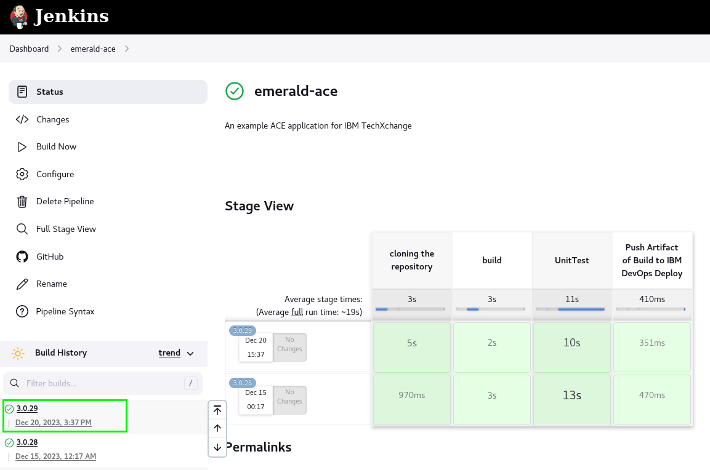</td>
</tr>
<tr class="odd">
<td>20</td>
<td>
When the build completes, click on the green checkmark next to the 3.0.29 build label in the Build History as shown above.

This will allow you to see the Console Output for the build shown to the right.
</td>
<td>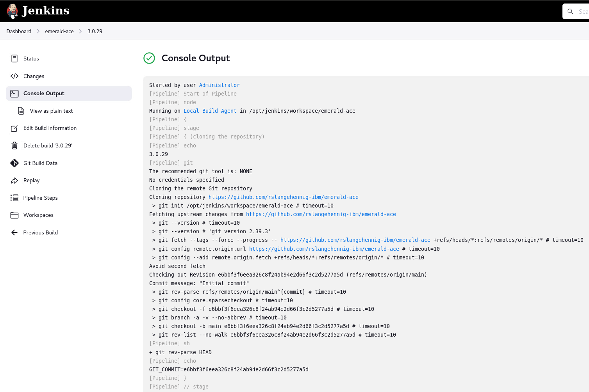</td>
</tr>
<tr class="even">
<td>21</td>
<td>Scroll down and you will see the successful build of the BAR.</td>
<td>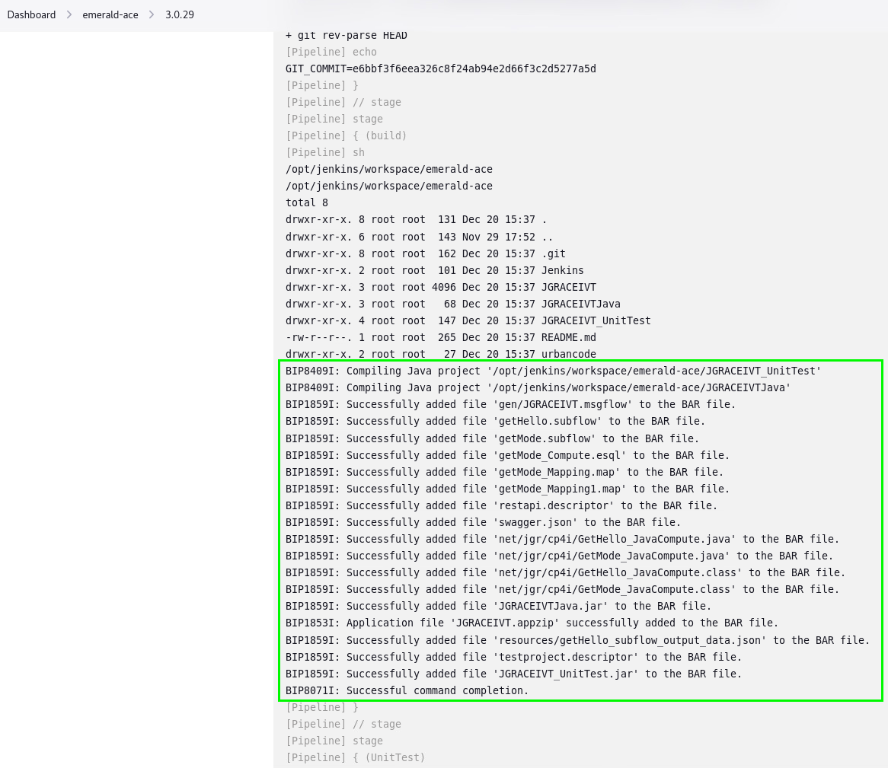</td>
</tr>
<tr class="odd">
<td>22</td>
<td>Scroll down a little further and you will see the Unit Tests were run and that they were successful.</td>
<td>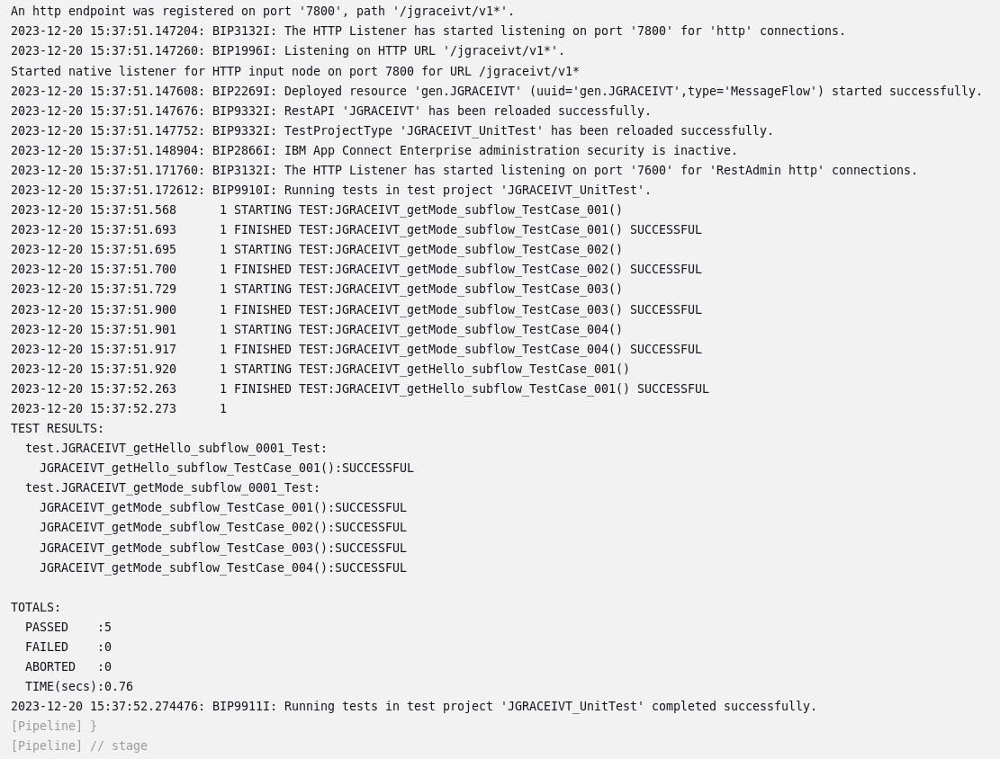</td>
</tr>
<tr class="even">
<td>23</td>
<td>
If you scroll down, you will notice one more stage called ‘<strong>Push Artifact of Build to IBM DevOps Deploy</strong>’. This stage is not configured yet.

Let’s modify this build project to perform this step so we can deploy our BAR file to our target environments.
</td>
<td>We will work on this stage together to enable it to push the BAR to the DevOps Deploy Server for automated deployment.</td>
</tr>
<tr class="odd">
<td>24</td>
<td>
In your browser window, create a new tab.

Then click on the ‘<strong>UrbanCode Deploy: Login</strong>’ bookmark in the toolbar as shown to the right.
</td>
<td>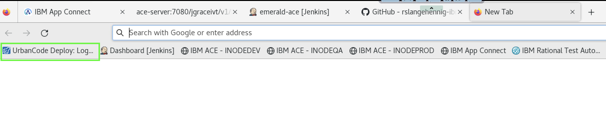</td>
</tr>
<tr class="even">
<td>25</td>
<td>Login as the user ‘<strong>admin’</strong> and with a password of ‘<strong>admin’</strong></td>
<td>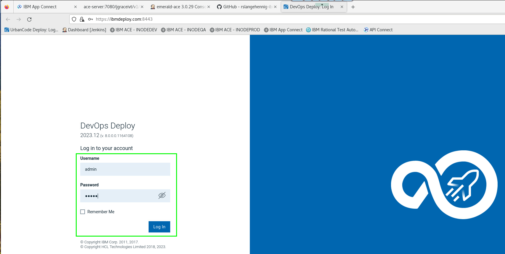</td>
</tr>
<tr class="odd">
<td>26</td>
<td>Click on Components at the top of the page as shown to the right</td>
<td>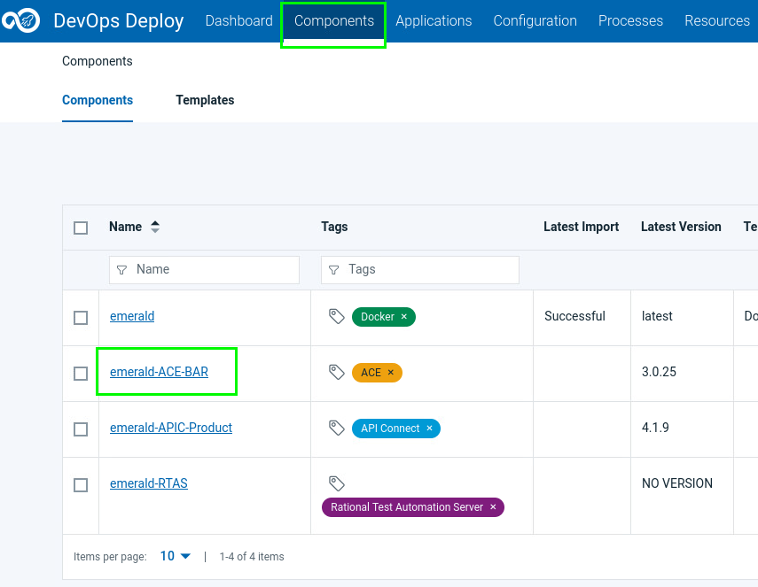</td>
</tr>
<tr class="even">
<td>27</td>
<td>Click on ‘emerald-ACE-BAR’ as shown above to view this component</td>
<td></td>
</tr>
<tr class="odd">
<td>28</td>
<td>
Notice the component versions listed.

This is where are Jenkins build process will push the built artifact as a new component version using the build tag.
</td>
<td>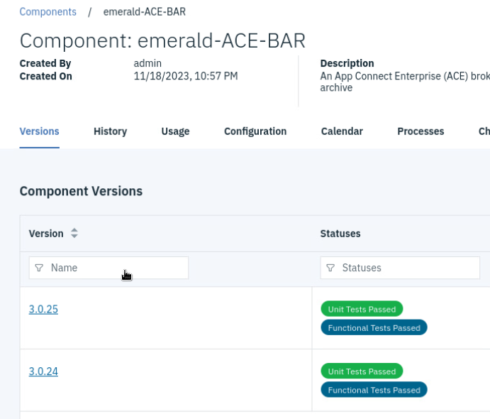</td>
</tr>
<tr class="even">
<td>29</td>
<td>
In order for the Jenkins build to push the new component version, we need to create an Authentication Token that it can use.

Click on the <strong>Settings</strong> tab at the top right-hand side of the page.
</td>
<td>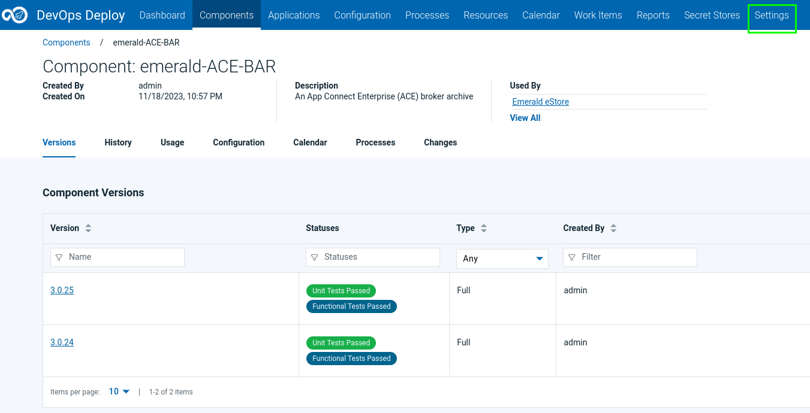</td>
</tr>
<tr class="odd">
<td>30</td>
<td>Click on <strong>Tokens</strong> found in the Security section of the Settings page.</td>
<td>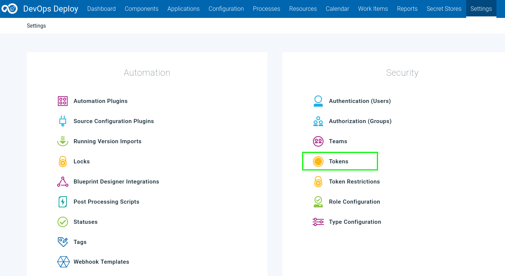</td>
</tr>
<tr class="even">
<td>31</td>
<td>Click on the ‘<strong>Create Token</strong>’ button</td>
<td>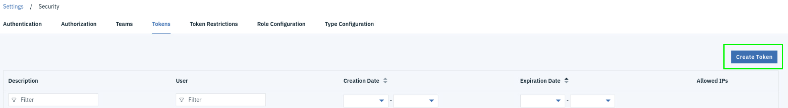</td>
</tr>
<tr class="odd">
<td>32</td>
<td>
The Create Token dialog will appear. Use the following follows:

Description: Jenkins Token

User: admin

Expiration Date: 12/13/2024

Expiration Time: 08:00 AM
</td>
<td></td>
</tr>
<tr class="even">
<td>33</td>
<td>Click Save</td>
<td></td>
</tr>
<tr class="odd">
<td>34</td>
<td>In the Newly Created Token dialog that appears, copy the Token value to your buffer.</td>
<td>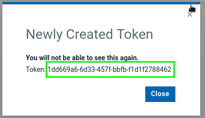</td>
</tr>
<tr class="even">
<td>35</td>
<td>Open a Text Editor by clicking on Activities at the top left-hand side of the page (step 1) and then click on the dots (step 2) to see all the applications.</td>
<td>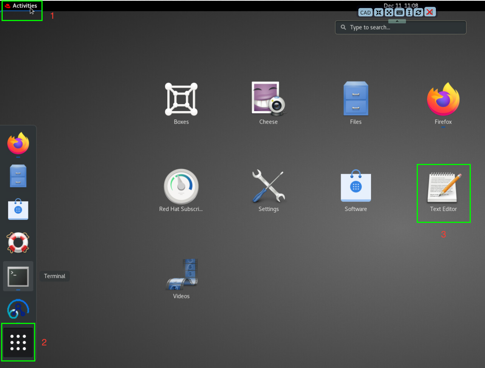</td>
</tr>
<tr class="odd">
<td>36</td>
<td>Click on the <strong>Text Editor</strong> icon (step 3) as shown above to start the editor.</td>
<td></td>
</tr>
<tr class="even">
<td>37</td>
<td>In the terminal window, enter ‘Deploy Token:’ and then paste your auth token.</td>
<td>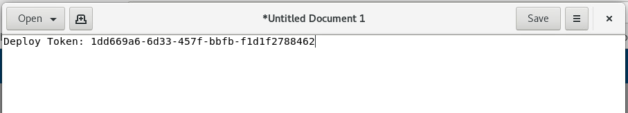</td>
</tr>
<tr class="odd">
<td>38</td>
<td>Close the ‘Newly Created Token’ dialog in the Deploy web console by clicking the ‘Close’ button.</td>
<td>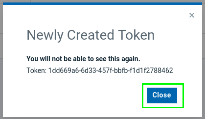</td>
</tr>
<tr class="even">
<td>39</td>
<td>
Return to your Jenkins tab in your browser.

Return to the ‘emerald-ace’ project as shown to the right. You can click on ‘emerald-ace’ in the crumb trail at upper-right of screen to return to this page.
</td>
<td>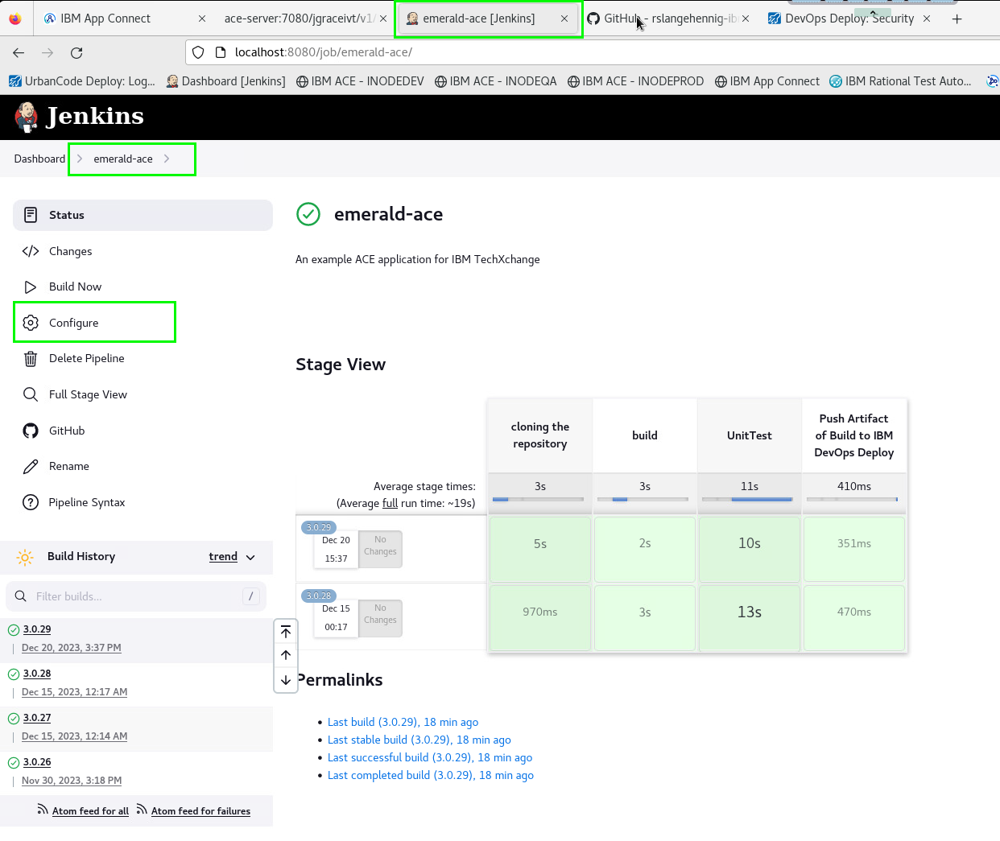</td>
</tr>
<tr class="odd">
<td>40</td>
<td>Click on ‘Configure’ for the ‘emerald-ace’ pipeline as shown above</td>
<td></td>
</tr>
<tr class="even">
<td>41</td>
<td>Scroll down to the Pipeline script and expand the script pane to give you more space to work with.</td>
<td>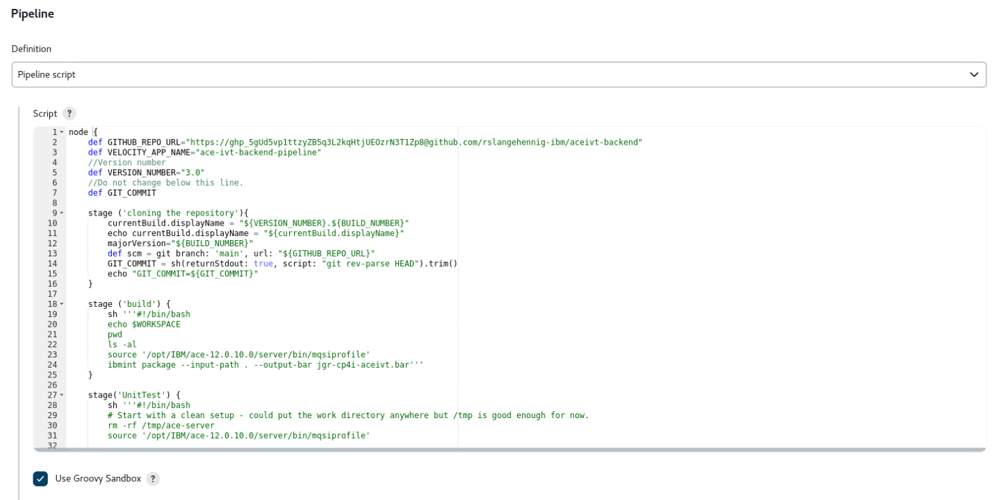</td>
</tr>
<tr class="odd">
<td>42</td>
<td>In the script area, scroll down to the ‘<strong>Push Artifact of Build to IBM DevOps Deploy’</strong> stage.</td>
<td></td>
</tr>
<tr class="even">
<td>43</td>
<td>
Notice line 50 of the script:

export UCD_AUTH_TOKEN=”replace-me”
</td>
<td>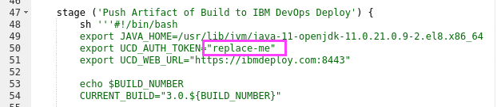</td>
</tr>
<tr class="odd">
<td>44</td>
<td>
Paste your new auth token value to replace the ‘replace-me’ text as shown in the example to the right.

<strong>NOTE:</strong> normally this would be configured as a secure property.
</td>
<td>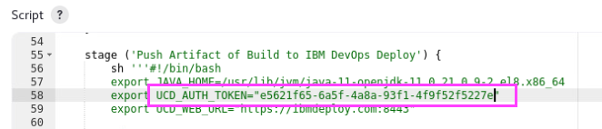</td>
</tr>
<tr class="even">
<td>45</td>
<td>
Scroll down and remove the # at the beginning of lines 70-72 to uncomment them.

This will allow the pipeline to create a new component version using the IBM DevOps Deploy udclient command.
</td>
<td>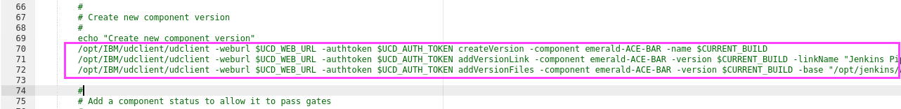</td>
</tr>
<tr class="odd">
<td>46</td>
<td>Scroll down to line 78 and remove the # to uncomment this line so it will add a component status of ‘Unit Tests Passed’</td>
<td>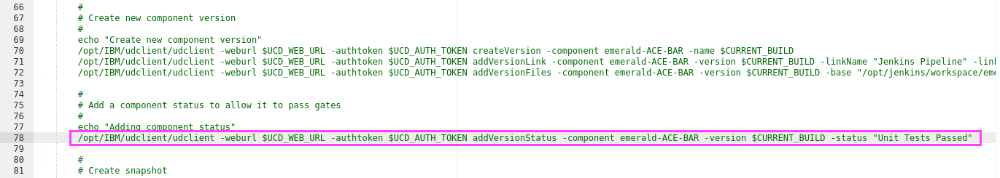</td>
</tr>
<tr class="even">
<td>47</td>
<td>
Click ‘<strong>Save</strong>’ to save your updates to the pipeline script.

<strong>NOTE:</strong> you do not need to uncomment lines 83-87. Leave them as they were.
</td>
<td>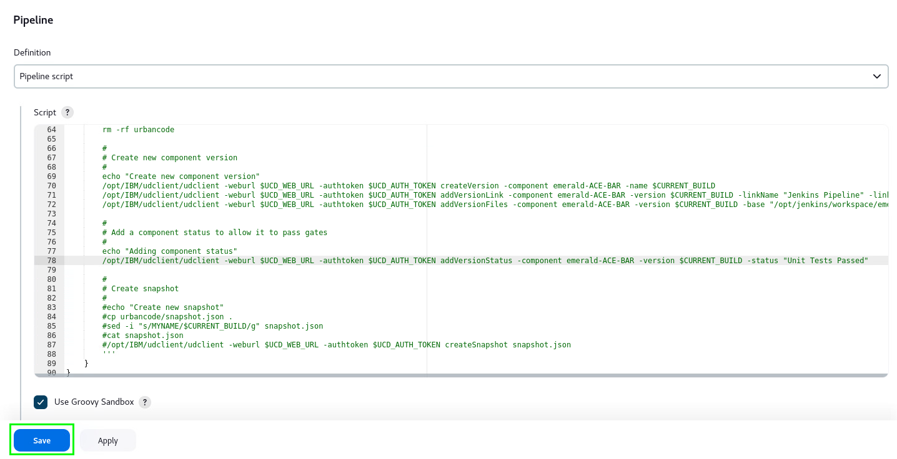</td>
</tr>
<tr class="odd">
<td>48</td>
<td>In the crumb trail at the top left, click on ‘emerald-ace’</td>
<td>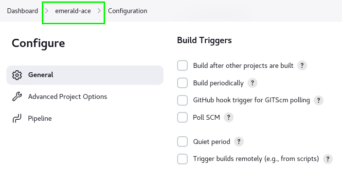</td>
</tr>
<tr class="even">
<td>49</td>
<td>Initiate a new build by clicking the ‘<strong>Build Now</strong>’ button</td>
<td>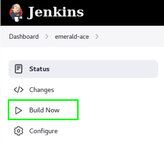</td>
</tr>
<tr class="odd">
<td>50</td>
<td>
You will see a new build initiate.

The build should complete successfully.
</td>
<td>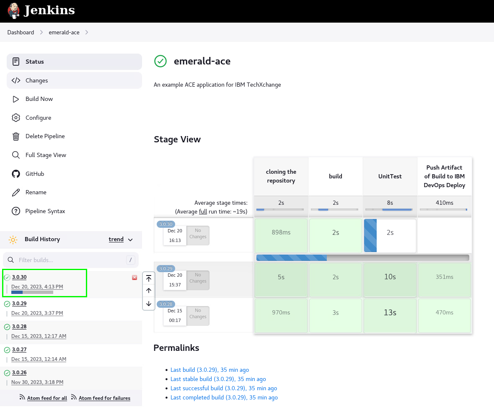</td>
</tr>
<tr class="even">
<td>51</td>
<td>
Examine the build output and you should see that it was successful in creating a new component version to push the new deployable artifact.

<strong>NOTE:</strong> DevOps Deploy can integrate with other definitive asset repositories like JFrog Artifactory or Sonatype Nexus.
</td>
<td>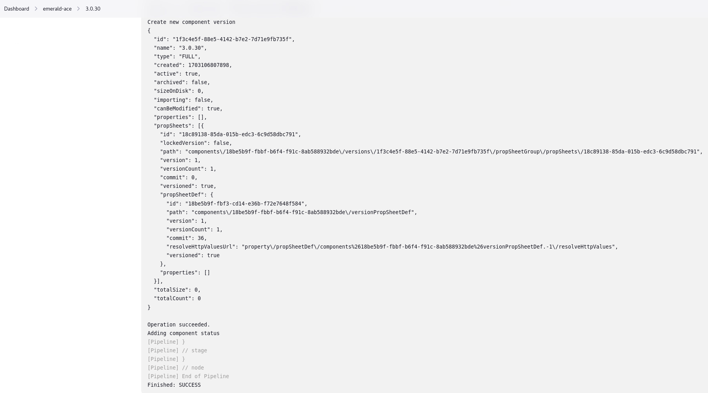</td>
</tr>
<tr class="odd">
<td>52</td>
<td>In your browser, click on the ‘DevOps Deploy’ tab.</td>
<td></td>
</tr>
<tr class="even">
<td>53</td>
<td>
Click on Components at the top of the page.

NOTE: you may need to re-authenticate using username of ‘admin’ and password of ‘admin’
</td>
<td>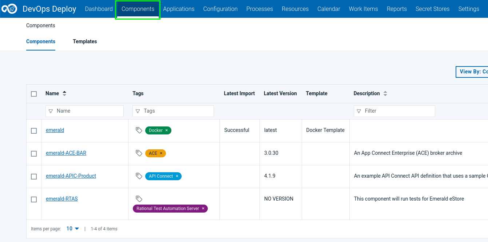</td>
</tr>
<tr class="odd">
<td>54</td>
<td>Click on the ‘emerald-ACE-BAR’ component.</td>
<td></td>
</tr>
<tr class="even">
<td>55</td>
<td>You should see a new component version, 3.0.30, in the list of Component Versions as shown to the right.</td>
<td>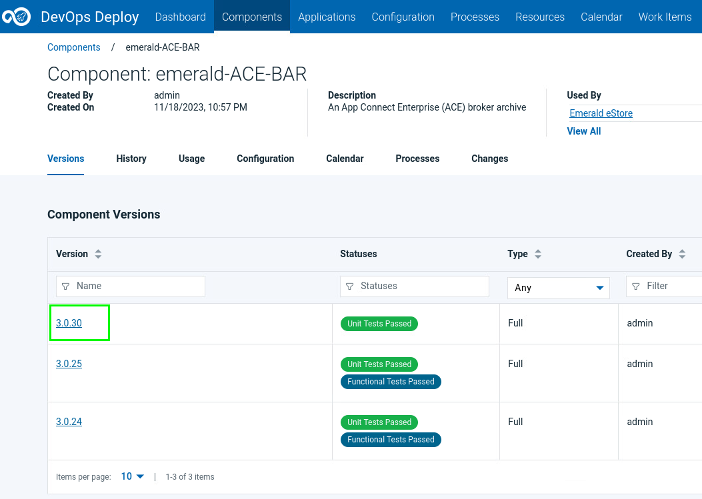</td>
</tr>
<tr class="odd">
<td>56</td>
<td>
Click on 3.0.30 to view the new version.

Notice the immutable artifact in the Artifacts list, <strong>jgr-cp4i-aceivt.bar</strong>. A component version can have one or more files.
</td>
<td>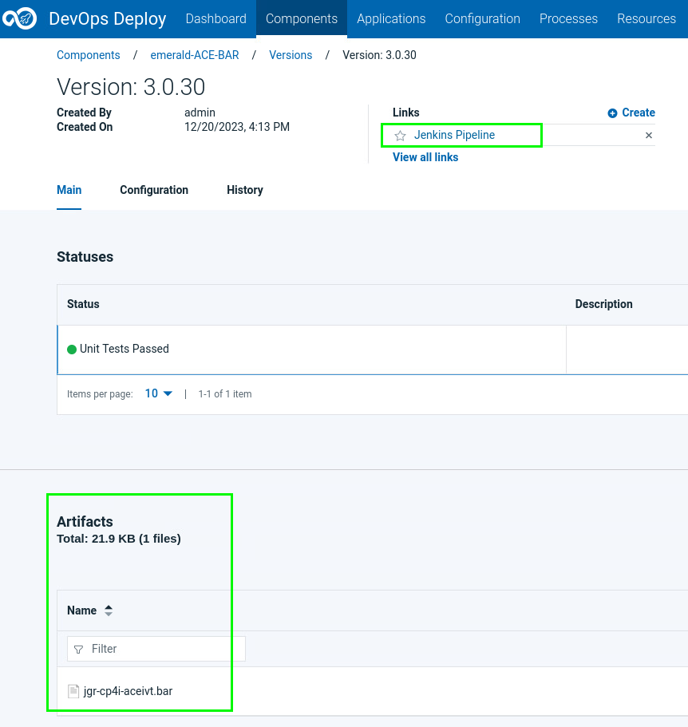</td>
</tr>
<tr class="even">
<td>57</td>
<td>
Notice the link back to the Jenkins pipeline (see screenshot above) so you have traceability back to the build and the git commit.

If you right click on the link, you can open this link in a new tab. It will take you to the build ‘Console Output’ as shown to the right.
</td>
<td>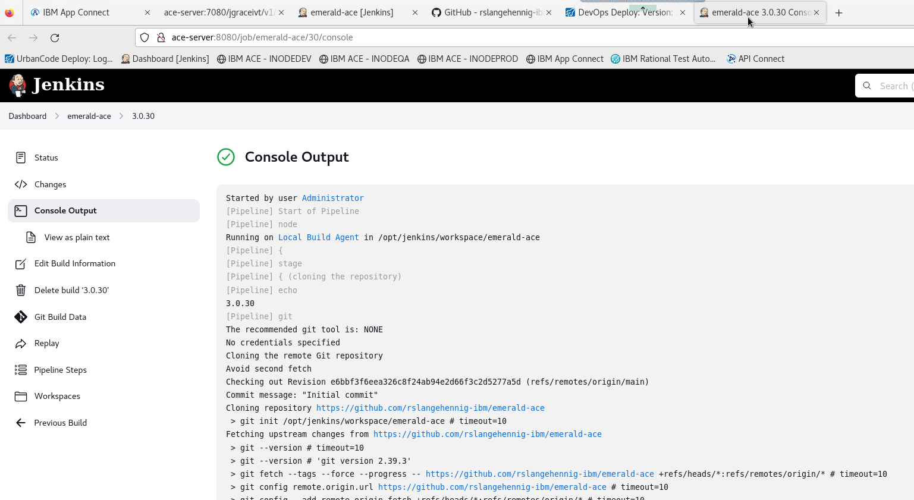</td>
</tr>
<tr class="odd">
<td>58</td>
<td>
You have completed this lab.

In the next lab, we will look at the deployment of the application in IBM DevOps Deploy.
</td>
<td></td>
</tr>
<tr class="even">
<td><strong>End of Section – 3.2</strong></td>
<td></td>
<td></td>
</tr>
</tbody>
</table>

## Review the Emerald eStore Application in IBM DevOps Deploy

### Overview

In this lab section, you will explore the ‘Emerald eStore’ application
in IBM DevOps Deploy. The solution leverages an application model that
is comprised of three parts:

1.  Environments

2.  Components that make up your application. You can have more than
    one.

3.  Processes to perform deployments.

### Workbook steps

<table>
<thead>
<tr class="header">
<th><strong>Step</strong></th>
<th><strong>Details</strong></th>
<th><strong>Additional Information</strong></th>
</tr>
</thead>
<tbody>
<tr class="odd">
<td>1</td>
<td>In your Firefox browse, return to the “Deploy” tab.</td>
<td>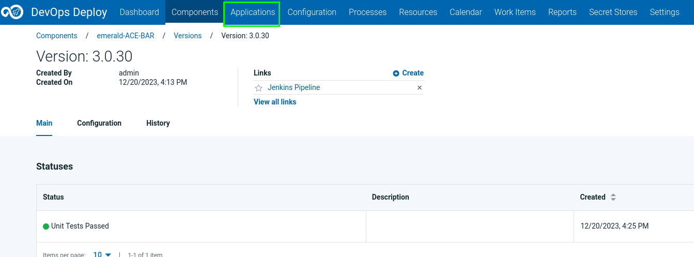</td>
</tr>
<tr class="even">
<td>2</td>
<td>Click on the “Applications” tab at the top of the page as highlighted above.</td>
<td><strong>NOTE:</strong> you may be asked to re-authenticate to the Deploy Console using your admin/admin credentials</td>
</tr>
<tr class="odd">
<td>3</td>
<td>
You will see the “<strong>Emerald eStore</strong>” application in the Applications list.

Click on “Emerald eStore” to view the application
</td>
<td>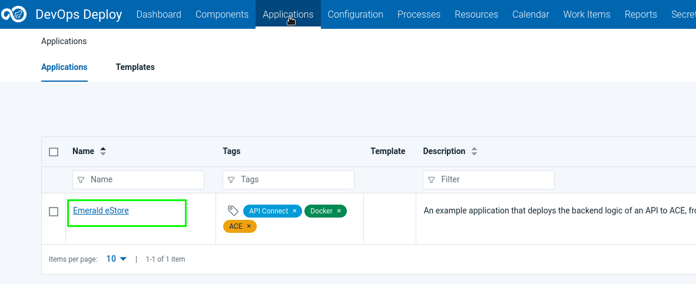</td>
</tr>
<tr class="even">
<td>4</td>
<td>The first part of the application model which we can see are the target environments which are DEV, QA, and PROD which are already configured for you.</td>
<td>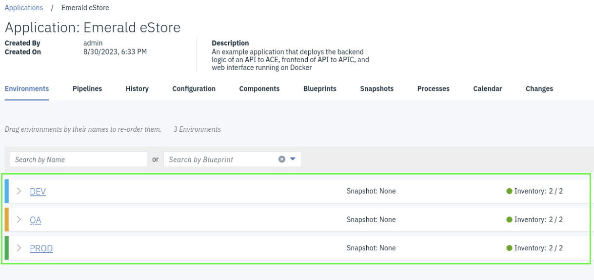</td>
</tr>
<tr class="odd">
<td>5</td>
<td>
Expand the DEV environment by clicking the arrow next to the DEV environment. You will see the second part of the model which are the components.

In this case, we have a component named “emerald” and our ACE component named “emerald-ACE-BAR”.

Notice that IBM DevOps Deploy tracks inventory of what is currently deployed in the DEV environment (e.g. 9.1.6-201 for “emerald” which is usually a build tag for traceability)
</td>
<td>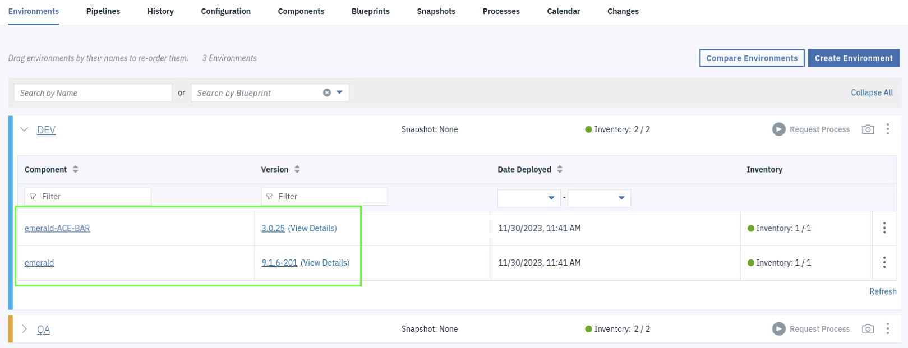</td>
</tr>
<tr class="even">
<td><strong>INFO</strong></td>
<td>
To see all the components, you can also click on the “Components” sub-tab.

Not all components will necessarily track inventory. For instance, the “emerald-RTAS” component will run operational processes to initiate test execution using Rational Test Automation Server.
</td>
<td></td>
</tr>
<tr class="odd">
<td>6</td>
<td>
The last part of the application model are processes. For now, click on the “Processes” sub-tab for our application to see our application process which will perform the deployment of the Emerald eStore application and more.

We will be updating a process as part of the next lab section.
</td>
<td>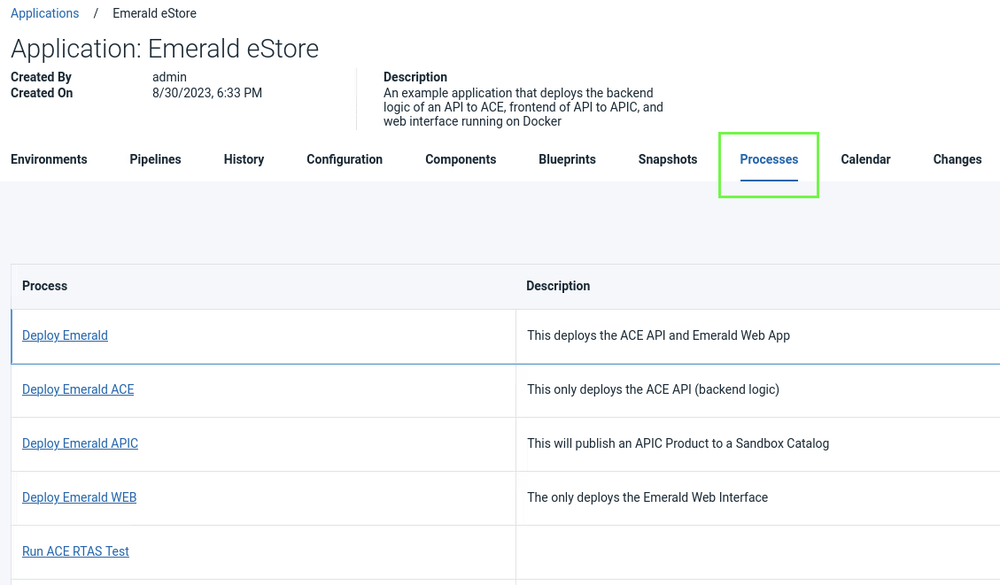</td>
</tr>
<tr class="even">
<td><strong>End of Section – 3.3</strong></td>
<td></td>
<td></td>
</tr>
</tbody>
</table>

## Work with the emerald-ACE-BAR Component in Deploy

### Overview

In this lab section, you will review the emerald-BAR component which
will be used to deploy your broker archive that was built earlier in the
lab. You will update the component process and then test the deployment
to a DEV environment.

### Workbook steps

<table>
<thead>
<tr class="header">
<th><strong>Step</strong></th>
<th><strong>Details</strong></th>
<th><strong>Additional Information</strong></th>
</tr>
</thead>
<tbody>
<tr class="odd">
<td>1</td>
<td>Continuing to work in the IBM DevOps Deploy application, click on the <strong>Components</strong> tab at the top of the page</td>
<td>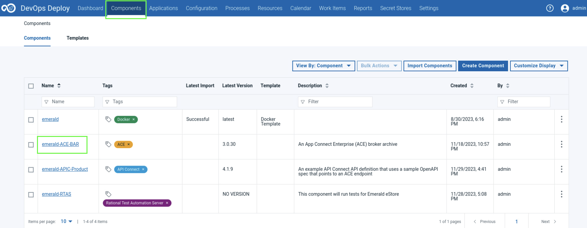</td>
</tr>
<tr class="even">
<td>2</td>
<td>Click on the “emerald-ACE-BAR” component as highlighted above</td>
<td></td>
</tr>
<tr class="odd">
<td>3</td>
<td>Click on the “History” sub-tab as highlighted to the right.</td>
<td>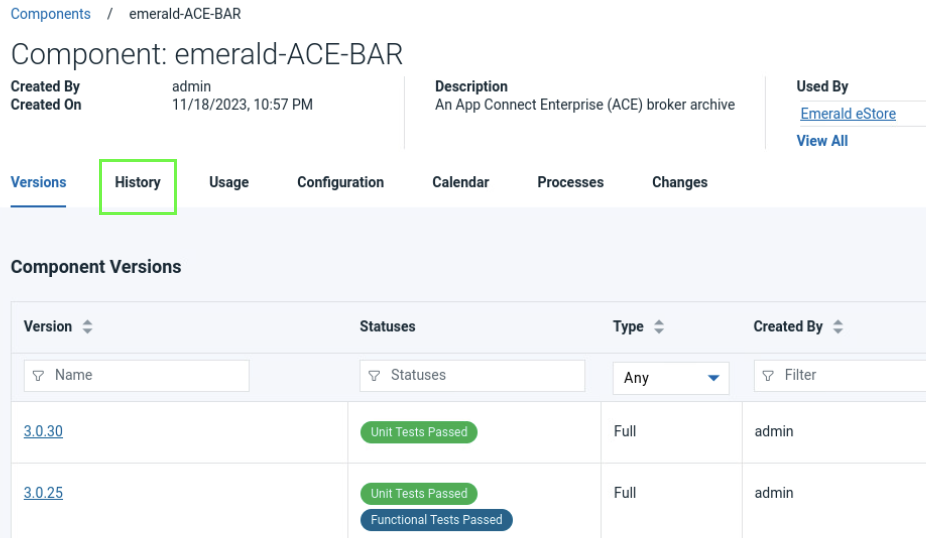</td>
</tr>
<tr class="even">
<td>4</td>
<td>This view will show you which versions of a component are deployed in each target environment.</td>
<td>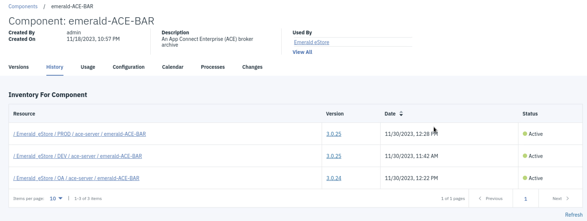</td>
</tr>
<tr class="odd">
<td>5</td>
<td>Click on the “Usage” sub-tab just to the right of the History sub-tab.</td>
<td></td>
</tr>
<tr class="even">
<td>6</td>
<td>The Usage tab will allow you to see which component version is currently deployed to a target environment, what used to be deployed in the environment prior, and at what days over time was it deployed there.</td>
<td>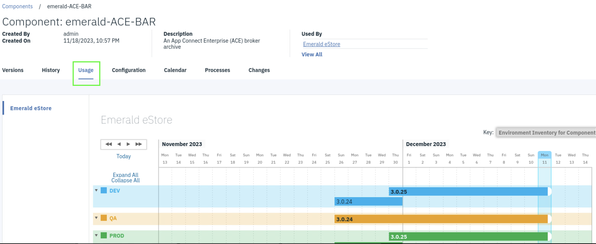</td>
</tr>
<tr class="odd">
<td>7</td>
<td>Click on the “Processes” sub-tab (see below)</td>
<td></td>
</tr>
<tr class="even">
<td>8</td>
<td>Click on the “Deploy-BAR” process as shown to the right</td>
<td>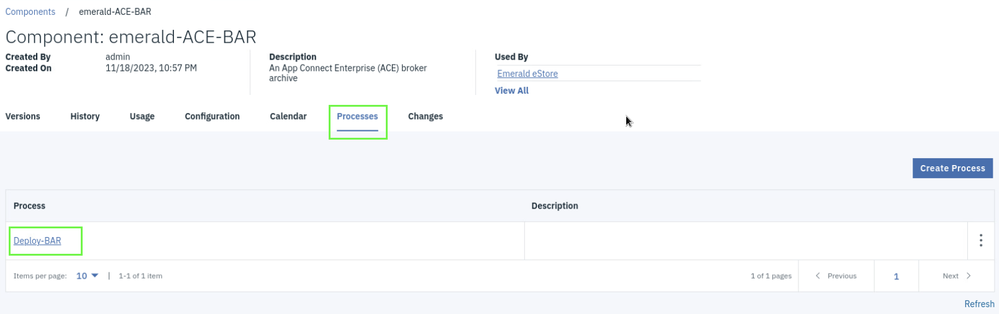</td>
</tr>
<tr class="odd">
<td>9</td>
<td>
The visual process designer will appear and display the component process.

This left-hand pane of the designer is where you will find all the steps that you can drag and drop onto the process design. You can add to these steps by installing automation plugins.

Notice the flow of the process. The first step downloads the artifact for deployment from IBM DevOps Deploy’s codestation repository.
</td>
<td>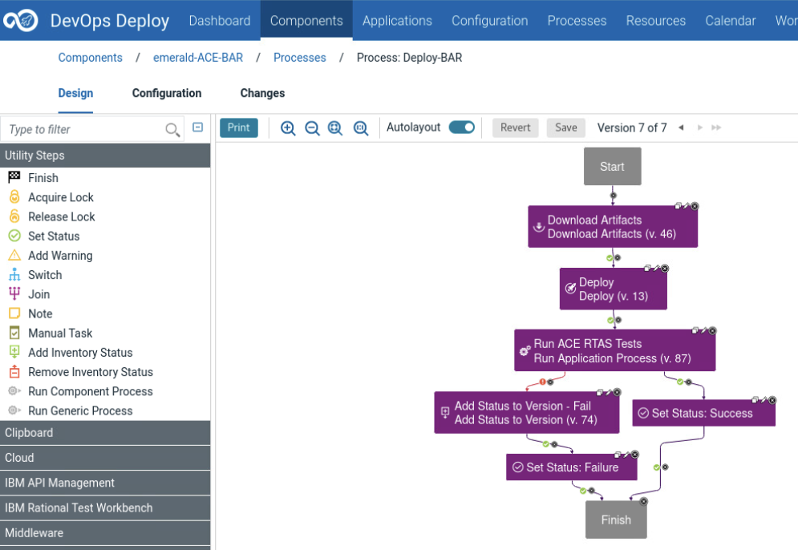</td>
</tr>
<tr class="even">
<td>10</td>
<td>
In the ‘Type to filter’ text area found at the upper left, type ‘ACE’ as shown.

The left-hand step-palette will display all of the IBM ACE plugin steps including the ‘Deploy’ step. This is the step we will use to deploy the broker archive (BAR) to an integration server running on an integration node.
</td>
<td>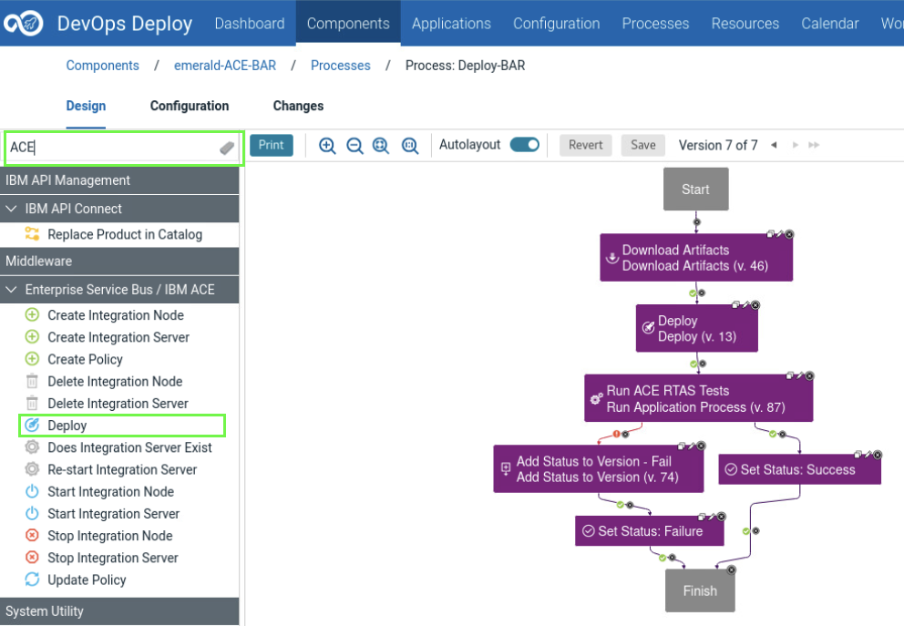</td>
</tr>
<tr class="odd">
<td>11</td>
<td>Click the pencil icon for the existing ‘Deploy’ step in the component process to examine the step details.</td>
<td>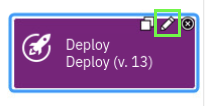</td>
</tr>
<tr class="even">
<td>12</td>
<td>
Examine the inputs for the step.

With IBM DevOps Deploy, you can pass in a hard-code string value for some of the inputs, however, it is most common to leverage properties.

A property in IBM DevOps Deploy looks like <strong>${p:my-property}</strong>. If a value could vary from one environment to the next, you can set the property at an environment scope. You can then reference the property with <strong>${p:environment/my-property}</strong> in your step.
</td>
<td>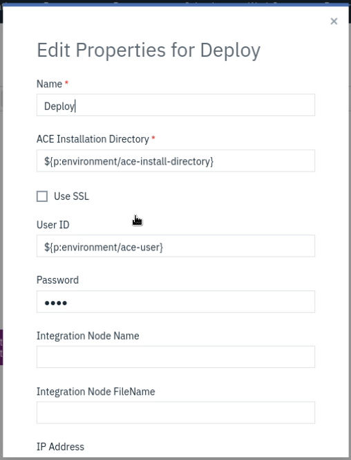</td>
</tr>
<tr class="odd">
<td>13</td>
<td>Scroll down and observe some additional properties for the ACE Deploy step including ip-address, ace-port, and integration-server-name.</td>
<td>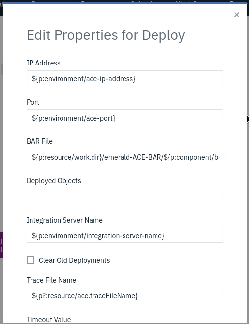</td>
</tr>
<tr class="even">
<td>14</td>
<td>
Check the box to ‘<strong>Clear Old Deployments’</strong>

Notice the help pop-up dialog for each step you can hover your mouse over.

The help tells us that when ‘Clear Old Deployments’ is enabled (or checked), this will run a complete deployment (as opposed to incremental).
</td>
<td>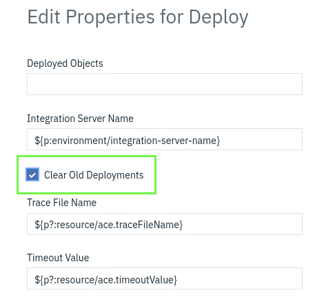</td>
</tr>
<tr class="odd">
<td>15</td>
<td>Scroll down and click OK</td>
<td>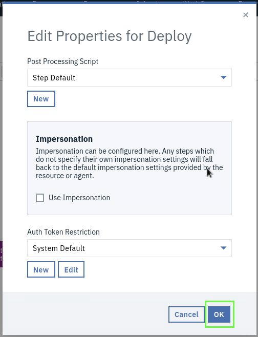</td>
</tr>
<tr class="even">
<td>17</td>
<td>Notice that the next step in the process will ‘Run ACE RTAS Tests’. This will execute some automated tests in IBM DevOps Test Hub to verify the deployed BAR is working as expected.</td>
<td>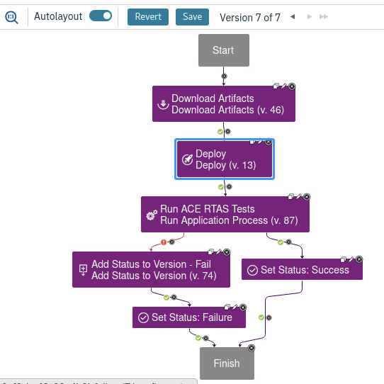</td>
</tr>
<tr class="odd">
<td>18</td>
<td>
IBM DevOps Deploy has a governance feature that you can leverage called ‘<strong>gates’</strong>. The gates help to ensure that a component version meets entry criteria for a target environment. For example, “Unit Tests Passed” or Functional Tests Passed”.

Here is an example of gates configured for an application:

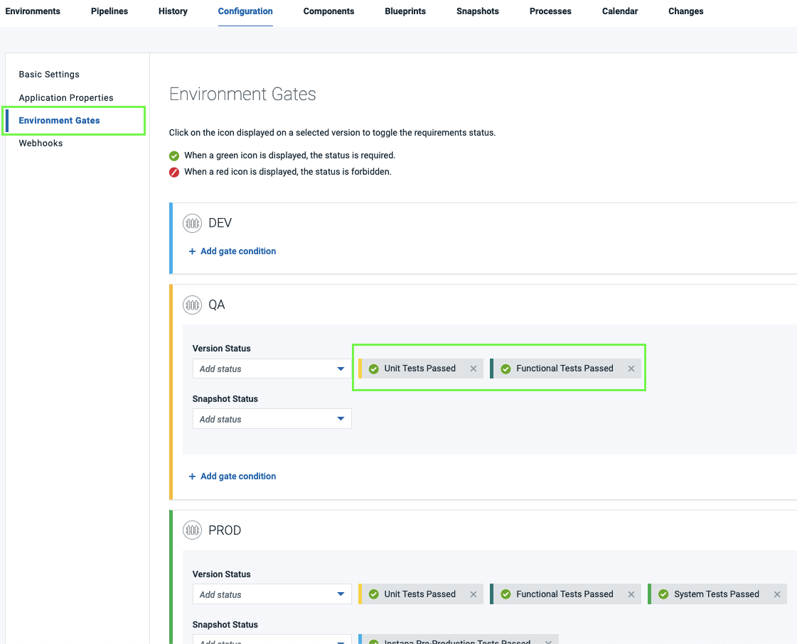

For our process, we need to update the process so that if the functional test pass, we automatically set a status called ‘<strong>Functional</strong> <strong>Tests</strong> <strong>Passed’</strong>. This is needed so we can promote this to the QA environment.

In the search ‘<strong>Type to filter’</strong> text field, type ‘<strong>Add Status</strong>’ as shown to the right
</td>
<td>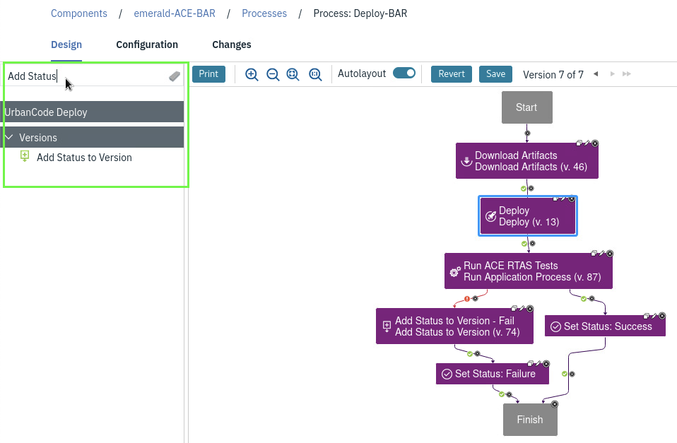</td>
</tr>
<tr class="even">
<td>19</td>
<td>
Drag the ‘<strong>Add Status to Version</strong>’ step from the step palette and drop it on the process design.

The best way to do this is to drag the step and hover over the line that connects the ‘<strong>Run ACE RTAS Tests’</strong> step to ‘<strong>Set Status: Success</strong>’ step. The line will turn a blue color. (See the screen shot to the right). While the line is blue, release your mouse to drop the step onto the design.
</td>
<td>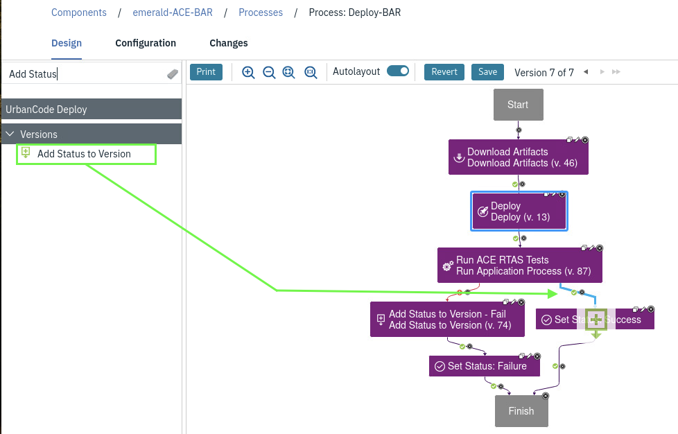</td>
</tr>
<tr class="odd">
<td>20</td>
<td>
Your process design should now look like this.

Click the pencil icon for the new step you added to the process design
</td>
<td>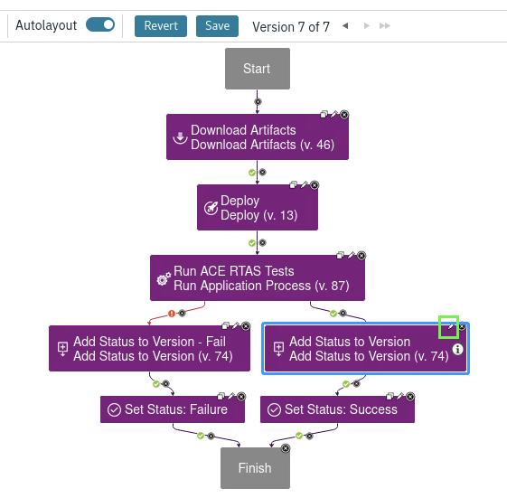</td>
</tr>
<tr class="even">
<td>21</td>
<td>
In the Edit Properties dialog that appears, provide the following initial values:

<strong>Name</strong>: Add Status to Version - Pass

<strong>Status</strong>: Functional Tests Passed

<strong>NOTE</strong>: the status is case sensitive and it must match an existing Status that exists. Be sure the value you type is ‘<strong>Functional</strong> <strong>Tests</strong> <strong>Passed’</strong> as shown to the right.
</td>
<td>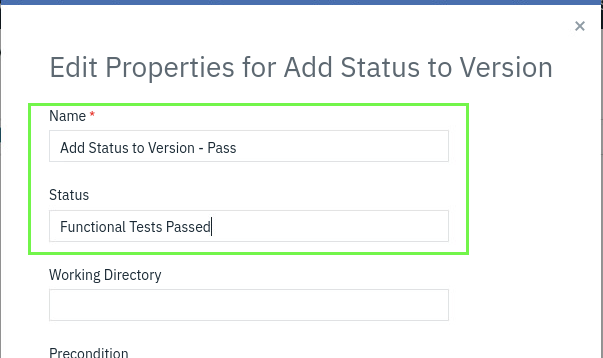</td>
</tr>
<tr class="odd">
<td>22</td>
<td>Scroll down and click OK</td>
<td>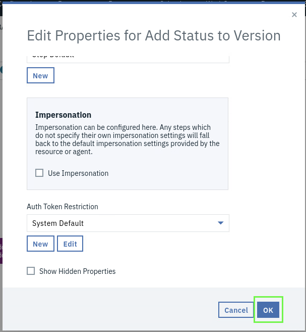</td>
</tr>
<tr class="even">
<td>23</td>
<td>Click the <strong>Save</strong> button to save the component process</td>
<td>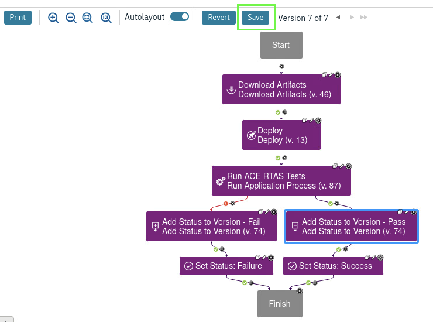</td>
</tr>
<tr class="odd">
<td>24</td>
<td>
You should notice that the version of the process is now ‘Version 10 of 10’ as highlighted to the right.

DevOps Deploy has built-in versioning capabilities in the tool you can leverage. This process can be exported in a JSON format and checked into a git repository.
</td>
<td>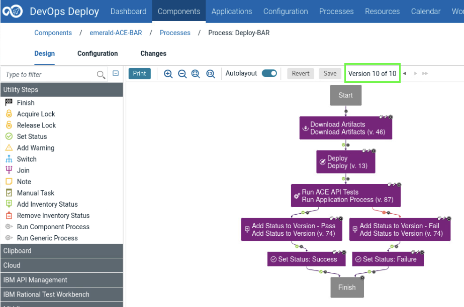</td>
</tr>
<tr class="even">
<td>25</td>
<td>
Before we complete this section of the lab, we need to generate a new API Token in IBM DevOps Test Hub that will be used by our processes to test what we deploy to the target environments. The API Token is needed to authenticate with the IBM DevOps Test Hub application.

In your browser, create a new tab and then click the ‘<strong>DevOps Test Hub</strong>’ bookmark found the toolbar.
</td>
<td></td>
</tr>
<tr class="odd">
<td>26</td>
<td>Login to IBM DevOps Test Hub as the user <em><strong>techxchange</strong></em> with password of <em><strong>password</strong></em></td>
<td></td>
</tr>
<tr class="even">
<td>27</td>
<td>Right click on the user profile at the top-right of the screen as shown to the right (step 1).</td>
<td>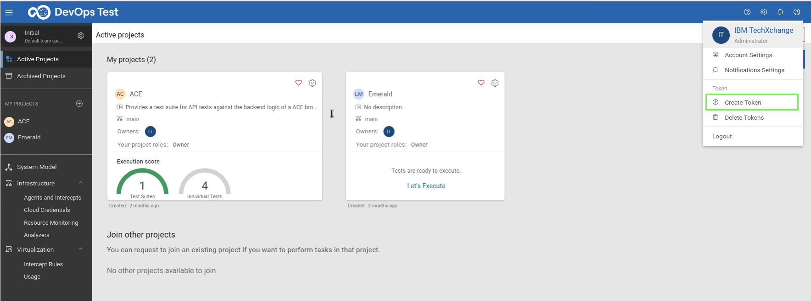</td>
</tr>
<tr class="odd">
<td>28</td>
<td>Click the ‘<strong>Create Token</strong>’ menu item as highlighted above (step 2).</td>
<td></td>
</tr>
<tr class="even">
<td>29</td>
<td>
A new API Token will appear.

Click the ‘<strong>Copy</strong>’ button to copy the token to your buffer.
</td>
<td>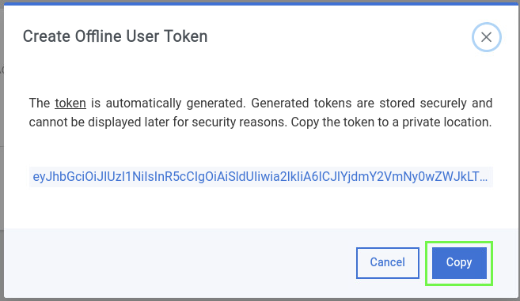</td>
</tr>
<tr class="odd">
<td>30</td>
<td>Open your ‘Text Editor’ window and paste the API Token for future reference as shown in the example to the right.</td>
<td>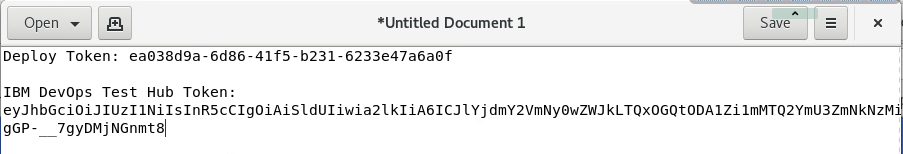</td>
</tr>
<tr class="even">
<td>31</td>
<td>
Return to your DevOps Deploy tab in your browser.

Click on Components at the top of the screen (step 1).
</td>
<td>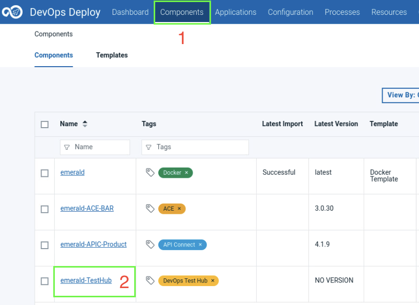</td>
</tr>
<tr class="odd">
<td>32</td>
<td>Click on the ‘emerald-TestHub component (step 2) as shown above.</td>
<td></td>
</tr>
<tr class="even">
<td>33</td>
<td>Click on the Processes sub-tab</td>
<td>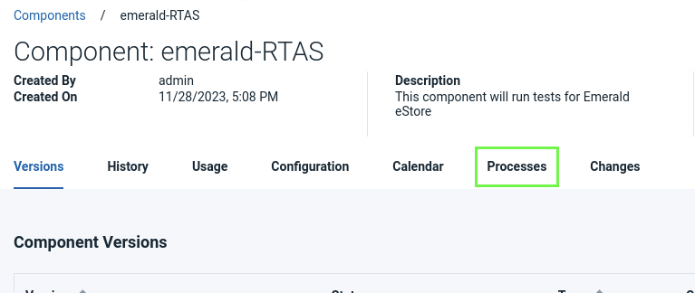</td>
</tr>
<tr class="odd">
<td>34</td>
<td>Click on the ‘Run Automated Test for ACE API’ process.</td>
<td>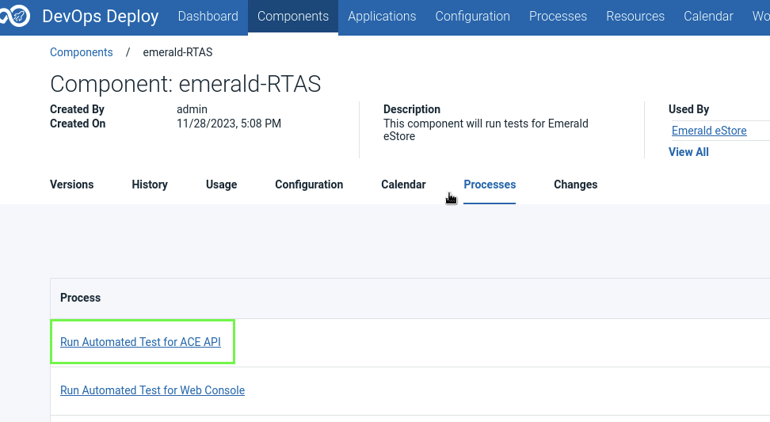</td>
</tr>
<tr class="even">
<td>35</td>
<td>
The visual process design will appear for the process.

Click the pencil icon for the ‘<strong>Run IBM Rational Test Automation Server test</strong>’ step as shown to the right.
</td>
<td>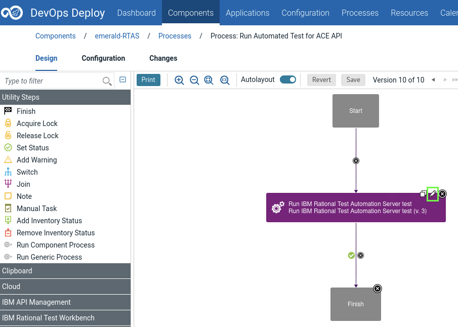</td>
</tr>
<tr class="odd">
<td>36</td>
<td>Paste the new API Key from your Text Editor window into the ‘<strong>Offline Token</strong>’ field as shown to the right.</td>
<td>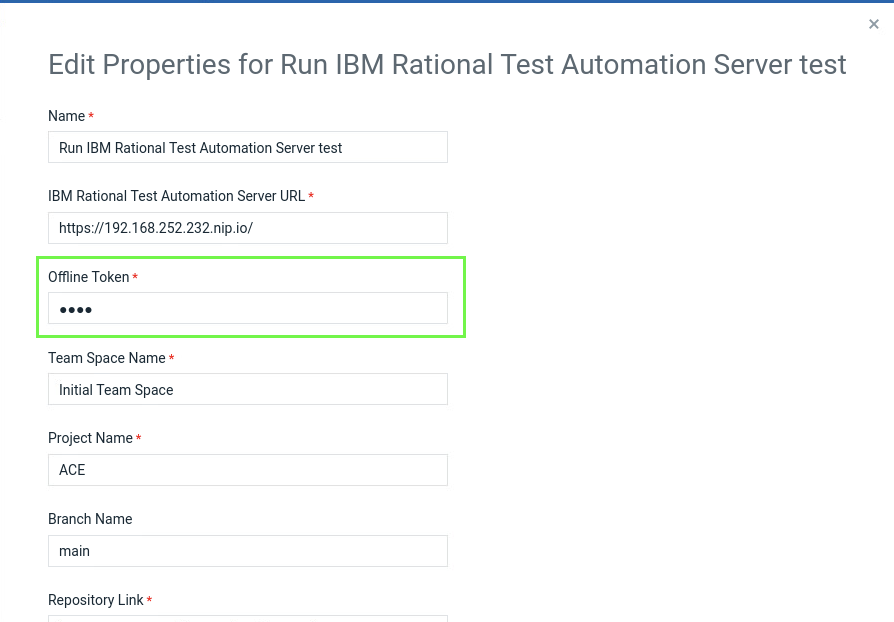</td>
</tr>
<tr class="even">
<td>37</td>
<td>Scroll down and click OK.</td>
<td>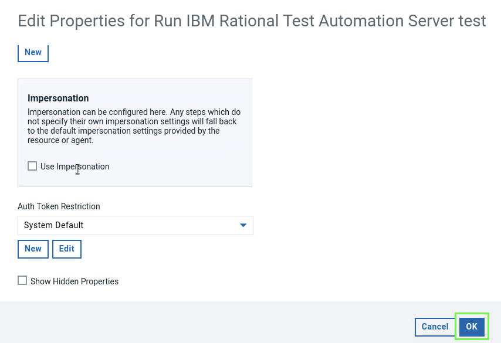</td>
</tr>
<tr class="odd">
<td>38</td>
<td>In the Visual Process Designer, click ‘<strong>Save</strong>’ to save the changes to the process.</td>
<td>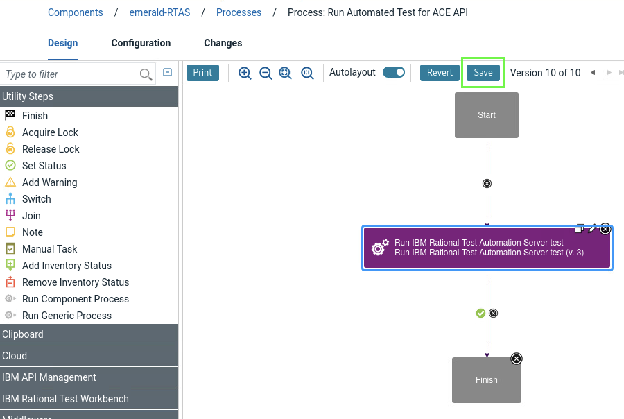</td>
</tr>
<tr class="even">
<td>39</td>
<td>
We need to repeat these steps for one more process.

Click on ‘Processes’ next to ‘emerald-TestHub’ in the crumb trail as shown to the right
</td>
<td>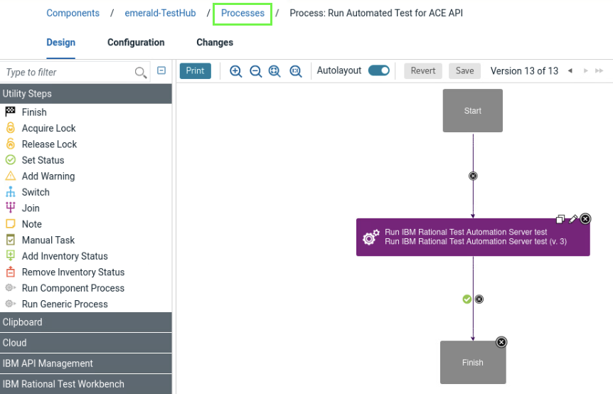</td>
</tr>
<tr class="odd">
<td>40</td>
<td>Click on the ‘<strong>Run Automated Test for Web Console</strong>’ process</td>
<td>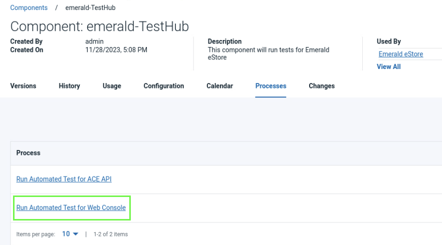</td>
</tr>
<tr class="even">
<td>41</td>
<td>
The Visual Process Designer will appear for the process.

Click the pencil icon on the step ‘<strong>Run IBM Rational Test Automation Server test</strong>’ as shown to the right.
</td>
<td>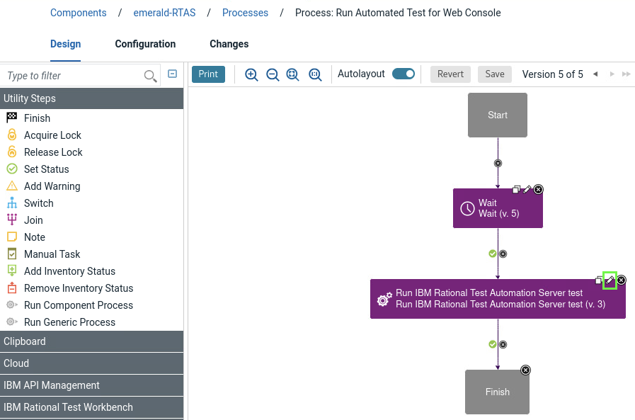</td>
</tr>
<tr class="odd">
<td>42</td>
<td>Paste the API Key from your Text Editor into the ‘<strong>Offline Token</strong>’ field as shown to the right.</td>
<td>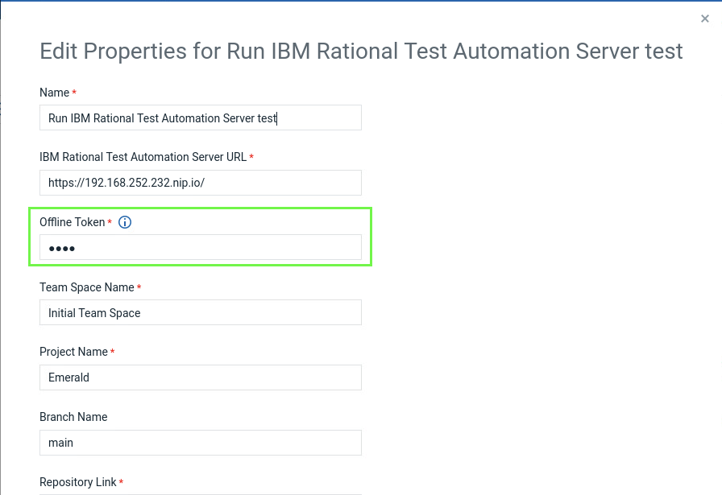</td>
</tr>
<tr class="even">
<td>43</td>
<td>Scroll down and click the OK button</td>
<td>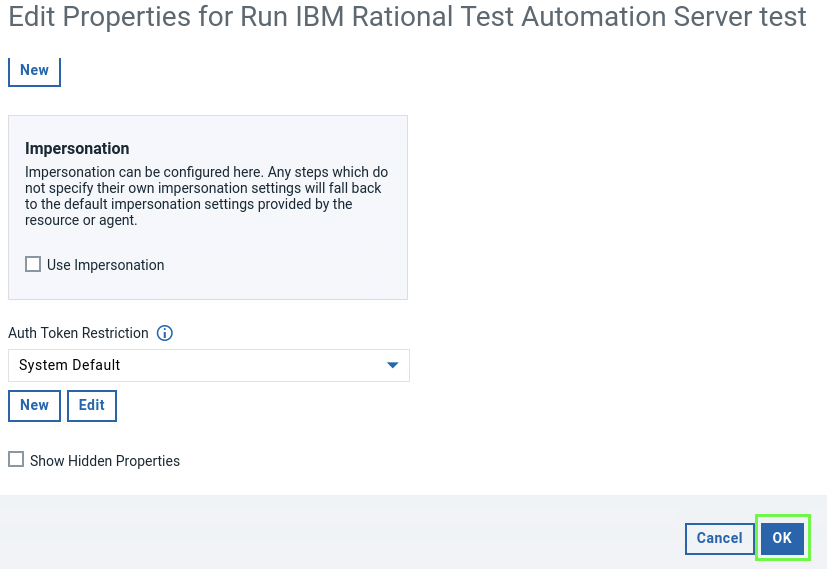</td>
</tr>
<tr class="odd">
<td>44</td>
<td>In the Visual Process Designer view, click the ‘<strong>Save</strong>’ button to save your changes to the process.</td>
<td>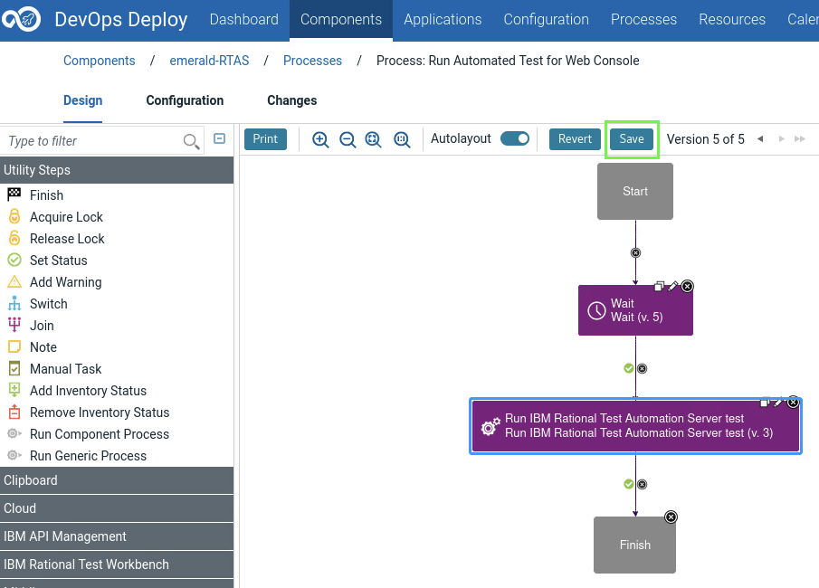</td>
</tr>
<tr class="even">
<td>45</td>
<td>
You have completed this lab section!

In the next section, we will deploy our new BAR file to the DEV environment and an automated test will be executed in IBM DevOps Test Hub.
</td>
<td></td>
</tr>
<tr class="odd">
<td><strong>End of Section - 3.4</strong></td>
<td></td>
<td></td>
</tr>
</tbody>
</table>

## Deploy the ACE Broker Archive using IBM DevOps Deploy to DEV

### Overview

In this lab section, we will deploy the built ACE broker archive file to
the DEV environment and invoke an automated API test using Rational Test
Automation Server (RTAS).

### Workbook steps

<table>
<thead>
<tr class="header">
<th><strong>Step</strong></th>
<th><strong>Details</strong></th>
<th><strong>Additional Information</strong></th>
</tr>
</thead>
<tbody>
<tr class="odd">
<td>1</td>
<td>Return to your IBM DevOps Deploy web console in your browser.</td>
<td></td>
</tr>
<tr class="even">
<td>2</td>
<td>Click on <strong>Applications</strong> at the top of the page</td>
<td>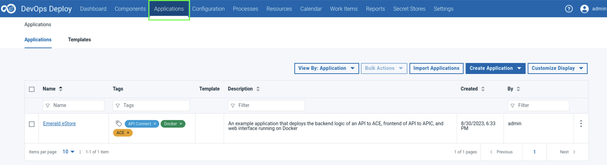</td>
</tr>
<tr class="odd">
<td>3</td>
<td>Click on the ‘Emerald eStore’ application in the list</td>
<td></td>
</tr>
<tr class="even">
<td>4</td>
<td>
Before we initiate the deployment, we will review the environment properties that are set for the DEV environment.

Click on the “DEV” text for the DEV environment as shown to the right.
</td>
<td>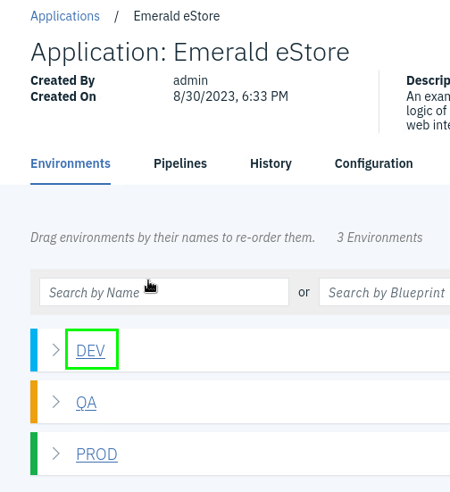</td>
</tr>
<tr class="odd">
<td>5</td>
<td>In the ‘Environment: DEV’ page, click on the ‘<strong>Configuration</strong>’ sub-tab</td>
<td>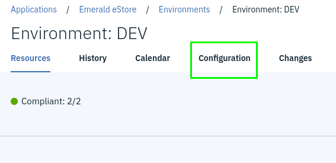</td>
</tr>
<tr class="even">
<td>6</td>
<td>Click on ‘<strong>Environment Properties</strong>’ in the left-hand pane</td>
<td>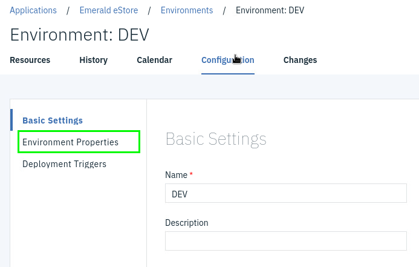</td>
</tr>
<tr class="odd">
<td>7</td>
<td>
Here you will see the property values that are used in our automated deployment processes.

Notice the ACE specific properties that you saw referenced in the component process we reviewed in the previous lab.
</td>
<td>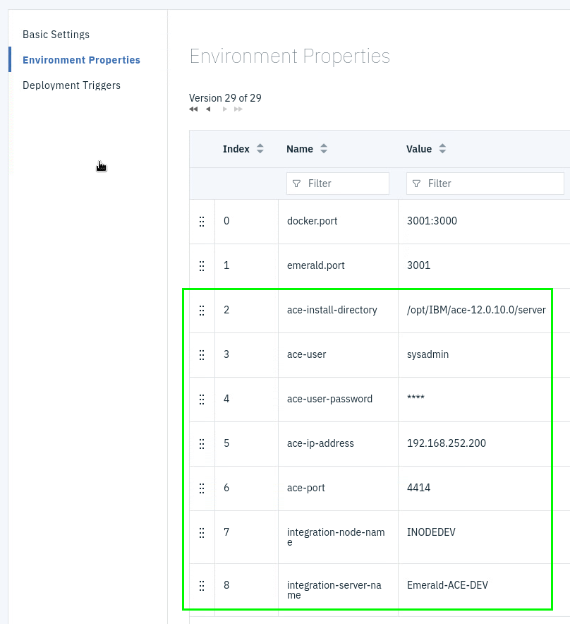</td>
</tr>
<tr class="even">
<td><strong>INFO</strong></td>
<td>
If the way you deploy one BAR file is the same way you will deploy the other 10 BAR files you typically deploy, you can setup a reusable <strong>component template</strong> to handle these deploys. This provides two benefits:

<ul>
<li>
You can quickly on-board other ACE components based on the template
</li>
<li>
You have one place to make updates to the ACE deployment process (helping with maintenance)
</li>
</ul>

The use of properties, rather than hard-coded string values, is vital to the creation of reusable templates. Properties can be set at the environment, component, application, and resource scope in IBM DevOps Deploy.
</td>
<td></td>
</tr>
<tr class="odd">
<td>8</td>
<td>
Let’s initiate our deployment.

Click on “Emerald eStore” in the crumb trail at the top of the page.
</td>
<td>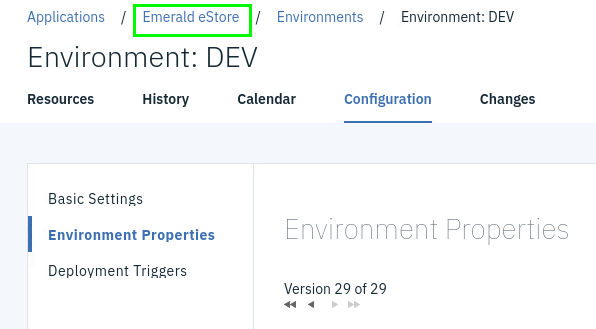</td>
</tr>
<tr class="even">
<td>9</td>
<td>Click the “<strong>Request Process</strong>” button for your DEV environment as shown to the right</td>
<td>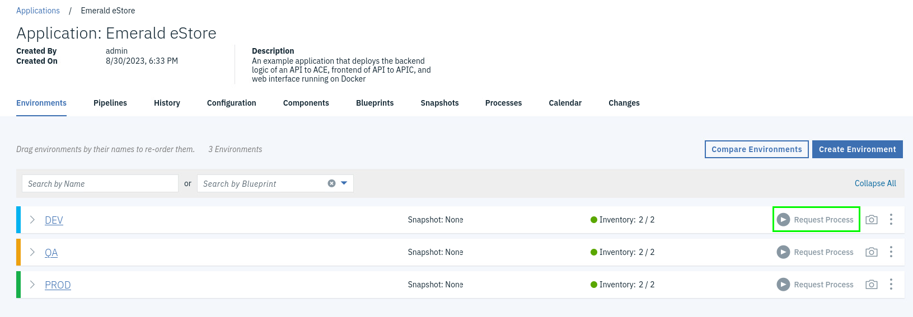</td>
</tr>
<tr class="odd">
<td>10</td>
<td>For the ‘Run Application Process’ page that appears, select the Process labeled ‘<strong>Deploy</strong> <strong>Emerald</strong>’ from the pulldown menu.</td>
<td>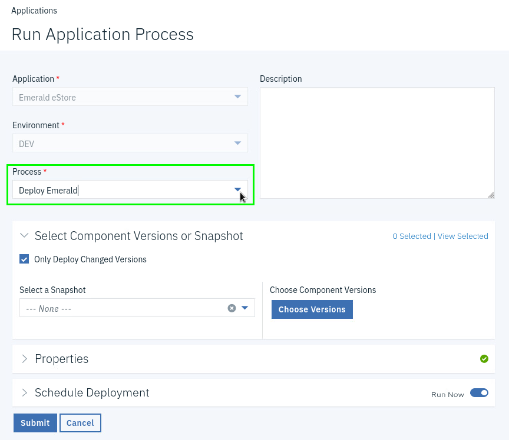</td>
</tr>
<tr class="even">
<td>11</td>
<td>
Click the ‘Choose Versions’ button to choose component versions.

A ‘Select Component Versions’ dialog will appear to the right.
</td>
<td>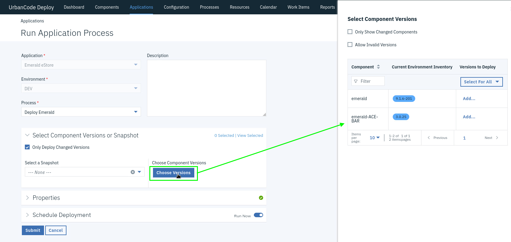</td>
</tr>
<tr class="odd">
<td>12</td>
<td>In the Select Component Versions dialog that appears to the right, click the ‘<strong>Select For All</strong>’ pulldown and choose ‘<strong>Latest Available</strong>’ as shown to the right</td>
<td>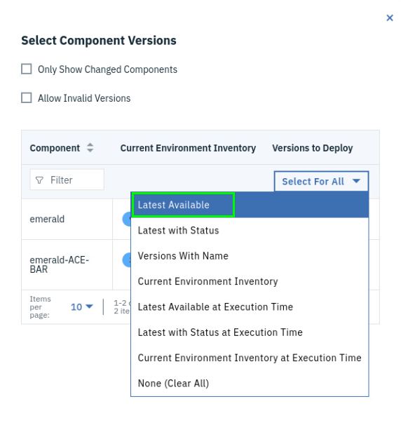</td>
</tr>
<tr class="even">
<td>13</td>
<td>You should see that the values in the ‘Versions to Deploy’ column look different from what is in the ‘Current Environment Inventory’ column.</td>
<td>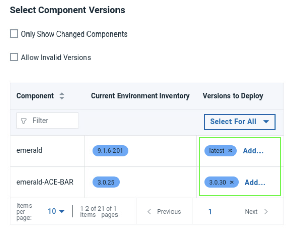</td>
</tr>
<tr class="odd">
<td>14</td>
<td>Back in the ‘Run Application Process’ page, notice that it shows that there are ‘2 Selected’ component versions for deployment.</td>
<td>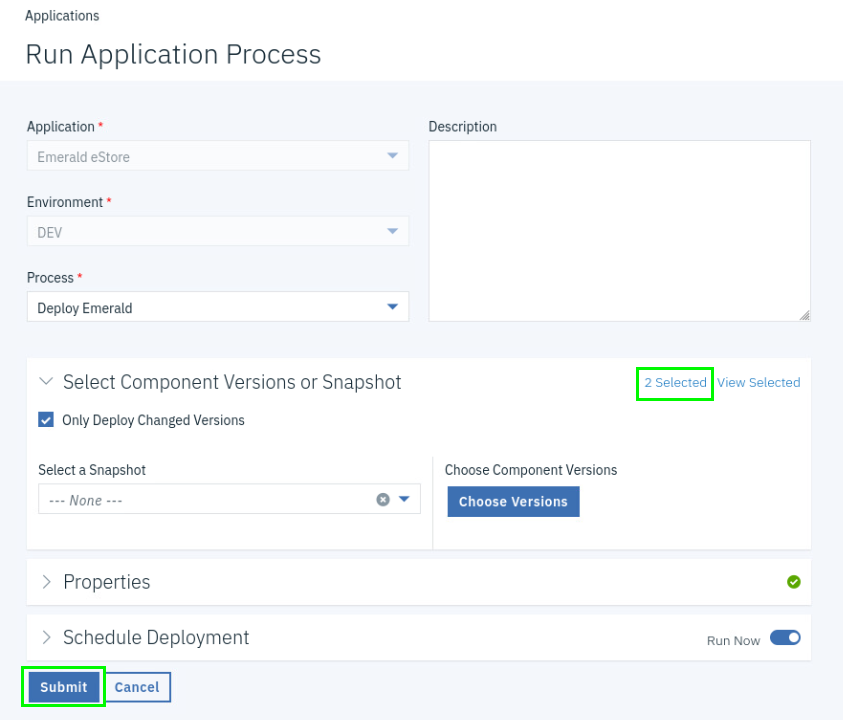</td>
</tr>
<tr class="even">
<td>15</td>
<td>Click the ‘<strong>Submit’</strong> button to initiate the deployment (as shown above)</td>
<td>NOTE: you can schedule the deployment for a specific day and time as well if you like.</td>
</tr>
<tr class="odd">
<td><strong>INFO</strong></td>
<td><strong>NOTE:</strong> We are running the deployment through the web console, however, keep in mind that this deployment could be initiated automatically following a build process. You can make REST or CLI calls to start deployments automatically from your Jenkins or GitLab pipeline.</td>
<td></td>
</tr>
<tr class="even">
<td>16</td>
<td>
The deployment will start, and you will have a nice trail of audit for each deployment as you see to the right.

You can click ‘Expand All’ or manually expand the deployment for the BAR file.
</td>
<td>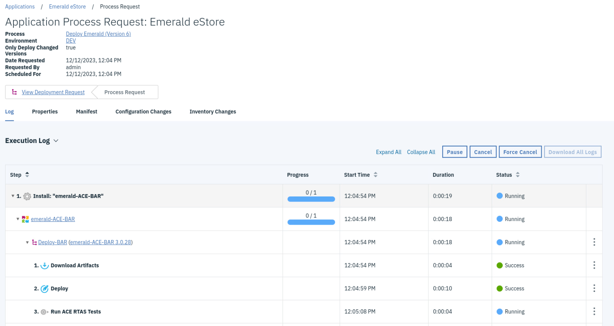</td>
</tr>
<tr class="odd">
<td>17</td>
<td>
Click the layer cake (dots) pulldown menu to the right of the ‘<strong>Deploy’</strong> step as shown to the right.

Then click the ‘<strong>View Output Log’</strong> menu item for the pulldown menu
</td>
<td>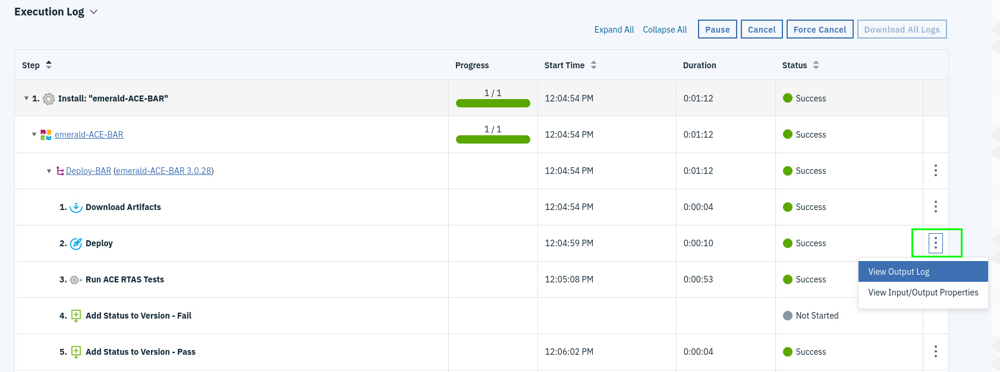</td>
</tr>
<tr class="even">
<td>18</td>
<td>
You can view the Output Log for any of the steps that were executed.

Here we see that the deployment of the BAR file was successful.
</td>
<td>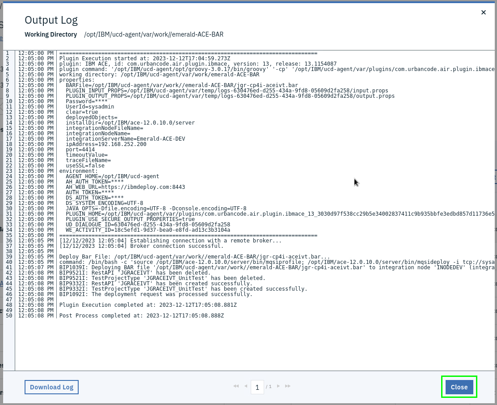</td>
</tr>
<tr class="odd">
<td>19</td>
<td>Click the ‘Close’ button to close the Output Log dialog</td>
<td></td>
</tr>
<tr class="even">
<td>20</td>
<td>Notice that following the deployment that we are incorporating automated test execution to validate the ACE APIs using IBM DevOps Test Hub to run an automated API test suite.</td>
<td>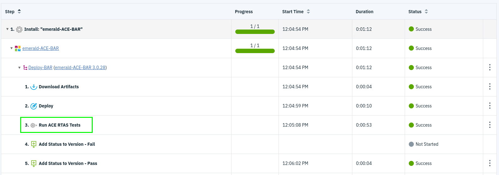</td>
</tr>
<tr class="odd">
<td><strong>INFO</strong></td>
<td>
IBM DevOps Test Hub can run many different types of tests including:

<ul>
<li>
API Tests
</li>
<li>
Performance Tests
</li>
<li>
Functional Tests
</li>
</ul></td>
<td></td>
</tr>
<tr class="even">
<td>21</td>
<td>
In your browser, return to the IBM DevOps Test Hub tab.

If you need to create a new tab, click the ‘<strong>DevOps Test Hub</strong>’ bookmark found the toolbar as shown to the right.
</td>
<td>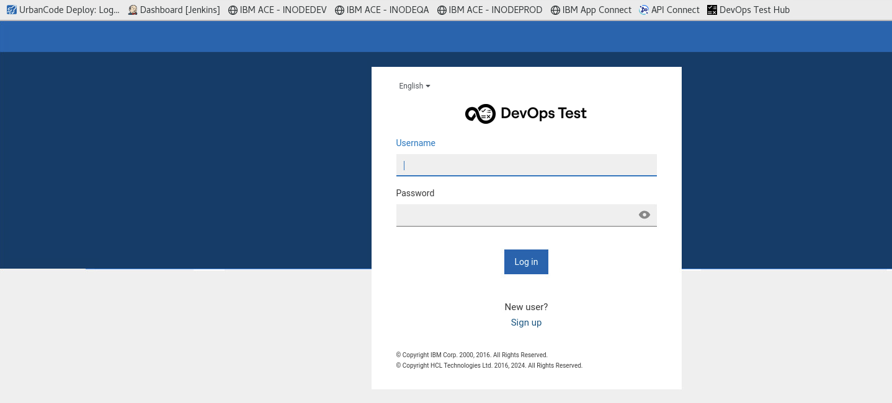</td>
</tr>
<tr class="odd">
<td>22</td>
<td>Login to IBM DevOps Test Hub as the user <em><strong>techxchange</strong></em> with password of <em><strong>password</strong></em></td>
<td></td>
</tr>
<tr class="even">
<td>23</td>
<td>
You will see your Active Projects in the view.

Click on the <strong>ACE</strong> project as highlighted to the right.
</td>
<td>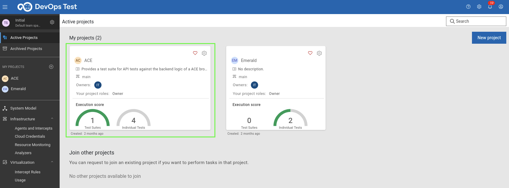</td>
</tr>
<tr class="odd">
<td>24</td>
<td>In the ACE Overview page that appears, you can see the latest execution results.</td>
<td>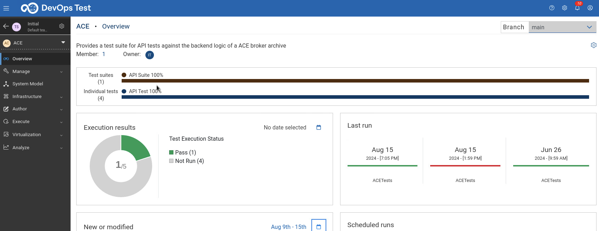</td>
</tr>
<tr class="even">
<td>25</td>
<td>In the left-hand menu, click on Analyze to expand the menu. Click on “Results” in the pulldown menu. This should show you all the Results from your tests as shown to the right.</td>
<td>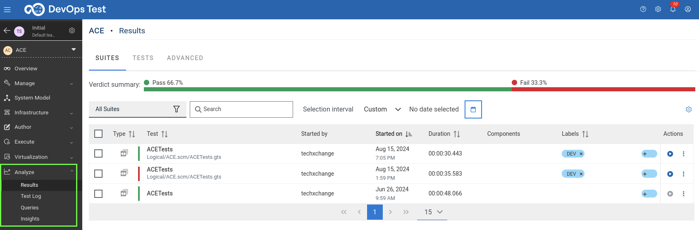</td>
</tr>
<tr class="odd">
<td>26</td>
<td>You can drill into the test logs for a given test run. Click on our latest test (click on the “ACETests” text) that was run against the DEV environment.</td>
<td></td>
</tr>
<tr class="even">
<td>27</td>
<td>
A dialog will appear to the right.

Click on the ‘Test Log’ link
</td>
<td>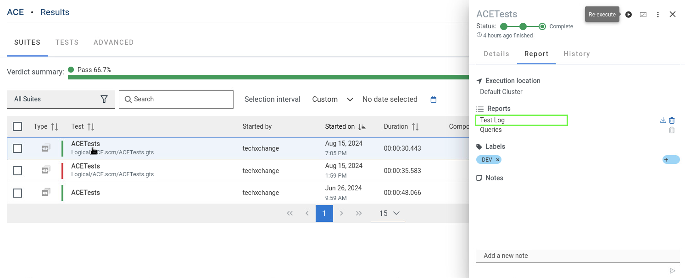</td>
</tr>
<tr class="odd">
<td>28</td>
<td>The Test Log will appear. Expand the ‘<strong>Create Scenario</strong>’ node in the left pane to see each test that was executed.</td>
<td>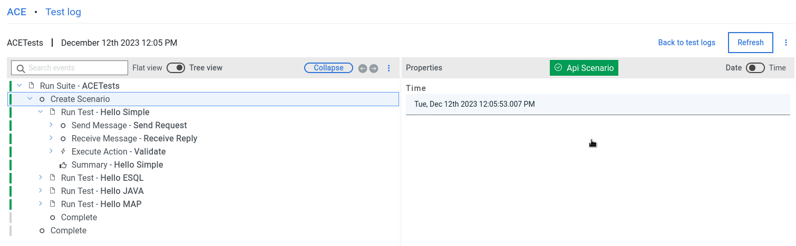</td>
</tr>
<tr class="even">
<td>29</td>
<td>Expand the ‘<strong>Run Test – Hello ESQL</strong>’ test and examine the Send Message, Receive Message, and more to see the results of the test.</td>
<td>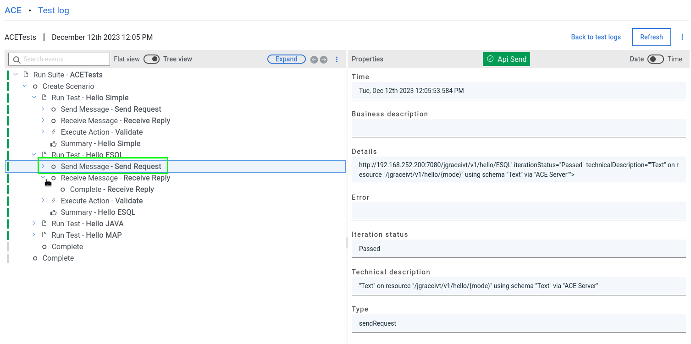</td>
</tr>
<tr class="odd">
<td>30</td>
<td>
Return to the IBM DevOps Deploy tab in your browser.

The deployment of both the ACE BAR and the Emerald web application should succeed as shown to the right.
</td>
<td>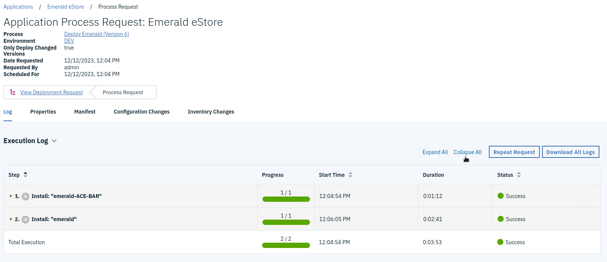</td>
</tr>
<tr class="even">
<td>31</td>
<td>Click on ‘Emerald eStore’ in the crumb trail as shown to the right</td>
<td>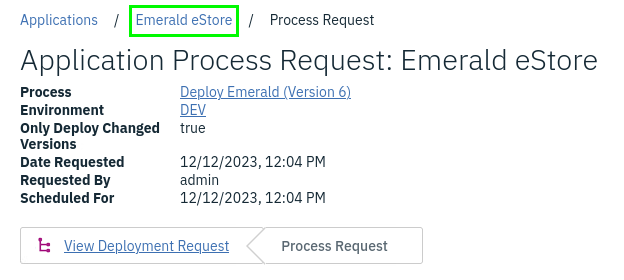</td>
</tr>
<tr class="odd">
<td>32</td>
<td>Expand the DEV environment to see that the inventory has been updated to reflect the component versions that you deployed.</td>
<td>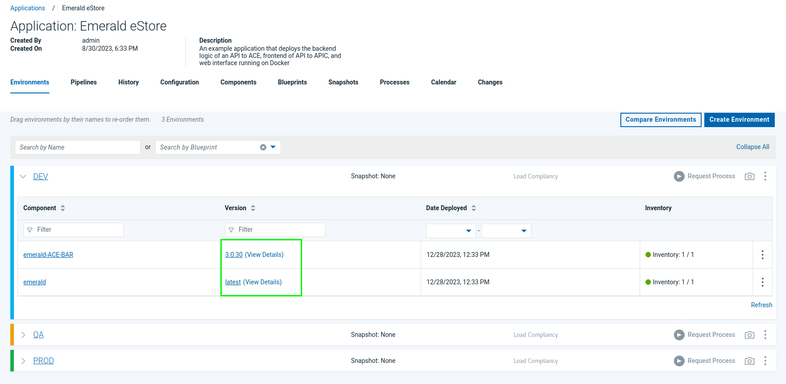</td>
</tr>
<tr class="even">
<td>33</td>
<td>Click on the ‘emerald-ACE-BAR’ component</td>
<td></td>
</tr>
<tr class="odd">
<td>34</td>
<td>
Notice that version 3.0.30 that we just deployed and ran automated tests against now has a ‘<strong>Functional Tests Passed</strong>’ status added to it.

In IBM DevOps Deploy, you can use these status values to ensure <strong>Gate criteria</strong> are met before a deployment occurs to the next environment.

This helps to ensure good quality code is progressing through your pipeline using IBM DevOps Deploy.
</td>
<td>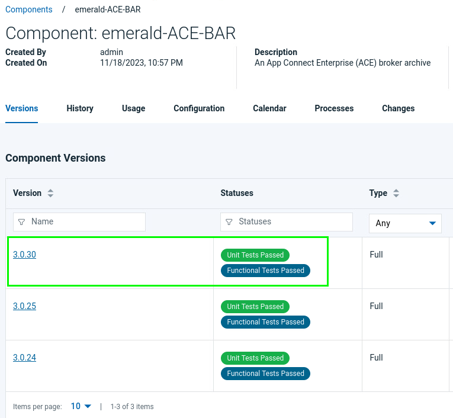</td>
</tr>
<tr class="even">
<td>35</td>
<td>
Let’s go check what was deployed.

In your browser, create a new tab.

Click the “IBM ACE – INODEDEV” bookmark to open this page.
</td>
<td>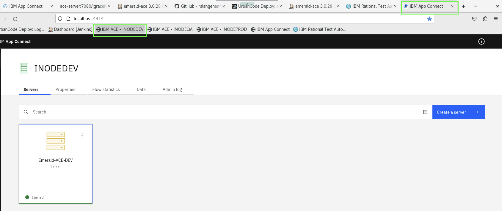</td>
</tr>
<tr class="odd">
<td>36</td>
<td>Click on “Emerald-ACE-DEV” or select “Open” from the layer cake pulldown menu item to see that the JGRACEIVT API has been deployed to this Integration Server.</td>
<td>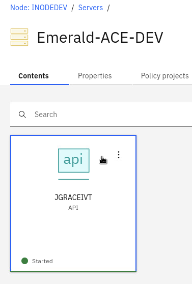</td>
</tr>
<tr class="even">
<td>37</td>
<td>
If you open the JGRACEIVT API, you can see the REST APIs that are available for it as shown to the right.

<strong>NOTE:</strong> Our DevOps Test Hub automated test exercised these APIs to ensure they were working properly.
</td>
<td>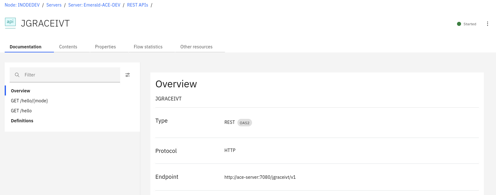</td>
</tr>
<tr class="odd">
<td>38</td>
<td>
In your browser window, view the Emerald web application running in the DEV environment by opening a new tab and navigating to:

<a href="http://192.168.252.201:3001/">http://192.168.252.201:3001/</a>

You should see the application as shown to the right.
</td>
<td>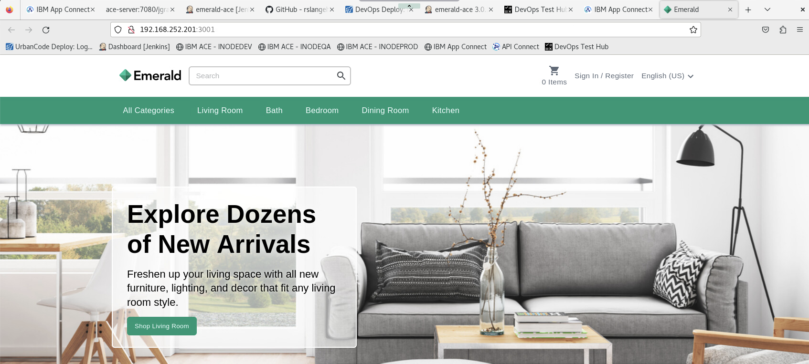</td>
</tr>
<tr class="even">
<td>39</td>
<td>
You have successfully deployed the ACE BAR to the DEV environment along with the Emerald web application!

We will promote our updates to the QA environment in the next lab.
</td>
<td></td>
</tr>
<tr class="odd">
<td><strong>End of Section – 3.5</strong></td>
<td></td>
<td></td>
</tr>
</tbody>
</table>

## Promote the Emerald Components to the QA Environment

### Overview

In this lab section, we will deploy the built ACE broker archive file to
the QA environment and invoke an automated API test using Rational Test
Automation Server (RTAS). We will review the results.

### Workbook steps

<table>
<thead>
<tr class="header">
<th><strong>Step</strong></th>
<th><strong>Details</strong></th>
<th><strong>Additional Information</strong></th>
</tr>
</thead>
<tbody>
<tr class="odd">
<td>1</td>
<td>In your browser, return to the IBM DevOps Deploy tab.</td>
<td></td>
</tr>
<tr class="even">
<td>2</td>
<td>Click on the ‘<strong>Applications’</strong> tab at the top of the page and click on the ‘<strong>Emerald eStore</strong>’ application as shown to the right.</td>
<td>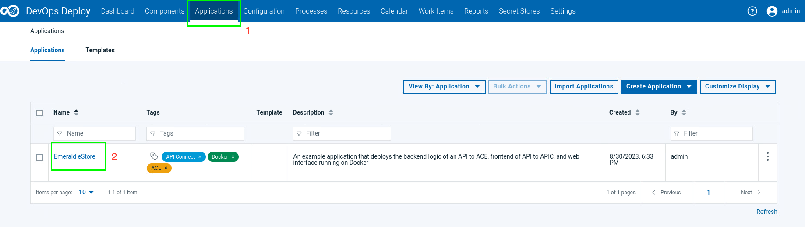</td>
</tr>
<tr class="odd">
<td>3</td>
<td>Expand the DEV environment to show what is currently deployed to the DEV environment.</td>
<td>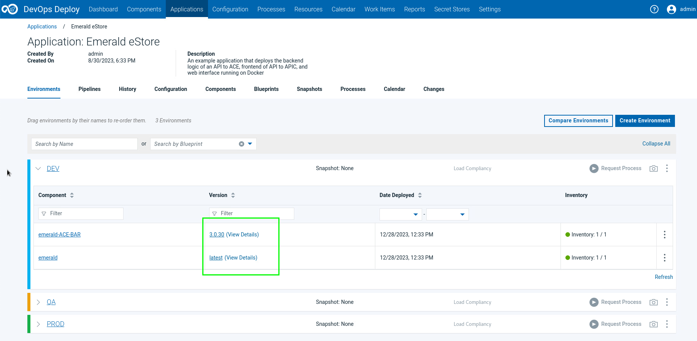</td>
</tr>
<tr class="even">
<td>4</td>
<td>
One of the nice features of IBM DevOps Deploy is that you can create a Snapshot of an environment.

This allows you to easily promote what you have tested together (the component versions for the ACE and WEB components) to the next environment.

Click on the ‘<strong>camera</strong>’ icon for the DEV environment as shown to the right to create a Snapshot.
</td>
<td>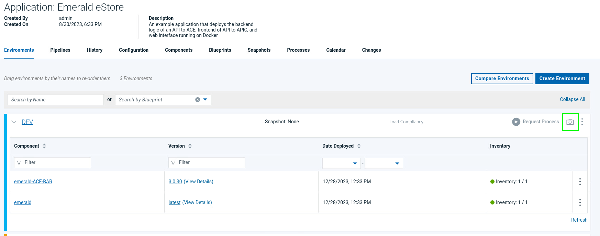</td>
</tr>
<tr class="odd">
<td>5</td>
<td>
Enter the following values in the ‘Create Snapshot’ dialog that appears:

Name: 2024-Nov-01

You may optionally add a description similar to what is shown in the screen capture to the right.
</td>
<td></td>
</tr>
<tr class="even">
<td>6</td>
<td>
Click the ‘<strong>Save</strong>’ button

The snapshot page will appear.
</td>
<td></td>
</tr>
<tr class="odd">
<td>7</td>
<td>Click on the ‘Component Versions’ sub-tab as shown to the right.</td>
<td></td>
</tr>
<tr class="even">
<td>8</td>
<td>
Notice that the current inventory of the DEV environment was added as Component Versions for the snapshot.

<strong>NOTE:</strong> you can press the ‘Lock Versions’ button to ensure this snapshot cannot be modified.
</td>
<td>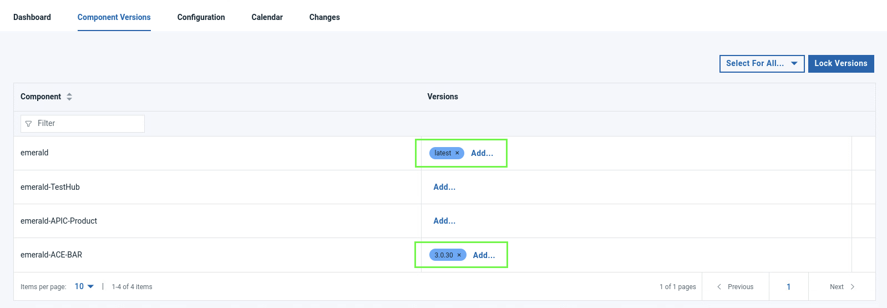</td>
</tr>
<tr class="odd">
<td>9</td>
<td>In the crumb trail at the top, click on ‘Emerald eStore’</td>
<td>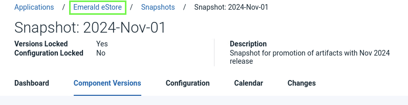</td>
</tr>
<tr class="even">
<td>10</td>
<td>
Let’s examine our QA environment to see that we have setup an approval process before a deployment can take place.

Click on the text ‘QA’ for the QA environment.
</td>
<td>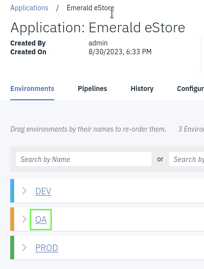</td>
</tr>
<tr class="odd">
<td>11</td>
<td>Click on the ‘Configuration’ sub-tab as shown to the right.</td>
<td>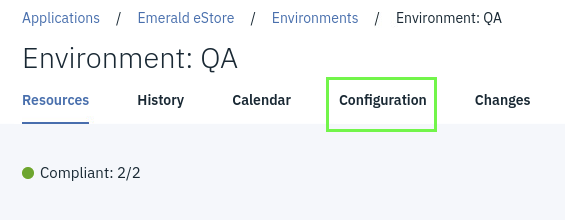</td>
</tr>
<tr class="even">
<td>12</td>
<td>On the Basic Settings page that appears, scroll down to the ‘Deployment Approvals’ section and notice that the ‘Require Manual Approvals’ is enabled (or checked) as shown to the right.</td>
<td>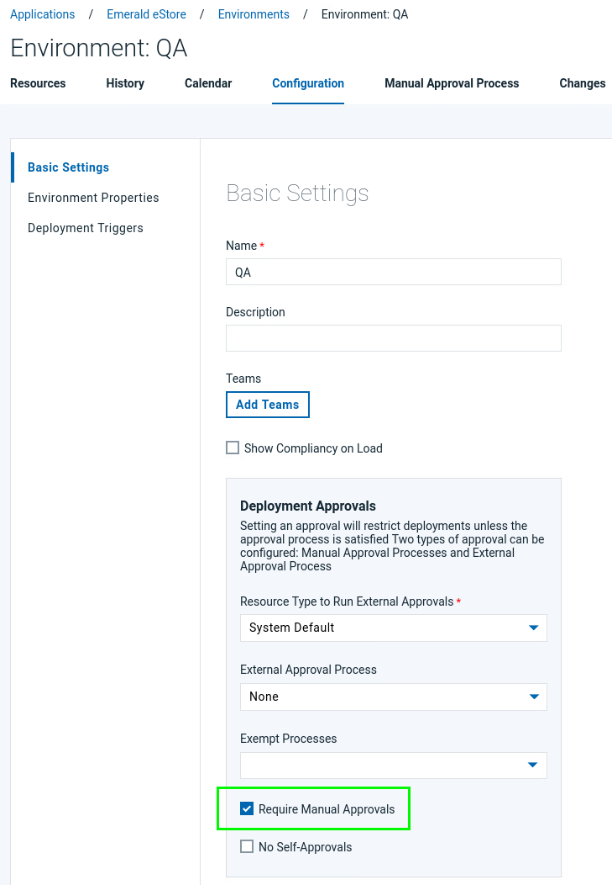</td>
</tr>
<tr class="odd">
<td>13</td>
<td>Click on the ‘<strong>Manual Approval Process</strong>’ sub-tab that appears</td>
<td>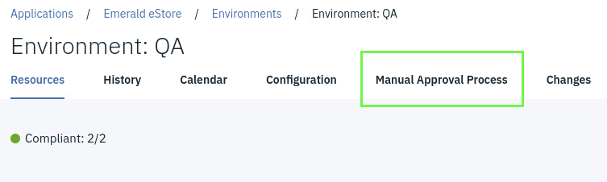</td>
</tr>
<tr class="even">
<td>14</td>
<td>In the process design that appears, slide the ‘Autolayout’ slider to the on position.</td>
<td>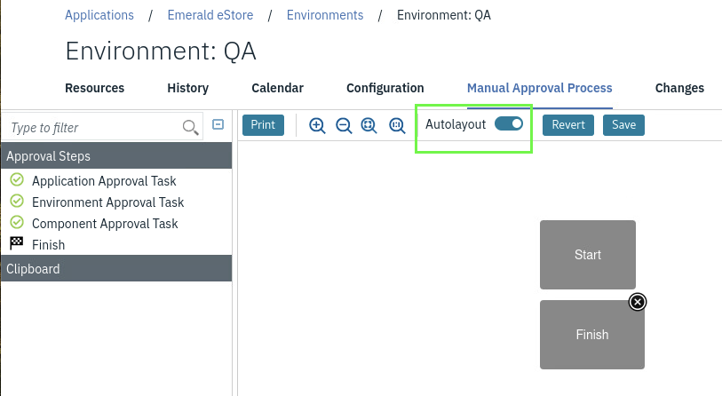</td>
</tr>
<tr class="odd">
<td>15</td>
<td>
Drag and drop the ‘Environment Approval Task’ step in the left-hand palette to the process design.

<strong>NOTE:</strong> Using the Autolayout feature, the process design will automatically connect the Start and Finish steps for you.
</td>
<td></td>
</tr>
<tr class="even">
<td>16</td>
<td>Click the pencil icon for the ‘Environment Approval’ step to edit it</td>
<td></td>
</tr>
<tr class="odd">
<td>17</td>
<td>
The properties of the step will be displayed.

Take the defaults as shown and scroll down and click OK.
</td>
<td>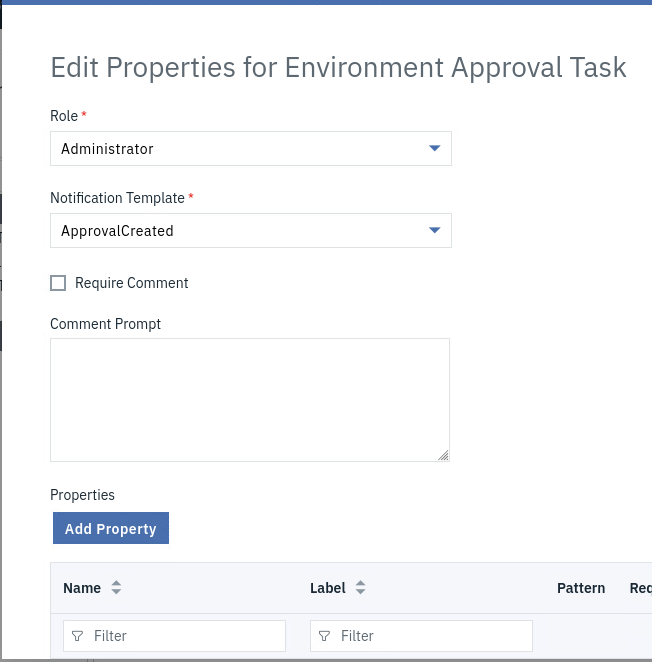</td>
</tr>
<tr class="even">
<td>18</td>
<td>Click ‘Save’ to save your approval process.</td>
<td>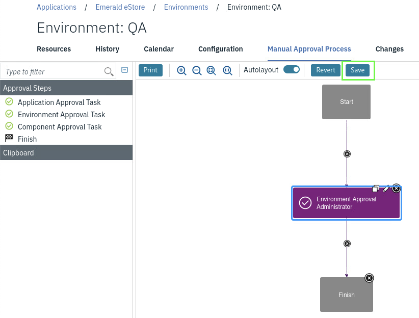</td>
</tr>
<tr class="odd">
<td>19</td>
<td>Click on ‘Emerald eStore’ in the crumb-trail at the top to return to the application.</td>
<td>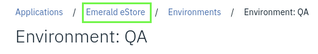</td>
</tr>
<tr class="even">
<td>20</td>
<td>
In IBM DevOps Deploy, you can compare inventory of one environment to another.

Click the layer-cake icon next to the DEV environment and then click ‘<strong>Compare</strong>’ from the pull-down menu as shown to the right.
</td>
<td>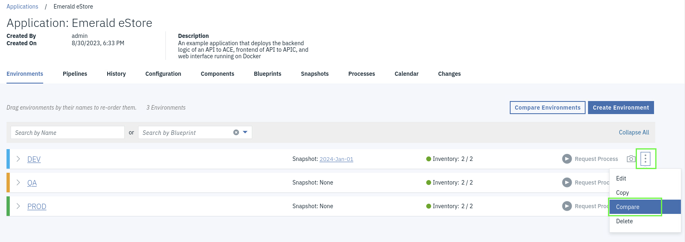</td>
</tr>
<tr class="odd">
<td>22</td>
<td>In the ‘Compare Environments’ dialog that appears, choose the QA environment from the pull-down menu.</td>
<td>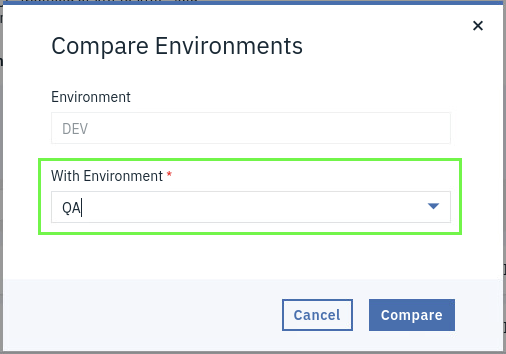</td>
</tr>
<tr class="even">
<td>23</td>
<td>Click ‘Compare’</td>
<td></td>
</tr>
<tr class="odd">
<td>24</td>
<td>An Environment Comparison page will be displayed so you can see the inventory differences between the DEV and QA environments.</td>
<td>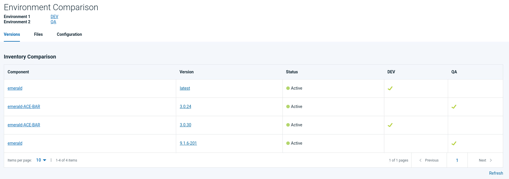</td>
</tr>
<tr class="even">
<td>25</td>
<td>
Let’s deploy the snapshot to the QA environment.

Click on ‘Emerald eStore’ in the crumb-trail as you have before to return the main page for the application.
</td>
<td>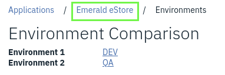</td>
</tr>
<tr class="odd">
<td>26</td>
<td>Click the ‘Request Process’ button next to the QA environment</td>
<td>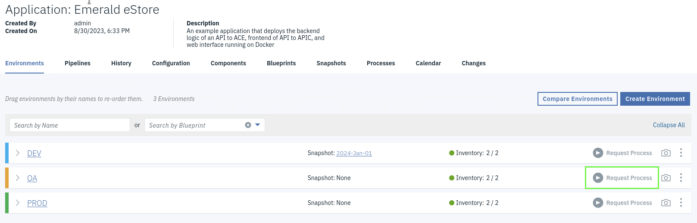</td>
</tr>
<tr class="even">
<td>27</td>
<td>In the ‘Run Application Process’ page that appears, select ‘Deploy Emerald’ from the Process pulldown menu.</td>
<td>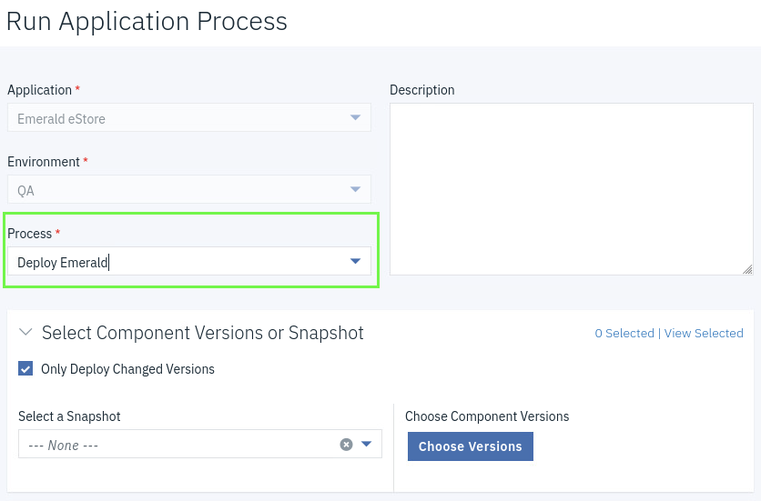</td>
</tr>
<tr class="odd">
<td>28</td>
<td>In the ‘Select a Snapshot’ pulldown, select ‘2024-Nov-01’ as shown to the right.</td>
<td>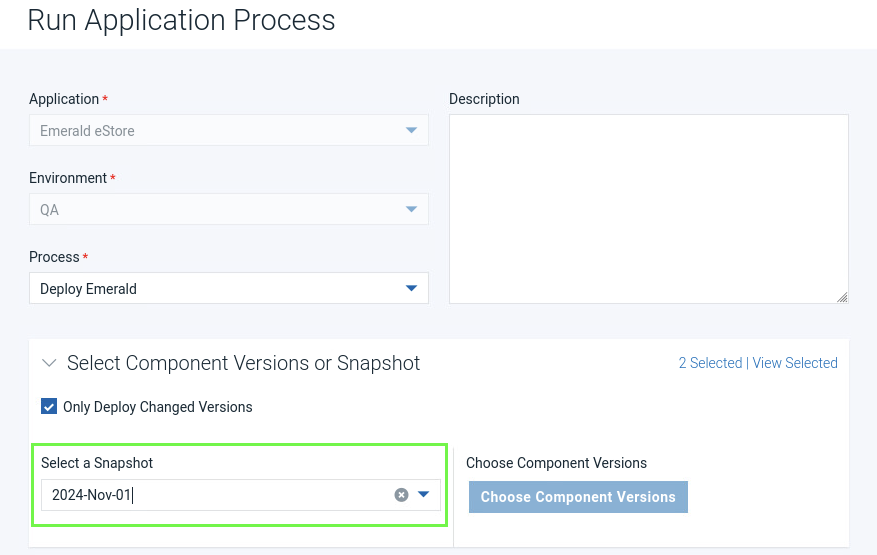</td>
</tr>
<tr class="even">
<td>29</td>
<td>Scroll down and click the ‘<strong>Submit</strong>’ button to initiate the deployment.</td>
<td>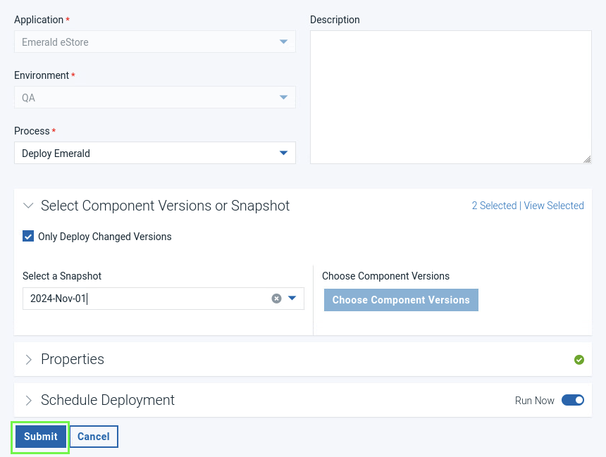</td>
</tr>
<tr class="odd">
<td>30</td>
<td>
Notice that the deployment is waiting for an approval before it can begin.

<strong>Before we respond to this approval request</strong>, we are going to disable all future approval requirements just for this lab.

<strong>Click on</strong> ‘<strong>Emerald eStore</strong>’ in the crumb-trail as you have before
</td>
<td>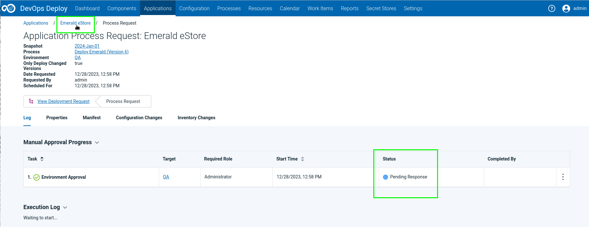</td>
</tr>
<tr class="even">
<td>31</td>
<td>Click on the QA environment text</td>
<td>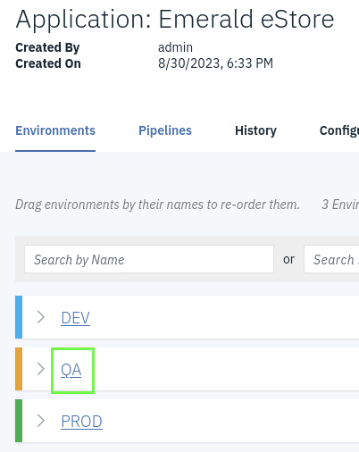</td>
</tr>
<tr class="odd">
<td>32</td>
<td>Click on the ‘Configuration’ sub-tab and scroll down to <strong>uncheck</strong> the ‘<strong>Require Manual Approvals</strong>’ checkbox as shown to the right.</td>
<td>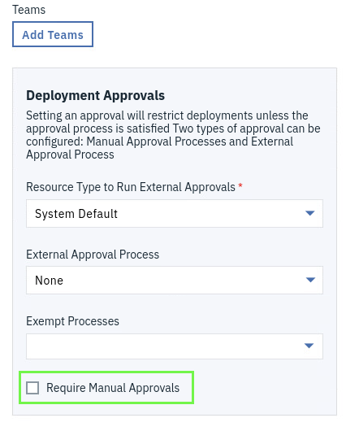</td>
</tr>
<tr class="even">
<td>33</td>
<td>Scroll down and click ‘<strong>Save</strong>’</td>
<td>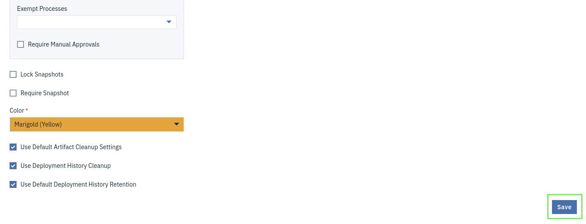</td>
</tr>
<tr class="odd">
<td>34</td>
<td>Let’s return to our deployment. Click on the ‘Work Items’ tab at the top of the page.</td>
<td>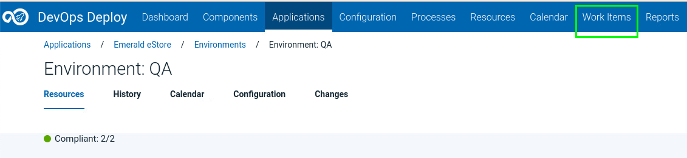</td>
</tr>
<tr class="even">
<td>35</td>
<td>
Click the layer cake icon next to the QA approval request and select ‘View Request’ as shown to the right.

This will take us back to our deployment request.
</td>
<td>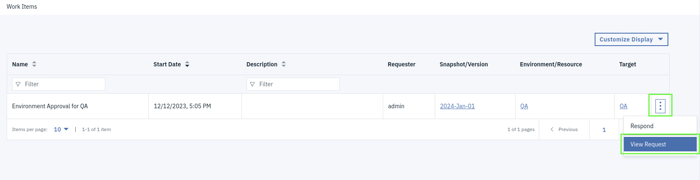</td>
</tr>
<tr class="odd">
<td>36</td>
<td>After reviewing the deployment, click the layer-cake icon to the right and select ‘<strong>Respond</strong>’ from the pulldown menu.</td>
<td>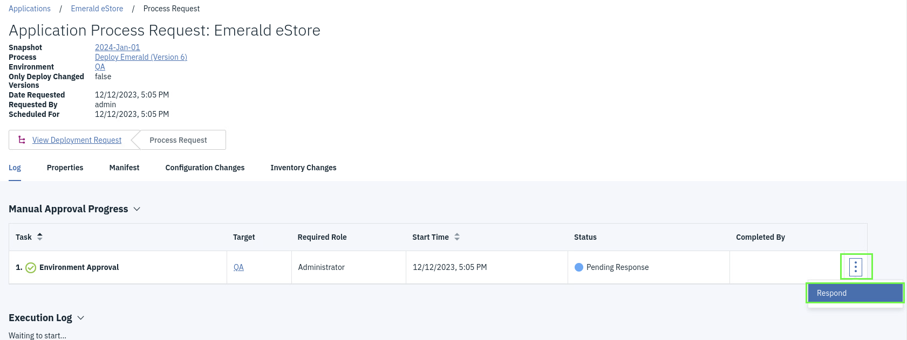</td>
</tr>
<tr class="even">
<td>37</td>
<td>
In the Respond dialog that appears, select ‘Approve’ from the response choice menu item and add an optional comment.

Click <strong>Submit</strong>
</td>
<td>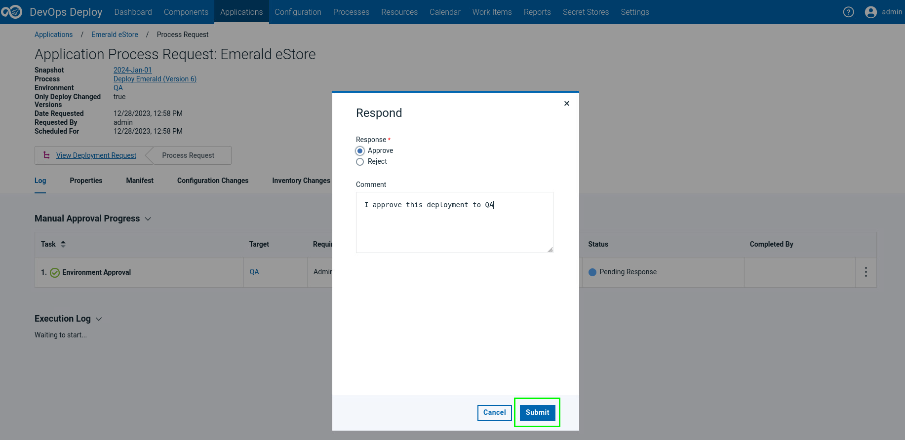</td>
</tr>
<tr class="odd">
<td>38</td>
<td>The deployment process will begin to the QA environment and you can view the progress of the deployment.</td>
<td></td>
</tr>
<tr class="even">
<td>39</td>
<td>
The deployment of the ACE BAR should succeed to QA just as it did earlier for the DEV environment.

The automated IBM DevOps Test Hub functional test will run against the API in the QA environment.
</td>
<td>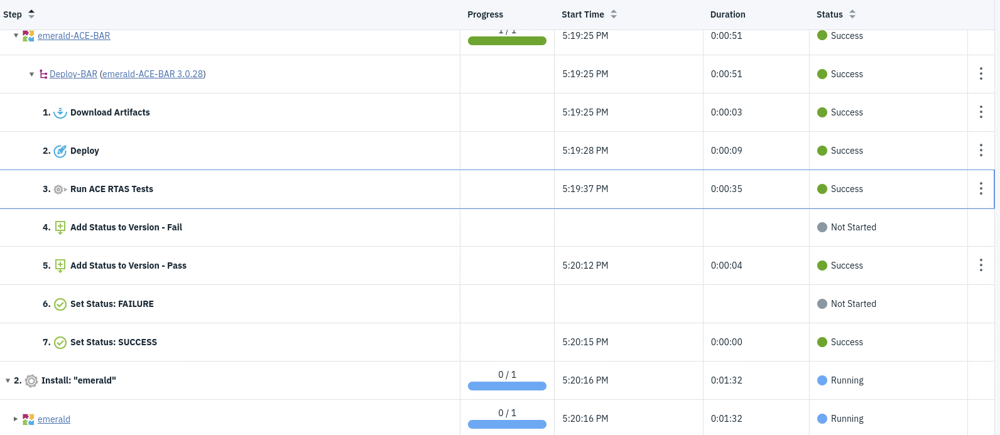</td>
</tr>
<tr class="odd">
<td>40</td>
<td>
Likewise, the deployment of the emerald WEB component should succeed as well.

<strong>NOTE:</strong> we are running functional tests against the web component as well using IBM DevOps Test Hub.
</td>
<td>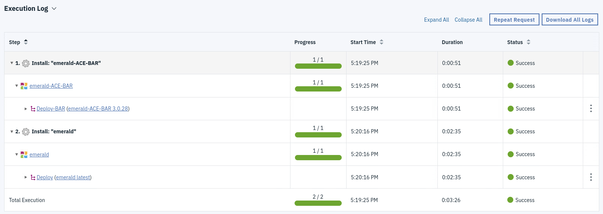</td>
</tr>
<tr class="even">
<td>41</td>
<td>
Optionally, review the test results in IBM DevOps Test Hub by switching to that tab in your browser.

For the ACE project, click on ‘Analyze’ in the left-hand pane and then click on ‘Results’.
</td>
<td>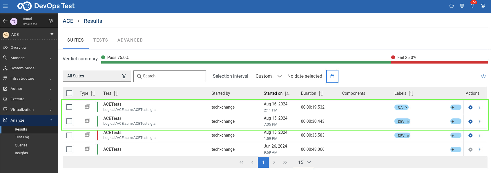</td>
</tr>
<tr class="odd">
<td>42</td>
<td>
Optionally, review the test results in IBM DevOps Test Hub for the ‘Emerald’ project.

For the Emerald project, click on ‘Analyze’ in the left-hand pane and then click on ‘Results’.

In the right hand Results view, click on the ‘Tests’ sub-tab as shown to the right.
</td>
<td>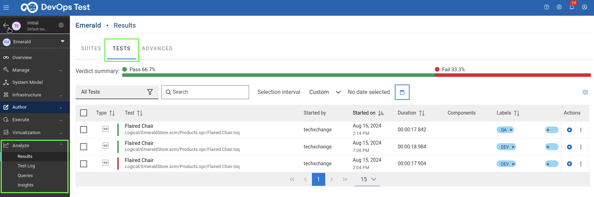</td>
</tr>
<tr class="even">
<td>43</td>
<td>In your IBM DevOps Deploy tab, return to the ‘Emerald eStore’ application view.</td>
<td></td>
</tr>
<tr class="odd">
<td>44</td>
<td>Notice that inventory is updated for the QA environment to show that the snapshot has been deployed</td>
<td>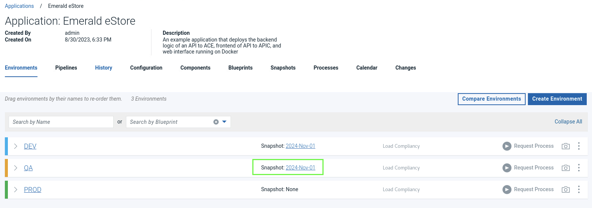</td>
</tr>
<tr class="even">
<td>45</td>
<td>In your browser, create a new tab and click the ‘IBM ACE – INODEQA’ bookmark</td>
<td>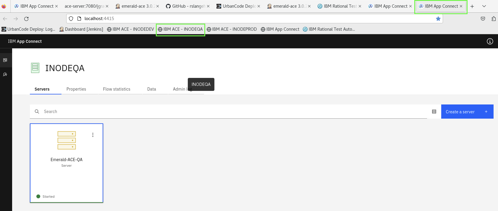</td>
</tr>
<tr class="odd">
<td>46</td>
<td>Open the Emerald-ACE-QA integration server to see that the JGRACEIVT API is deployed as expected.</td>
<td>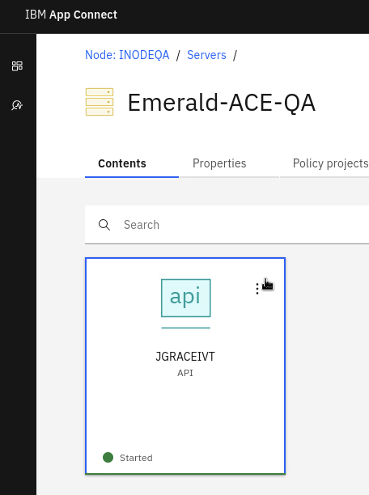</td>
</tr>
<tr class="even">
<td>47</td>
<td>
In your browser window, view the Emerald web application by opening a new tab and navigating to:

<a href="http://192.168.252.201:3002/">http://192.168.252.201:3002/</a>

You should see the application as shown to the right.
</td>
<td>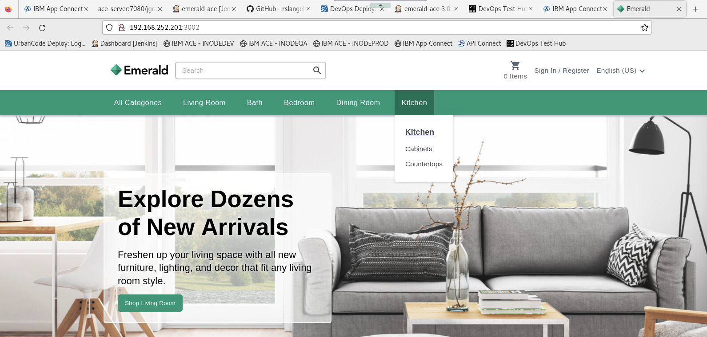</td>
</tr>
<tr class="odd">
<td>48</td>
<td>Congratulations! You have successfully promoted the BAR file as well as the web component.</td>
<td></td>
</tr>
<tr class="even">
<td><strong>End of Section – 3.6</strong></td>
<td></td>
<td></td>
</tr>
</tbody>
</table>

## Publishing a Product to API Connect using IBM DevOps Deploy

### Overview

IBM API Connect is a full lifecycle API management solution that uses
you create, manage, secure, socialize, and monetize APIs. In this final
lab, you will publish a product, which includes APIs you want to
socialize to your end users in a secure manner. The product will be
published to a ‘sandbox’ catalog that is already setup and ready for you
to use in a DEV environment.

**NOTE**: this Lab is leveraging an API Connect instance that is running
in the IBM Cloud. Each student in the lab will be provided a unique
login and password to authenticate with this API Connect instance.

### Workbook steps

<table>
<thead>
<tr class="header">
<th><strong>Step</strong></th>
<th><strong>Details</strong></th>
<th><strong>Additional Information</strong></th>
</tr>
</thead>
<tbody>
<tr class="odd">
<td>1</td>
<td>
For this lab, each student will be assigned a student number which will provide you with a unique login credential as well as an organization to use for API Connect.

Open or return to a terminal window and run this command:

# cd /home/sysadmin/scripts

# ls -al

You should see a ‘student-passwords.txt’ file as shown to the right.
</td>
<td>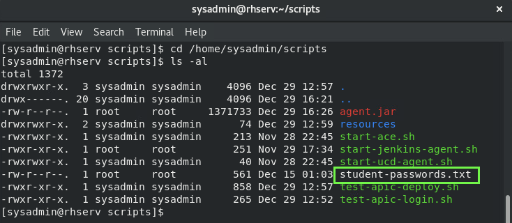</td>
</tr>
<tr class="even">
<td>2</td>
<td>
Run this command:

# cat student-passwords.txt

<strong>NOTE:</strong> your login will be ‘studentxx’ based on your number. For this example, I will be using ‘student20’.
</td>
<td>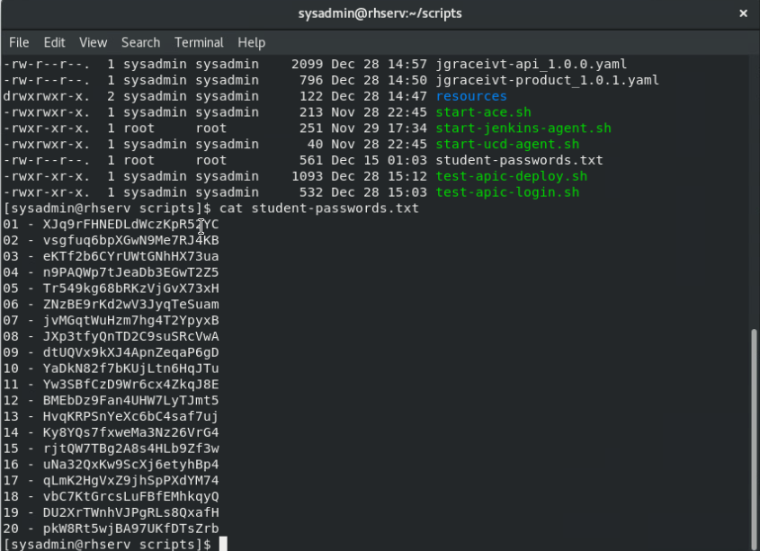</td>
</tr>
<tr class="odd">
<td>3</td>
<td>
For your student id, copy the line which contains your password.

For this example, I am using ‘student20’ so I copy the last line to my buffer.
</td>
<td>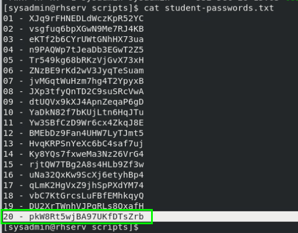</td>
</tr>
<tr class="even">
<td>4</td>
<td>Return to your ‘Text Editor’ window that you had opened earlier. Paste the student password into this file for future reference.</td>
<td>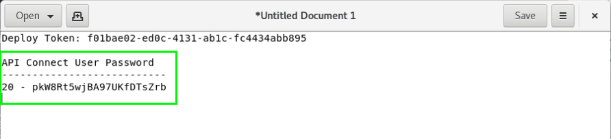</td>
</tr>
<tr class="odd">
<td>5</td>
<td>Return to your Firefox browser and your IBM DevOps Deploy tab.</td>
<td></td>
</tr>
<tr class="even">
<td>6</td>
<td>Click on the ‘Components’ tab at the top of the page as shown to the right.</td>
<td>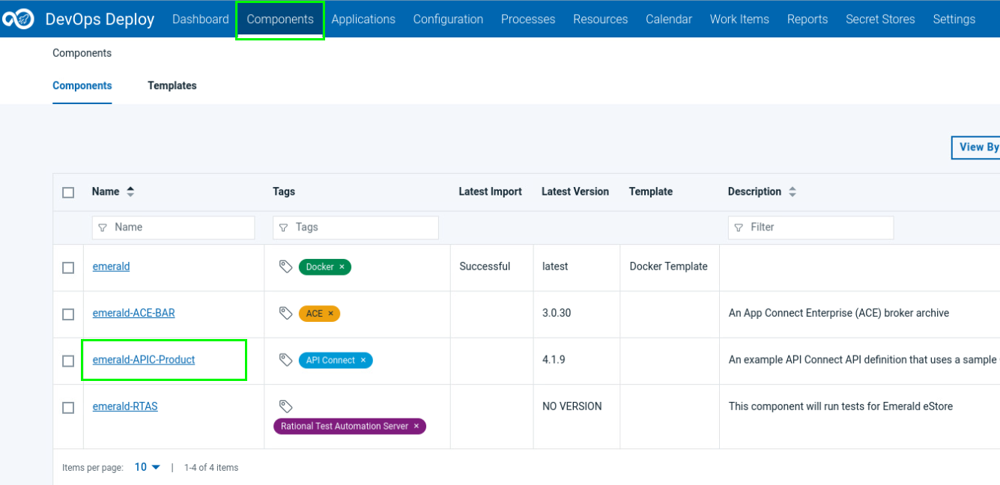</td>
</tr>
<tr class="odd">
<td>7</td>
<td>
You will see a ‘emerald-APIC-Product’ component in the list.

Click on the ‘<strong>emerald-APIC-Product</strong>’ component text
</td>
<td></td>
</tr>
<tr class="even">
<td>8</td>
<td>Notice we have a component version already this component. Let’s examine this by clicking on the ‘4.1.9’ component version.</td>
<td>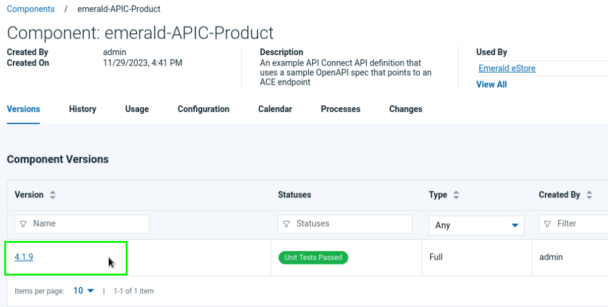</td>
</tr>
<tr class="odd">
<td>9</td>
<td>
You will see that the component version consists of two yaml files:

<ul>
<li>
jgraceivt-product_1.0.1.yaml
</li>
<li>
jgraceivt-api_1.0.0.yaml
</li>
</ul>

The ‘product’ yaml describes your product that you want to publish to a catalog to expose the ‘api’ that it references which is in the ‘api’ yaml file above.
</td>
<td>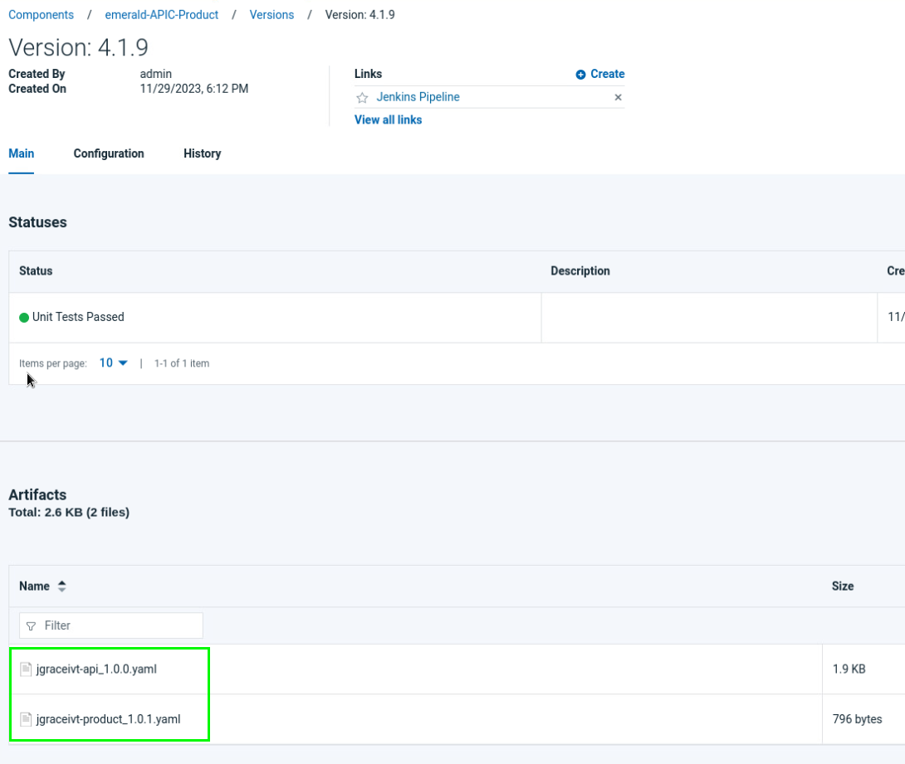</td>
</tr>
<tr class="even">
<td>10</td>
<td>Click on ‘emerald-APIC-Product’ in the crumb trail as shown to the right to return to the component.</td>
<td>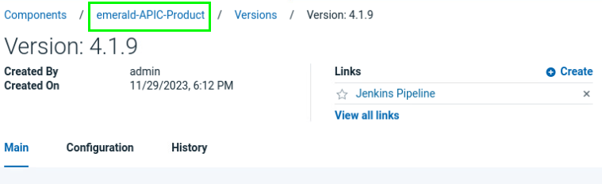</td>
</tr>
<tr class="odd">
<td>11</td>
<td>Click on the ‘Configuration’ sub-tab</td>
<td>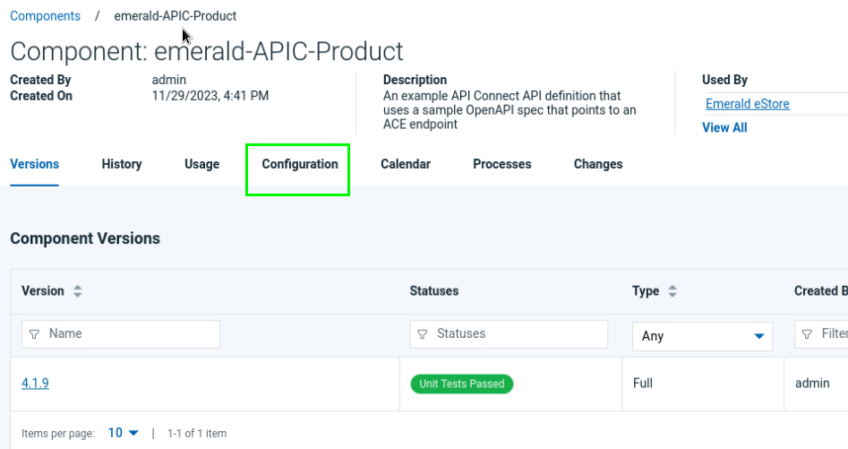</td>
</tr>
<tr class="even">
<td>12</td>
<td>Click on ‘Component Properties’ in the left-hand pane</td>
<td>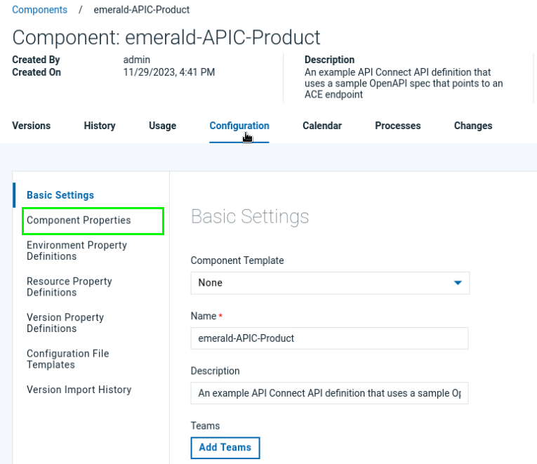</td>
</tr>
<tr class="odd">
<td>13</td>
<td>You will see the component properties that will be used by our deployment process listed in the right-hand pane.</td>
<td>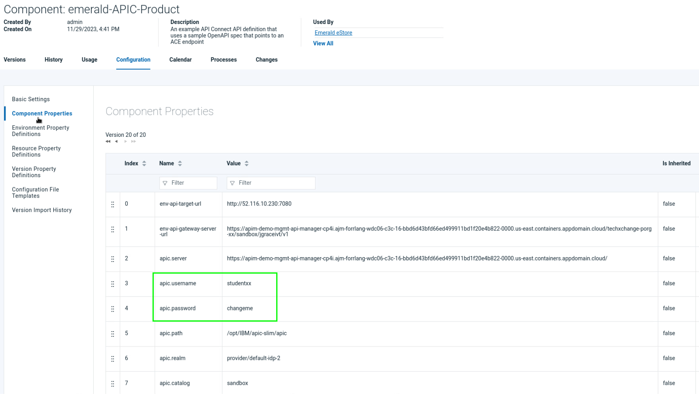</td>
</tr>
<tr class="even">
<td>14</td>
<td>For the <strong>apic.username</strong> and <strong>apic.password</strong> properties, use the three dots (layer cake) menu item and select ‘<strong>Edit’</strong> to change these values to your studentxx number you were assigned and the password found in your Text Editor.</td>
<td>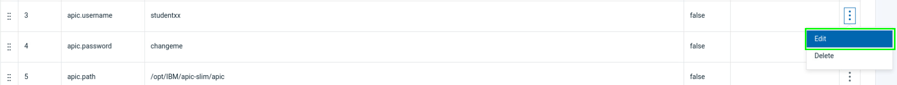</td>
</tr>
<tr class="odd">
<td>15</td>
<td>
The values for the ‘apic.username’ and ‘apic.password’ should reflect what you were assigned as shown to the right.

<strong>NOTE:</strong> you can ‘secure’ passwords in IBM DevOps Deploy where a user cannot see them.
</td>
<td>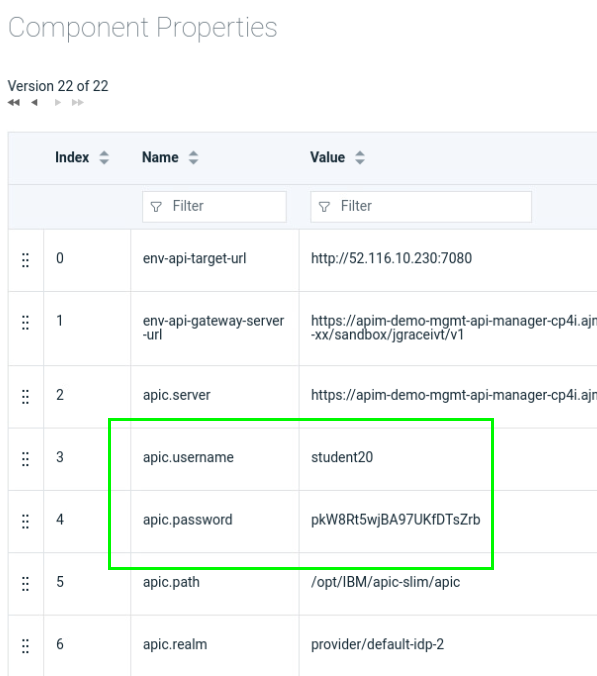</td>
</tr>
<tr class="even">
<td>16</td>
<td>In the component properties list, scroll down to the ‘<strong>apic</strong>.<strong>organization’</strong> property.</td>
<td>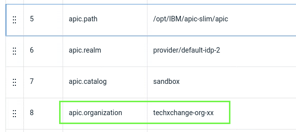</td>
</tr>
<tr class="odd">
<td>17</td>
<td>
Edit this value to be ‘<strong>techxchange</strong>-<strong>org</strong>-<strong>xx’</strong> where xx is your student number.

In my case, it is ‘techxchange-org-20’ as shown to the right.
</td>
<td>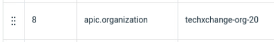</td>
</tr>
<tr class="even">
<td>18</td>
<td>
We will now quickly review the component process for deployment.

Click on the ‘Processes’ sub-tab as shown to the right.
</td>
<td>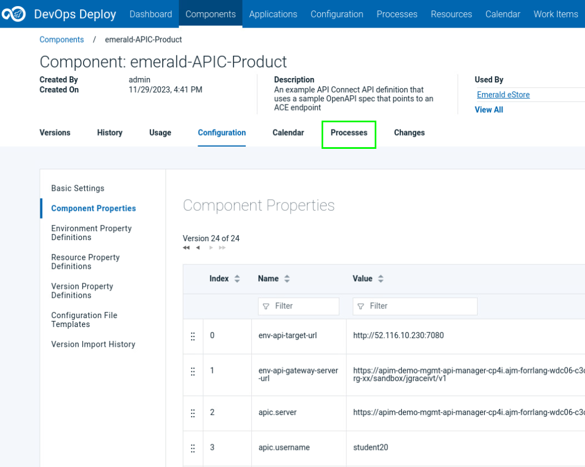</td>
</tr>
<tr class="odd">
<td>19</td>
<td>Click on the ‘Publish-Product’ process</td>
<td>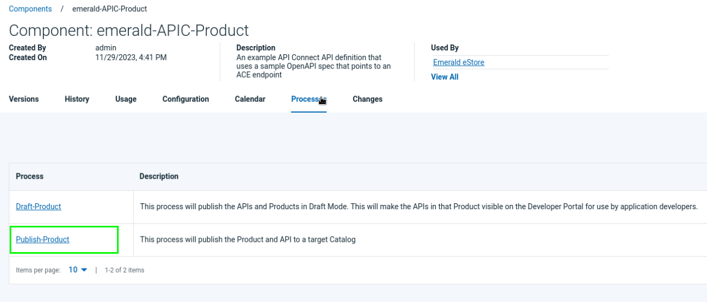</td>
</tr>
<tr class="even">
<td>20</td>
<td>
The visual process designer will appear.

The process starts with a ‘Download Artifacts’ step that will download the yaml files to a host that has the API Connect Toolkit installed.

The second step will replace tokens in the ‘jgraceivt-api_1.0.0.yaml’ file with environment properties set in DevOps Deploy. At time of deployment, these values will be substituted (these values can vary from one environment to the next). Here is our example:

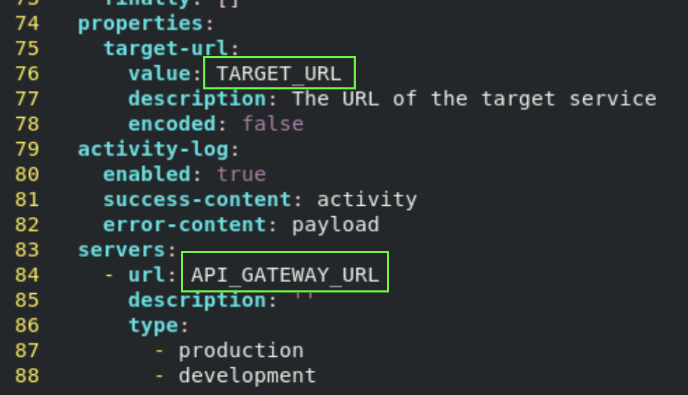

The third and fourth steps of the process use the APIC plugin steps to Login and ‘Publish the API Product Definition’ to your API Connect target environment catalog.
</td>
<td>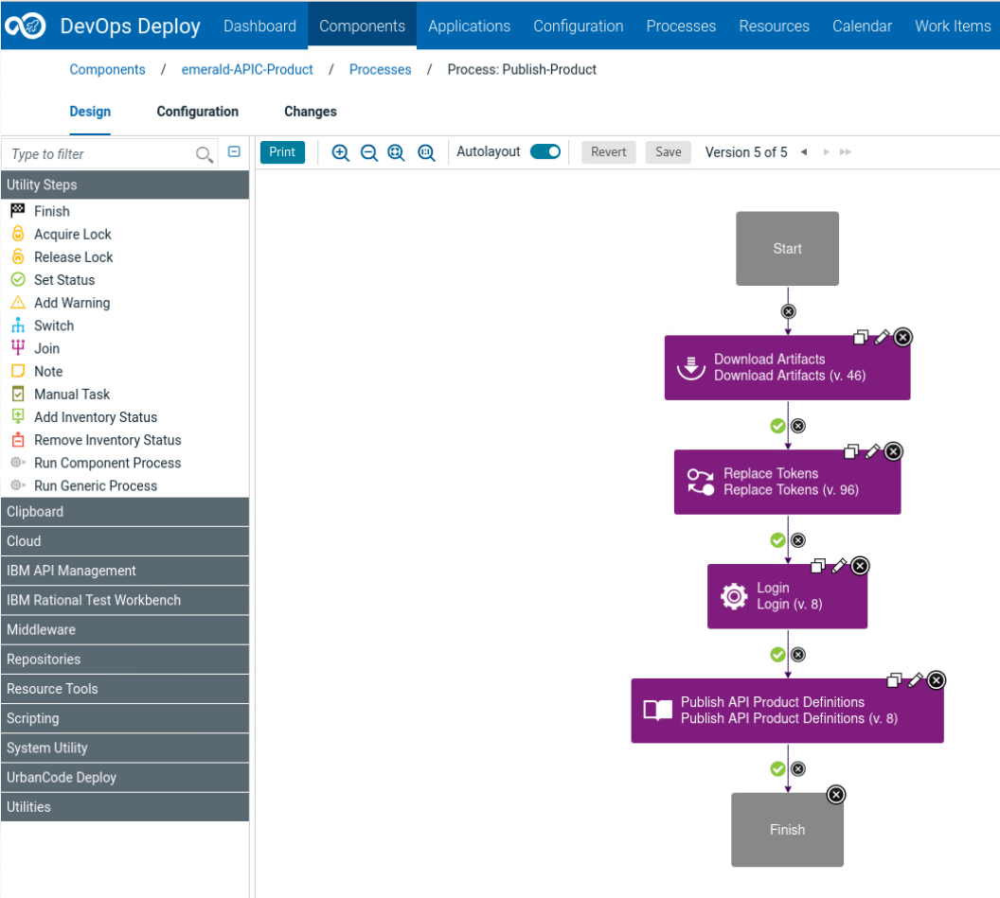</td>
</tr>
<tr class="odd">
<td>21</td>
<td>Click the pencil icon for the ‘Publish API Product Definitions’ step.</td>
<td></td>
</tr>
<tr class="even">
<td>22</td>
<td>Notice the use of the component properties that we reviewed and updated.</td>
<td>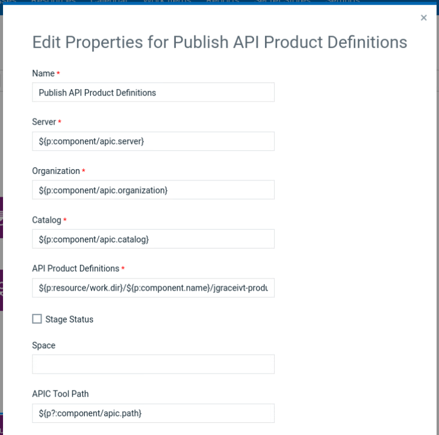</td>
</tr>
<tr class="odd">
<td>23</td>
<td>Scroll down and click <strong>Cancel</strong> to close the ‘Edit Properties’ dialog without making any changes.</td>
<td>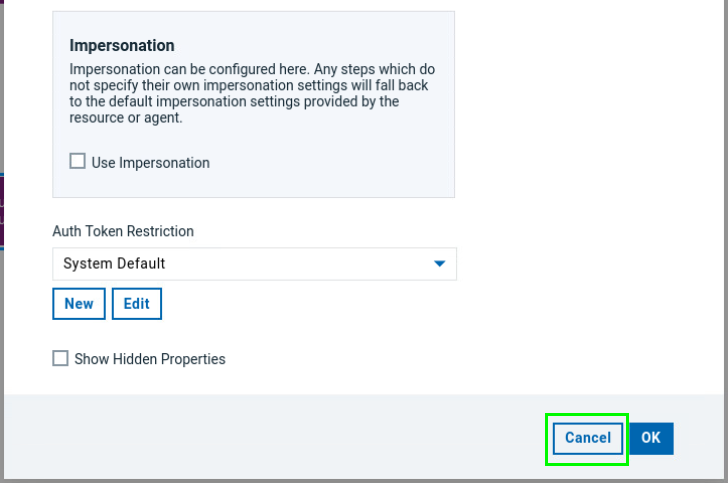</td>
</tr>
<tr class="even">
<td>24</td>
<td>
In your visual process design view, type ‘API Connect’ in the ‘Type to filter’ search text field as shown to the right.

This will show you the plugin steps that come with the ‘IBM API Connect’ automation plugin that you can leverage in IBM DevOps Deploy.

<strong>NOTE</strong>: IBM DevOps Deploy has plugins for MQ, DataPower and other technologies that many of our clients manage to run operational processes (e.g. ‘Create Queue Manager’) or deployment processes.
</td>
<td>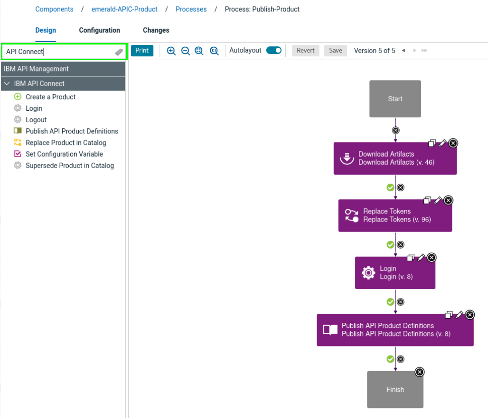</td>
</tr>
<tr class="odd">
<td>25</td>
<td>In the crumb trail at the top, click on ‘<strong>emerald</strong>-<strong>APIC</strong>-<strong>Product’</strong> to return to the component view.</td>
<td>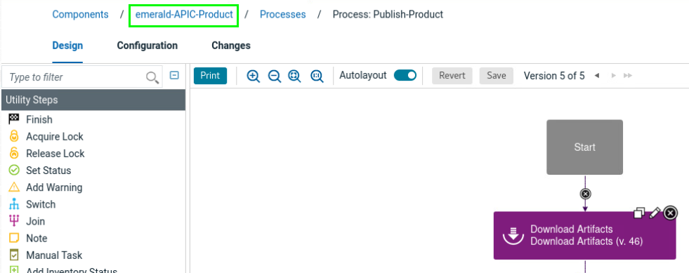</td>
</tr>
<tr class="even">
<td>26</td>
<td>
At the top of the Components view, you will see a ‘Used By’ field as shown to the right.

Click on ‘<strong>Emerald</strong> <strong>eStore’</strong> to return to the application.
</td>
<td>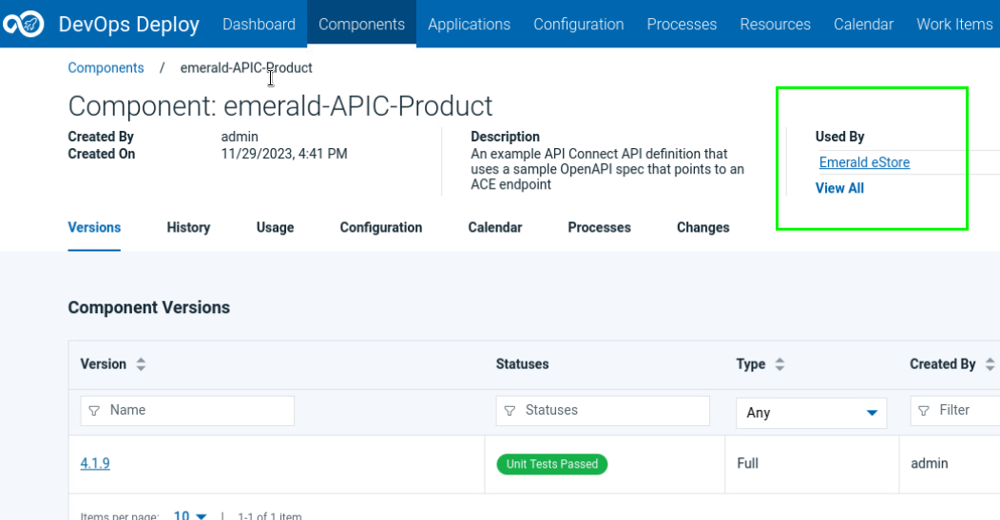</td>
</tr>
<tr class="odd">
<td>27</td>
<td>
From the Application view, we will now deploy our API Connect product to the DEV environment.

Click on the ‘Request Process’ button for the DEV environment as shown to the right.
</td>
<td>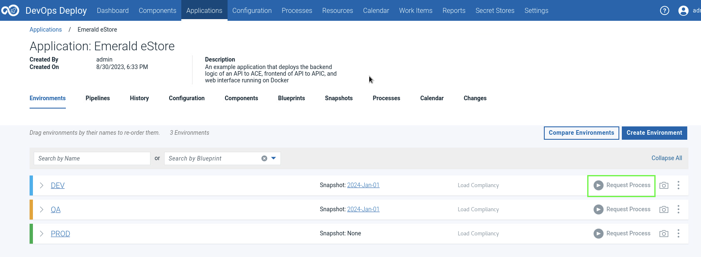</td>
</tr>
<tr class="even">
<td>28</td>
<td>In the Run Application Process page that appears, for the Process pull-down menu, select ‘<strong>Deploy</strong> <strong>Emerald</strong> <strong>APIC’</strong></td>
<td>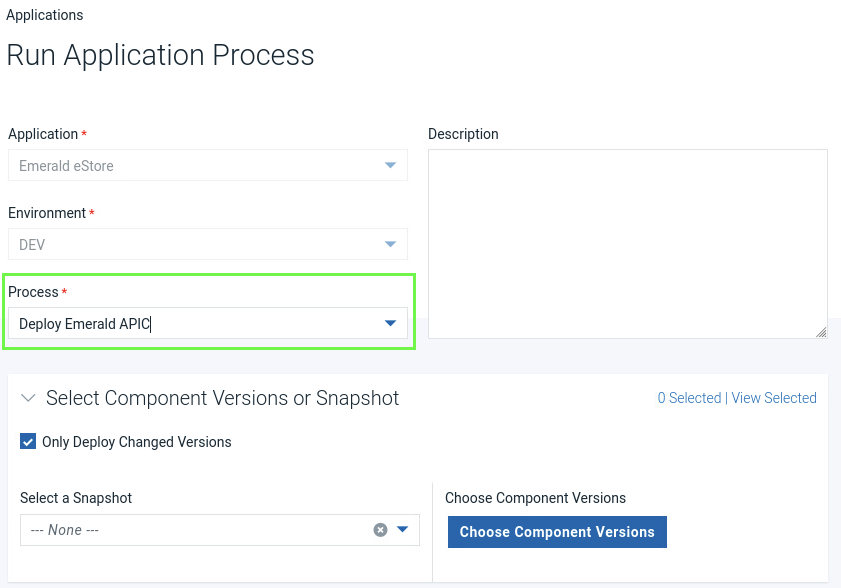</td>
</tr>
<tr class="odd">
<td>29</td>
<td>Click the ‘Choose Component Versions’ button</td>
<td>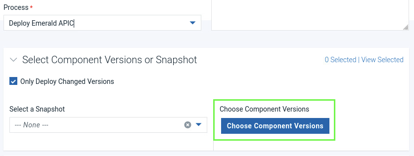</td>
</tr>
<tr class="even">
<td>30</td>
<td>From the ‘Select for All’ pulldown that appears, select the ‘<strong>Latest</strong> <strong>Available’</strong></td>
<td>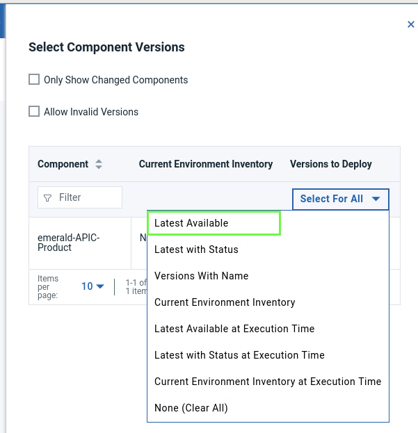</td>
</tr>
<tr class="odd">
<td>31</td>
<td>You should see version 4.1.9 selected to be deployed</td>
<td>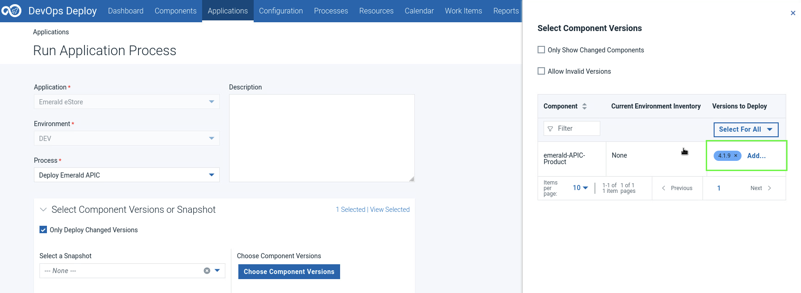</td>
</tr>
<tr class="even">
<td>32</td>
<td>Scroll down and click the ‘Submit’ button</td>
<td>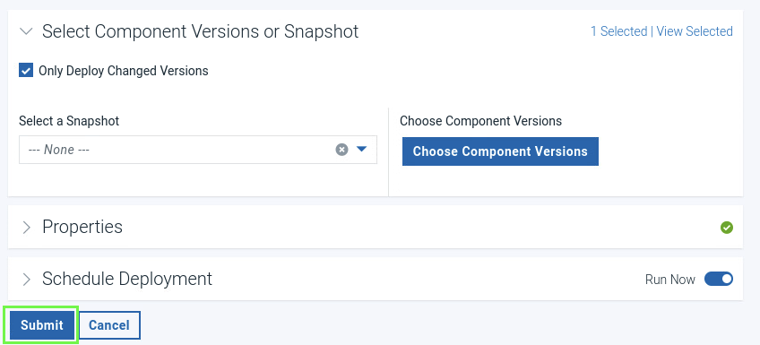</td>
</tr>
<tr class="odd">
<td>33</td>
<td>The deployment will begin. You can click the ‘Expand All’ link to show each step that is executed with the deployment.</td>
<td>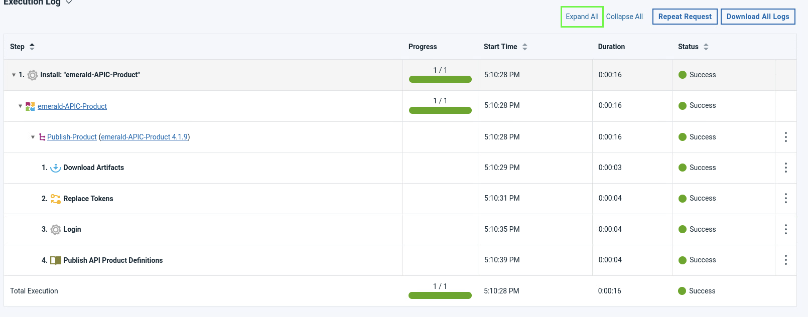</td>
</tr>
<tr class="even">
<td>34</td>
<td>The deployment should succeed as shown above.</td>
<td></td>
</tr>
<tr class="odd">
<td>35</td>
<td>View the output for the ‘Login’ step by clicking on the layer cake (three dot) icon to the right of the step and then select ‘View Output Log’</td>
<td>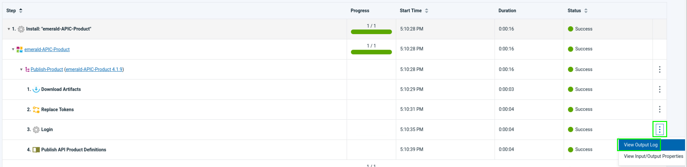</td>
</tr>
<tr class="even">
<td>36</td>
<td>
You should see ‘Authentication completed successfully’ as shown to the right.

Click ‘Close’ to close the Output Log dialog window.
</td>
<td>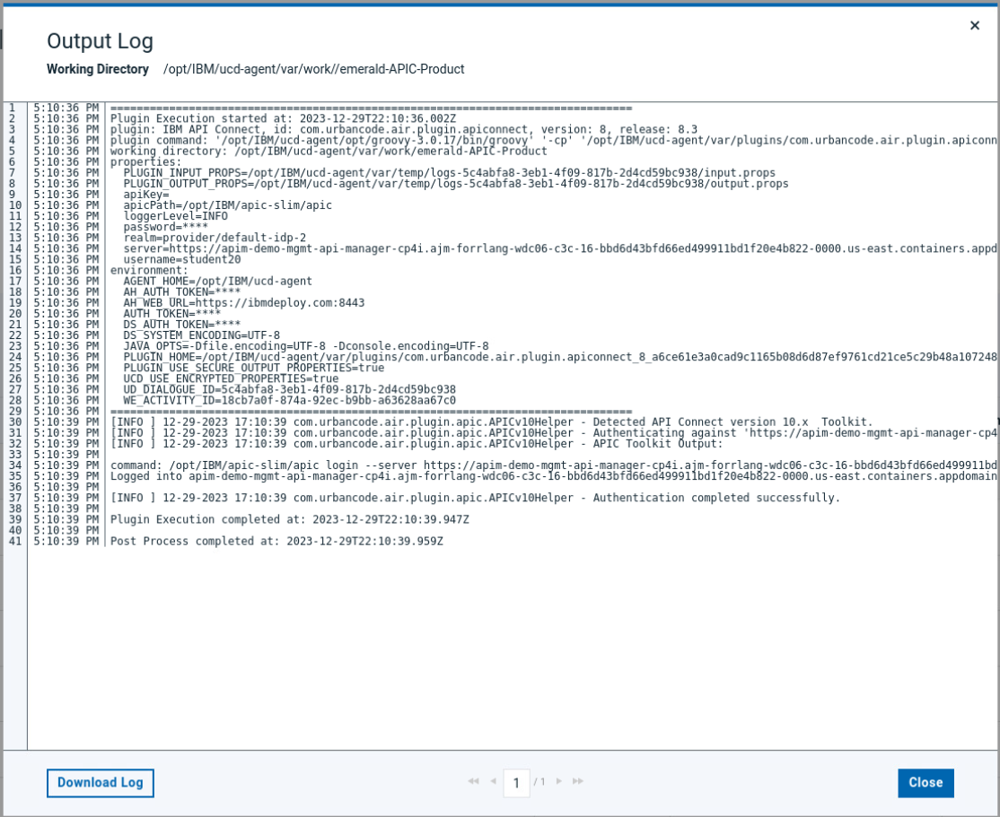</td>
</tr>
<tr class="odd">
<td>37</td>
<td>Repeat the same steps to view the output for the ‘Publish API Product Definitions’ step.</td>
<td>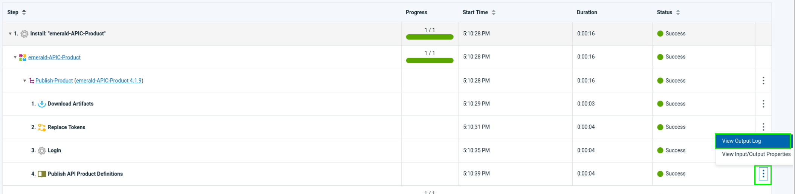</td>
</tr>
<tr class="even">
<td>38</td>
<td>
You should see the ‘[state: published]’ message as shown to the right along with a ‘Successfully published definition’ message in the output log.

Click Close to close the Output Log dialog window.
</td>
<td>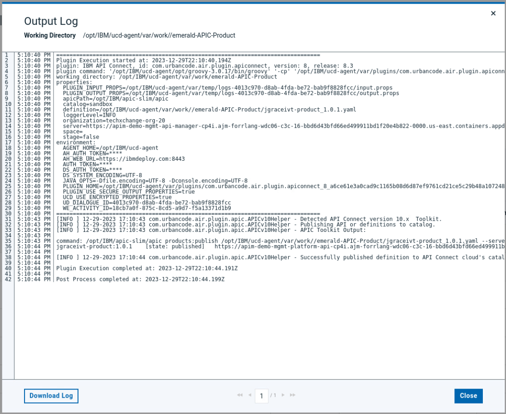</td>
</tr>
<tr class="odd">
<td>39</td>
<td>Open a new tab in your browser. Click on the ‘API Connect’ bookmark as shown to the right.</td>
<td></td>
</tr>
<tr class="even">
<td>40</td>
<td>
The API Connect Login Page will appear.

For the Username field, enter your <strong>studentxx</strong> number.

Copy the studentxx password from your Text Editor window. Paste this value into the Password field.
</td>
<td>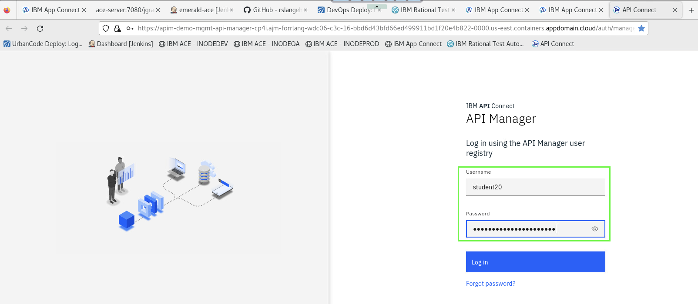</td>
</tr>
<tr class="odd">
<td>41</td>
<td>Click the ‘Log in’ button.</td>
<td></td>
</tr>
<tr class="even">
<td>42</td>
<td>Click on the ‘<strong>Manage</strong> <strong>catalogs’</strong> tile as shown to the right.</td>
<td>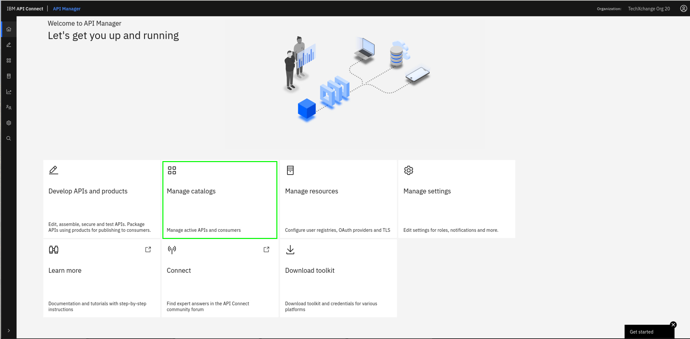</td>
</tr>
<tr class="odd">
<td>43</td>
<td>Click on the ‘Sandbox’ catalog</td>
<td>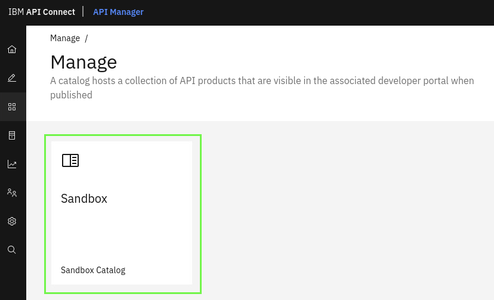</td>
</tr>
<tr class="even">
<td>44</td>
<td>You should see the ‘JGRACEIVT Product’ in the list of products following your deployment as shown to the right!</td>
<td>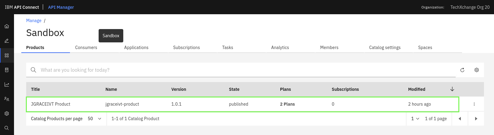</td>
</tr>
<tr class="odd">
<td>45</td>
<td>By clicking on the layer cake (three dot) menu to the right, select ‘Manage APIs’ to view the APIs that are securely exposed to end users.</td>
<td>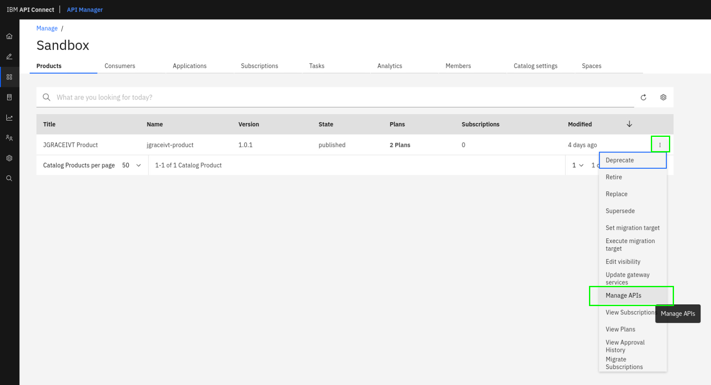</td>
</tr>
<tr class="even">
<td>46</td>
<td>
Here you see the APIs included with the product.

Click the ‘Close’ button
</td>
<td>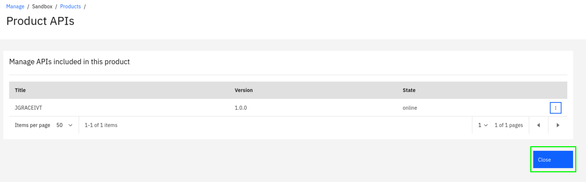</td>
</tr>
<tr class="odd">
<td>47</td>
<td>Repeat the same process to view the plans by clicking the ‘View Plans’ menu item.</td>
<td>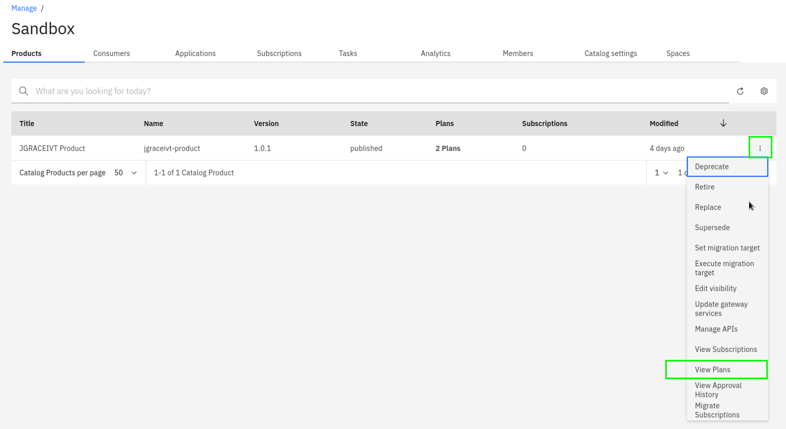</td>
</tr>
<tr class="even">
<td>48</td>
<td>You will see there is a ‘Default Plan’ as well as a ‘Premium Plan’ provided for this API that end users can subscribe to.</td>
<td>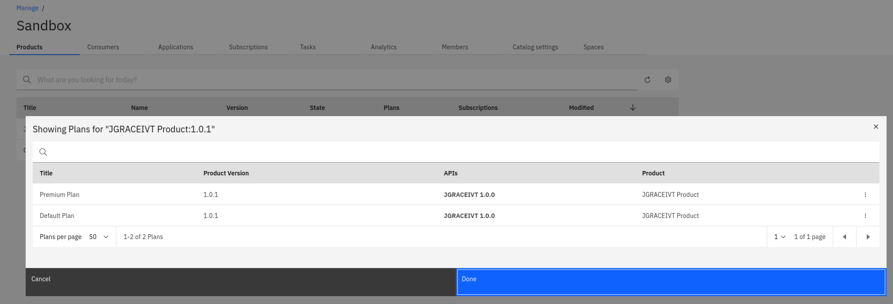</td>
</tr>
<tr class="odd">
<td>49</td>
<td>You have completed the lab!</td>
<td></td>
</tr>
<tr class="even">
<td><strong>End of Section – 3.7</strong></td>
<td></td>
<td></td>
</tr>
</tbody>
</table>

# Wrapping Things Up

## Lab Re-Cap

Congratulations\!

In this workbook you have gone through the process of integrating IBM
DevOps capabilities with IBM App Connect Enterprise (ACE) and API
Connect to provide an end-to-end DevOps experience. By executing each
lab, you were able to:

  - Explore IBM App Connect Enterprise (ACE) and how one can create,
    build, and deploy APIs from both the ACE Toolkit IDE and through a
    pipeline like Jenkins which integrates with DevOps Deploy to handle
    the deployment.

  - Explore IBM DevOps Deploy and its application model which includes
    target environments, components, and processes. We explored how to
    setup processes to handle the deployment of both IBM App Connect
    Enterprise (ACE) and API Connect assets in the labs.

  - Explore Rational Test Automation Server (RTAS) and how it can run
    automated tests and be triggered automatically as part of a
    deployment process.

  - Explore IBM API Connect and how you can automate the publish of a
    product to a target catalog using DevOps Deploy. IBM API Connect is
    a full lifecycle API management solution that is used to create,
    manage, secure, socialize, and monetize APIs.

For more information on each solution, please refer to the documentation
links below:

> **IBM DevOps Test Hub Overview** -
> <https://www.ibm.com/products/devops-test/hub>
> 
> **IBM DevOps Deploy Documentation** -
> <https://www.ibm.com/docs/en/urbancode-deploy/8.0.0?topic=notes-whats-new>
> 
> **IBM App Connect Enterprise Documentation** -
> <https://www.ibm.com/docs/en/app-connect/12.0?topic=overview-whats-new-in-version-120>
> 
> **IBM API Connect Overview** -
> <https://www.ibm.com/products/api-connect>
